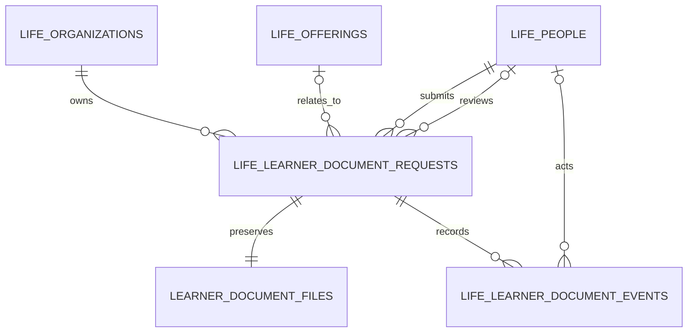

# 수강생 서류 민원 처리 데이터 모델

> Feature: `anchor-learner-document-workflow`
> Date: 2026-09-23

## 용어

| 용어 | 정의 |
|---|---|
| 문서 신청 | 수강생이 세 서식 중 하나의 입력을 완료해 서버에 제출한 단위 |
| 원본 PDF | 제출 시점 입력으로 서버가 생성한 PDF 1.7 바이트. 제출 뒤 수정하지 않는다. |
| 처리 사건 | 접수·검토·승인·반려·완료·취소로 상태가 바뀐 기록 |
| 담당 조직 | 해당 문서를 검토하는 `life_organizations` 행 |
| 처리 담당자 | 승인 가능한 역할과 최근 MFA를 갖고 상태를 변경한 `life_people` 행 |

## 관계

## 엔터티

### `public.life_learner_document_requests`

민감한 양식 내용 대신 업무 목록과 검색에 필요한 최소 정보만 보관한다.

| 필드 | 형식 | 제약/설명 |
|---|---|---|
| `id` | uuid | PK |
| `org_id` | uuid | 담당 조직 FK, 필수 |
| `person_id` | uuid | 제출자 FK, 필수 |
| `offering_id` | uuid | 연결 교육과정 FK, 선택 |
| `request_key` | uuid | 클라이언트 재시도 키, `(person_id, request_key)` unique |
| `kind` | text | `APPLICATION`, `SCHOLARSHIP`, `REFUND` |
| `course_name` | text | 제출 당시 과정명 |
| `applicant_name` | text | 목록 표시용 이름 |
| `phone_masked` | text | 목록 표시용 마스킹 전화번호 |
| `amount` | integer | 장학금/환불 요청액, 선택·0 이상 |
| `status` | text | 6개 상태 enum 제약 |
| `current_note` | text | 수강생에게 보이는 최신 담당자 안내 |
| `reviewer_id` | uuid | 마지막 담당자 FK, 선택 |
| `revision` | integer | 낙관적 잠금, 1부터 증가 |
| `submitted_at` | timestamptz | 접수 시각 |
| `updated_at` | timestamptz | 마지막 상태 변경 시각 |
| `resolved_at` | timestamptz | 반려 또는 완료 시각 |

### `public.life_learner_document_events`

모든 처리 전환을 추가만 가능한 사건으로 기록한다.

| 필드 | 형식 | 제약/설명 |
|---|---|---|
| `id` | bigint | identity PK |
| `request_id` | uuid | 문서 신청 FK |
| `actor_id` | uuid | 처리 행위자 FK |
| `from_status` | text | 최초 접수는 null |
| `to_status` | text | 변경 후 상태 |
| `note` | text | 수강생 공개 안내 메모 |
| `created_at` | timestamptz | 사건 시각 |

### `life_private.learner_document_files`

권한 검증 RPC로만 읽을 수 있는 제출 원본이다.

| 필드 | 형식 | 제약/설명 |
|---|---|---|
| `request_id` | uuid | PK, 문서 신청 FK |
| `pdf_data` | bytea | 서버 생성 PDF 1.7, 최대 5 MiB |
| `pdf_sha256` | text | 64자리 소문자 hex |
| `byte_size` | integer | 무결성·운영 점검용 |
| `created_at` | timestamptz | 보관 시각 |

## 인덱스

- `requests(person_id, submitted_at desc)` 수강생 이력
- `requests(org_id, status, submitted_at desc)` 관리자 문서함
- `requests(org_id, kind, submitted_at desc)` 유형 필터
- `events(request_id, created_at, id)` 타임라인
- `(person_id, request_key)` unique 재시도 멱등성

## 보안 경계

- 모든 테이블은 RLS를 활성화하고 테이블 직접 권한을 회수한다.
- 수강생은 `auth.uid()`에 연결된 본인 요청만 제출·조회·취소·PDF 조회한다.
- 관리자 목록·PDF 열람은 담당 조직의 `SYSTEM_ADMIN`, `COURSE_MANAGER`, `FINANCE` 역할과 MFA 인증을 요구한다.
- 상태 변경은 같은 역할과 최근 MFA를 요구한다.
- PDF 바이트는 목록·이력 JSON에 포함하지 않는다.
- 상태 변경과 제출은 `life_audit_events`에도 요약을 남긴다.
