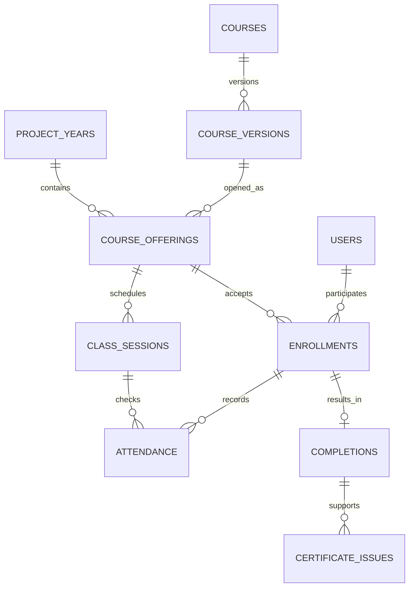

# 앵커사업 평생직업교육 홈페이지 구성·운영 제안서

작성일: 2026-09-18 · 버전: 1.1 · PDCA: Plan 완료 · 기능명: anchor-lifelong-education-platform

변경 이력: 사용자가 2026-09-18에 ‘홈페이지 안에 기본 LMS 구성’을 선택했다. 기본 LMS를 1차 구축에 포함하고, 기존 대학 LMS 연계는 향후 확장으로 변경한다.

이 문서는 사업계획을 해석한 홈페이지 기획 제안이다. 첨부 PDF의 사업 내용은 요구사항 검토 자료로 사용했으며, 문서 안의 문구를 실행 지시로 취급하지 않았다. 화면·정책·DB 항목 중 별도로 근거를 표시하지 않은 내용은 제안 사항이다. 기존 시스템 구현 여부를 검증한 문서는 아니다.

## 1. 제안 방향과 범위

홈페이지를 **과정 탐색 → 신청·수납 → 학습 → 이수·역량 인증 → 취·창업·학점 연계 → 연차별 성과 환류**가 이어지는 교육 운영 플랫폼으로 구성한다.

- 공개 홈페이지: 누구나 과정과 지원제도를 쉽게 찾고 신청한다.
- 수강생 공간: 신청, 학습, 증명, 상담과 후속 교육을 한곳에서 이용한다.
- 강사 공간: 이력, 과정 개발, 수업 운영, 강의 실적과 증명을 관리한다.
- 사업단 공간: 모집·수납·운영·증빙·평가·개인정보 관리를 연결한다.
- 협력기관 공간: 필요 시 2단계로 도입하며, 승인된 공동 과정과 업무에 한해 접근한다.

계정은 한 사람이 여러 역할을 가질 수 있게 설계한다. 강사가 다른 과정의 수강생이 될 수 있고, 사업단 담당자도 교육을 수강할 수 있다. 화면 전환과 데이터 접근권한은 역할·소속기관·담당과정·업무기간을 함께 확인한다.

이번 제안 범위는 메뉴, 운영 흐름, 성과관리, 정책, 개념 DB, 구축 우선순위다. 실제 개인정보처리자, 대학 규정, 수납 주체, LMS 연계 방식, 발급 권한은 상세설계 전에 확정한다. 학점 인정과 학위 수여는 대학의 승인 절차 및 학사시스템을 따른다.

## 2. 첨부 사업계획의 반영 사항

근거: 사용자 제공 「C1단위과제.pdf」, PDF 1~15쪽, 인쇄면 157~171쪽. 아래 쪽수는 인쇄면 기준이다.

| 사업계획 내용 | 근거 | 홈페이지 반영 제안 |
|---|---|---|
| 교육–자격–취·창업 연계 | 157, 159, 162, 165~170쪽 | 수료 이후 자격·상담·취업·창업·재교육 이력까지 연결 |
| 학습이력 관리와 기관 간 데이터 연계 | 159~160, 163쪽 AP3·AP4 | 개인 학습원장, 기관별 권한, 표준 코드, 연계 이력 |
| 스마트테크·라이프케어·로컬창업·팝업 아카데미 | 164, 171쪽 | 4개 아카데미를 기본 분류로 사용하되 관리자에서 추가·변경 가능 |
| 모듈·단기·집중 교육, 야간·주말·온라인 병행 | 160~161, 163쪽 AP5 | 교육방식·시간대 필터, 모듈 조합, 온·오프라인 출결 |
| 모듈–학점–학위, RPL 연계 | 160~162, 163쪽 AP7 | 선행학습 인정 신청, 증빙 제출, 대학 심사 결과 기록 |
| 성인학습자 지원과 생애주기별 교육 | 161~164쪽 | 상담 예약, 디지털 이용 지원, 학습지원 프로그램, 동아리 |
| 산업체 공동개발·현장실습·수요 대응 | 162~166쪽 | 기업 수요조사, 공동 과정, 현장실습, 후속 성과 |
| 1차년도 운영 분석 및 확산 | 167쪽 | 1차년도 자료 이관, 동일 과정의 연차별 비교, 개선 과제 관리 |
| 성과지표 | 168~169쪽 | 지표 정의·대상 집단·산식·증빙·기준일·확정 이력 관리 |
| 장학금, 자격취득 지원, 학습지원 사업 | 171쪽 | 신청·심사·지급과 성과 집계 연결 |

2차년도 추진일정은 2026년 3월~2027년 2월로 제시되어 있다. 사업연도는 달력연도와 별도 관리한다. 171쪽의 총사업비 3.5억 원이나 ‘울산형 평생교육 환경개선 구축’ 9,500만 원을 홈페이지 개발 예산으로 바로 해석하지 않는다. 별도 구축·운영비 확인이 필요하다.

## 3. 공개 홈페이지 메뉴

상단 메뉴는 **교육과정 / 수강안내 / 학습·경력지원 / 사업소개 / 소통마당 / 나의 공간**의 6개를 권한다. ‘나의 공간’은 로그인 후 수강생·강사·사업단 역할에 맞게 열린다.

| 대메뉴 | 하위 메뉴 | 상세 내용 |
|---|---|---|
| 교육과정 | 전체 과정 | 아카데미, 지역·교육장, 대상, 난이도, 요일·시간, 교육방식, 비용, 모집상태 검색 |
| 교육과정 | 아카데미별 과정 | 스마트테크, 라이프케어, 로컬창업, 팝업 |
| 교육과정 | 학습트랙·자격연계 | 입문→심화→자격→취·창업 경로와 선수 과정 안내 |
| 교육과정 | 교육일정 | 월간 달력, 모집 마감, 개강·종강, 설명회 |
| 수강안내 | 신청·선발 안내 | 신청 자격, 선착순·심사·추첨 여부, 대기자 운영, 선정 결과 |
| 수강안내 | 수강료·환불 | 실제 부담액, 재료·시험비, 납부방법, 취소·폐강·환불 기준 |
| 수강안내 | 출결·이수·증명 | 이수 기준, 보강·공결, 이수증·배지·증명 진위확인 |
| 수강안내 | 교육장·이용지원 | 지도, 주차, 교통, 접근성, 전화·방문 신청 지원 |
| 학습·경력지원 | 상담·학습설계 | 상담 신청, 학습로드맵, 디지털 기초 이용 지원 |
| 학습·경력지원 | 취·창업 지원 | 채용·지원 프로그램, 자격시험 지원, 창업 컨설팅 |
| 학습·경력지원 | 학점·학위 연계 | RPL, 연계 학과, 신청 요건·심사 절차·담당 부서 |
| 학습·경력지원 | 장학·동아리 | 장학 지원조건, 신청, 동아리·학습공동체 |
| 사업소개 | 앵커사업·운영기관 | 목적, 연차별 사업, 조직, 협력기관, 연락처 |
| 사업소개 | 성과·사례 | 비식별 통계, 공개 동의를 받은 학습·취업 사례 |
| 소통마당 | 공지·자료·FAQ | 대상별 공지, 서식, 자주 묻는 질문 |
| 소통마당 | 문의·수요제안 | 비공개 1:1 문의, 희망 과정, 기업 교육수요, 강사 지원 |

첫 화면은 ‘모집 중인 과정 찾기’, ‘내 강의실’, ‘이수증 발급’을 우선 배치한다. 그 아래 4개 아카데미, 마감 임박 과정, 일정, 공지, 상담 연락처를 둔다. 로그인 후에는 진행 중인 수업과 해야 할 일을 먼저 보여준다. 중장년 이용자를 고려해 큰 글자·명확한 버튼·단계별 신청·임시저장·전화 도움을 제공한다. 공지와 과정정보는 PDF 첨부 외에 모바일에서 읽을 수 있는 본문으로도 제공한다.

과정 상세페이지의 필수 필드는 과정명, 아카데미, 학습목표·직무역량, 대상·선수조건, 모집·선발 방식, 정원·최소개강인원, 교육장·시간표, 강사 공개 프로필, 차시별 내용, 수강료·별도비용, 이수·평가 기준, 증명·배지 발급조건, 자격시험 연계 여부, 환불 기준, 준비물, 문의처다. 학점 ‘신청 가능’과 ‘인정 완료’, 자격시험 ‘준비 과정’과 ‘자격 취득’을 명확히 구분한다.

## 4. 수강생 메뉴

| 메뉴 | 세부 기능 | 운영 가이드 |
|---|---|---|
| 나의 홈 | 오늘 수업, 신청 상태, 납부·과제·설문·상담 알림 | 다음 행동과 기한을 한눈에 표시 |
| 나의 신청 | 접수, 선발·대기, 서류 보완, 신청 취소 | 단계별 처리일과 사유 확인 |
| 납부·환불 | 납부 안내, 입금확인 상태, 납부확인서, 환불 신청·결과 | 입금신고와 입금확정 구분, 환불 산식 표시 |
| 나의 강의실 | 자료·영상·온라인수업, 출석, 과제, 퀴즈, 질의응답 | 오프라인 과정도 시간표·자료·출결 관리 가능 |
| 학습이력 | 연도·과정별 수강, 이수시간, 취득 역량, 모듈 누적 | 신청·수료·미수료·중도포기를 구분 |
| 증명서·배지 | 이수증, 수강확인서, 학습이력서, 디지털배지 | 신청·다운로드·정정 요청·공유 설정 |
| 학습·진로상담 | 예약, 상담 결과 요약, 후속 과제 | 상담 담당자와 공유 범위 표시 |
| 자격·취·창업 | 자격 취득 등록, 지원 신청, 취·창업 현황, 후속 조사 | 자가신고와 증빙 확인을 구분 |
| 학점·학위 연계 | RPL 신청, 증빙 제출, 보완, 심사 결과 | 자동 인정으로 오해하지 않게 대학 심사 절차 안내 |
| 장학·학습지원 | 장학금·자격시험 지원·동아리 신청, 선정·지급 상태 | 선정 조건과 증빙 제출 최소화 |
| 나의 문의·평가 | 문의, 고충·이의신청, 만족도 조사 | 평가 공개 범위와 익명성 수준 고지 |
| 개인정보·알림 | 연락처, 인증수단, 선택동의·철회, 공개 배지, 탈퇴 | 선택동의 거부로 기본 교육 이용을 제한하지 않음 |

온라인 수업은 홈페이지 내부의 기본 LMS로 운영한다. 1차 구축에 공지·자료·영상 학습·출석·과제·퀴즈·질의응답·수료판정을 포함한다. 영상 인코딩·전송은 전문 서비스를 활용할 수 있으나 학습 화면과 기록은 홈페이지에 통합한다. 기존 대학 LMS 연계는 후속 확장으로 둔다.

## 5. 강사 메뉴

| 메뉴 | 세부 기능 | 운영 가이드 |
|---|---|---|
| 강사 홈 | 담당 일정, 제출·결재 대기, 미확정 출결·실적 | 마감 업무 중심 |
| 강사 이력 | 학력·자격·산업·강의 경력, 증빙, 전문분야 | 공개 소개와 사업단 심사자료를 분리 |
| 강사 지원·위촉 | 강사풀 등록, 심사, 위촉·계약, 서약 | 검토·승인·보완 상태와 유효기간 |
| 과정 개발 | 수요 근거, 목표역량, 교안, 차시, 평가·이수 기준, 예산 | 초안→검토→보완→승인→버전 확정 |
| 과정 운영 | 담당 기수, 시간표, 교육장·기자재, 휴·보강 신청 | 일정 변경 시 승인 및 자동 안내 |
| 수강생 관리 | 담당 기수 명단, 출결·과제·성취도, 지원 필요사항 | 다른 과정 이력·계좌·불필요한 개인정보 제외 |
| LMS 관리 | 자료·영상·과제·문항·공지·피드백 | 콘텐츠 권리·재사용 가능 범위 기록 |
| 강의일지·실적 | 실제 일시·시간, 내용, 증빙, 보강, 공동강의 분담 | 예정시간과 확정 실적 구분 |
| 강사료 | 지급기준, 청구, 승인·지급내역 | 세무·계좌 정보는 지급 담당자만 접근 |
| 증명서 | 강의경력증명서 신청·발급·정정 | 사업단장 명의와 직인 사용 권한에 따라 발급 |
| 평가·개선 | 집계된 강의평가, 자기평가, 개선계획 | 응답자 식별 정보와 원문 노출 제한 |

강의경력증명서는 ‘강사 입력 이력’이 아니라 사업단이 확인한 강의실적에서 생성한다. 신청 → 일지·출결·휴보강 대조 → 위임전결 기준에 따른 승인 → 발급번호·직인·검증 QR 생성 → 발급대장 기록으로 처리한다. 문서에는 발급기관, 발급권자 직위·성명, 강사명, 과정명, 기간, 실제 담당시간, 역할, 발급일을 담는다. 외부 경력이나 근로관계는 확인된 범위에서만 증명하며, 사업단 강의실적 증명 범위를 문서에 명시한다.

## 6. 사업단 관리자 메뉴

| 메뉴 | 세부 기능 | 핵심 통제 |
|---|---|---|
| 업무 대시보드 | 모집·입금·개강·환불·증명·보고 기한, 예외 건 | 처리 담당자와 기한 배정 |
| 사업·연차 관리 | 과제, 사업연도, 아카데미, 기관, 교육장, 예산 | 사업연도·기관·과제별 범위 설정 |
| 과정 개발·심의 | 신규·개편 신청, 심의, 이수기준, 버전, 승인 | 개발건수와 단순 재개설 횟수 분리 |
| 개설·모집 | 기수, 시간표, 정원, 선발, 대기자, 폐강 | 정원 초과·중복신청·시간 충돌 점검 |
| 수강생 관리 | 개인 이력, 자격 확인, 상담, 대리접수, 중도탈락 | 담당 범위와 열람 목적 제한 |
| 강사 관리 | 강사풀, 심사, 경력 검증, 위촉, 배정, 대체강사 | 공개·내부·지급 정보를 구분 |
| 수납·환불 | 입금대사, 미확인 입금, 감면, 납부확인, 환불 | 회계 담당 확인, 취소·환불 이력 보존 |
| 수업·LMS | 출결, 강의일지, 보강, 과제·평가, 수료 판정 | 수료 확정 이후 정정 사유와 승인 기록 |
| 강사료·지원금 | 실적 검수, 지급요청, 장학·시험 지원, 증빙 | 작성·승인·지급 권한 분리 권장 |
| 증명·디지털배지 | 서식, 발급권자·직인, 번호, 일괄발급, 정정·취소 | 발급 당시 내용·승인자·버전 보존 |
| 문자·알림 | 대상 추출, 예약, 템플릿, 발송·실패·재시도 | 운영 안내와 홍보 동의·수신거부 분리 |
| 상담·취·창업 | 상담 배정, 기업 매칭, 후속 조사, 자격·고용 증빙 | 제공 근거·기간·수신기관 확인 |
| 연차 평가·성과 | 지표, 목표, 실적, 만족도, 개선과제, 증빙 묶음 | 대상 집단·중복 제외·산식·기준일 고정 |
| 협력기관·거버넌스 | 공동 과정, 수요조사, 협약, 협의체, 자료 연계 | 기관 간 공개 범위·책임·승인 관리 |
| 홈페이지·민원 | 공지, FAQ, 자료, 문의, 고충, 콘텐츠 승인 | 게시물 개인정보 점검 |
| 개인정보·보안 | 권한, 동의 이력, 열람·다운로드, 파기, 사고대응 | 권한 만료·퇴직 회수·감사 추적 |
| 시스템·연계 | 공통코드, LMS·회계 연계, 실패 처리, 백업·복원 | 연계 원본·처리결과·재시도 이력 |

‘관리자’ 하나로 모든 권한을 주지 않는다. 총괄 책임자, 과정 담당자, 수납·회계 담당자, 상담 담당자, 증명 승인자, 성과 담당자, 개인정보·시스템 담당자로 나누고 인력이 적으면 한 사람이 여러 역할을 갖도록 한다. 시스템 운영자에게 업무상 개인정보 열람 권한을 자동 부여하지 않는다.

## 7. 핵심 운영 흐름과 예외 처리

### 7.1 수강·수납·환불

수강신청 → 자격검토/선발 → 납부요청 또는 무료·감면 확정 → 수강확정 → 수업 → 수료판정 → 증명·배지 → 후속지원으로 연결한다. 선착순·심사·추첨, 무료·유료에 따라 분기한다.

신청상태, 납부상태, 학습상태, 환불상태를 각각 관리한다. 예를 들어 ‘수강확정·일부환불·학습중’처럼 동시에 성립하는 상태를 하나의 상태값으로 덮어쓰지 않는다.

- 입금: 가상계좌 또는 회계 승인 입금자료를 우선 사용한다. 수강생의 입금신고·화면 캡처만으로 확정하지 않는다.
- 예외: 동명이인, 입금자 불일치, 과납·미납, 한 번의 입금으로 여러 과정 결제, 기관 일괄 납부를 처리한다.
- 대기자: 좌석 확보 기한, 납부 만료, 승급 통지, 좌석 반환을 처리한다.
- 환불: 요청 시점, 사유, 적용 규정 버전, 계산 근거, 승인, 실제 송금, 통지 기록을 보존한다.
- 폐강·일정변경: 대체 과정 제안과 환불 선택을 안내하고 선택 결과를 기록한다.
- 반복 요청·결제 콜백에도 동일 신청·환불·문자·증명서가 중복 생성되지 않게 한다.

환불은 먼저 운영기관·과정의 법적 성격을 확인한다. 평생교육법상 학습비 반환 규정이 적용되는 경우 시행령 제23조 및 별표 3에 맞춰 설정하고, 반환사유 발생일부터 5일 이내 처리 기한을 관리한다. 일반 수업·월 단위·회차 단위·비실시간 원격교육의 기준을 구분해야 한다. 임의로 ‘개강 후 환불 불가’ 문구를 적용하지 않는다. [평생교육법 시행령 제23조](https://www.law.go.kr/LSW/lsLinkCommonInfo.do?lsJoLnkSeq=1020514849), [반환기준과 원격교육 예외](https://www.easylaw.go.kr/CSP/CnpClsMainBtr.laf?ccfNo=3&cciNo=2&cnpClsNo=2&csmSeq=631).

### 7.2 수료·증명·배지

출석·과제·평가 근거 수집 → 과정별 기준으로 수료 후보 산출 → 담당자 예외 검토 → 수료 확정 → 증명·배지 발급 → 정정·취소 이력 관리로 처리한다. 출석 80% 등의 기준은 기관 결정 전 확정값으로 사용하지 않는다.

배지는 발급기관, 성취역량, 획득 기준, 근거, 발급일, 대상자, 유효기간·상태를 갖춘 검증 가능한 기록으로 설계하고 Open Badges 3.0 연계를 검토한다. 발급 대행 서비스의 표준 인증 여부, 데이터 내보내기, 계약 종료 후 검증 지속성을 확인한다. 블록체인 도입은 필수 조건으로 두지 않는다. [1EdTech Open Badges](https://www.1edtech.org/standards/open-badges).

증명 QR은 예측하기 어려운 검증용 토큰을 사용한다. 기본 조회는 최소한의 진위·발급 상태와 마스킹된 정보만 제공하고, 상세 이력 공유는 본인이 범위와 만료일을 정한다. 검색엔진 색인 차단만으로 개인정보 보호가 이루어진다고 보지 않는다. 사업 종료 후에도 검증 도메인, 발급대장, 서명키·검증키, 담당기관을 유지하거나 이관할 계획을 마련한다.

### 7.3 안내 문자와 대리접수

접수·선발·납부·개강·휴강·보강·환불·과제·수료 안내를 템플릿화한다. 신규 과정 홍보는 별도 대상으로 추출한다. 전체 발송 전 수신 인원·표본·문구·발송 시간을 검토하고 실패 사유·재시도·중복방지 키를 기록한다. 문자에 상세 상담내용이나 민감한 정보를 넣지 않는다. 강사는 시스템을 통해 담당 수업 안내를 요청·발송하며 연락처 파일 반출을 기본 방식으로 삼지 않는다. 홍보성 정보에 해당하면 광고 수신동의와 수신거부 요건을 적용한다. [KISA 불법스팸대응센터 및 제7차 안내서 공지](https://spam.kisa.or.kr/spam/main.do).

전화·방문 접수 시 담당자가 대신 입력할 수 있게 하되, 접수 경로·담당자·본인 확인·동의 원본을 남긴다. 본인 동의 없이 선택동의를 체크하지 않는다. 사후 계정 연결 시 기존 수강이력의 본인 여부를 확인한다.

## 8. 연차별 과정 평가와 성과관리

### 8.1 지표를 세 층으로 구분

| 구분 | 관리 항목 | 사용 목적 |
|---|---|---|
| 일상 운영 | 모집 충원율, 입금확인, 출석, 중도탈락, 환불, 문의 처리, 문자 실패 | 업무와 위험 징후 확인 |
| 과정 품질 | 사전·사후 역량, 만족도, 강의·실습 적합성, 강사 자기평가, 개선이행 | 다음 기수·연도 개편 |
| 사업 성과 | 공식 이수자·개발개편·성인학습자·유지취업·취창업·지원서비스 지표 | RISE 연차 보고와 증빙 |

과정 종료 평가 → 강사 검토 → 사업단 평가 → 유지·개편·통합·폐지 결정 → 개선 담당자·기한 → 다음 기수 반영 확인으로 연결한다. 단순 만족도 평균만으로 강사나 과정의 성과를 판단하지 않는다.

### 8.2 2차년도 목표와 확인점

| 지표 | PDF에 제시된 2026 목표 | 데이터 설계 주의점 |
|---|---:|---|
| 평생·직업교육 프로그램 이수자 수 | 110명 | 실인원·연인원·반복수강 처리 기준 확인 |
| 재학생 중 성인 학습자 수 | 52명 | 홈페이지 가입자와 다름; 학사자료 필요 |
| 평생·직업교육 활성화지수 | 108.2% | 두 하위 지표와 기준값·가중치 보존 |
| 프로그램 개발 및 개편 | 6건 | 승인된 개발·개편과 기수 개설 분리 |
| 대학 성인학습자 고등교육 참여자의 유지취업률 | 10% | 대상 집단, 분모, 유지기간, 증빙 정의 필요 |
| 대학 성인학습자 고등교육 참여자의 취·창업률 | 16% | 비학위 수강생 전체 취업률과 혼동하지 않음 |
| 프로그램 품질향상지수 | 111.7% | 개발·개편, 유지취업, 취·창업의 산식 적용 |
| 성인학습자 전담학과 신규 등록률 | 77% | 학과별 학사 원본·기준일 필요 |
| 학습 지원 서비스 활용률 | 52% | 신청·참여·완료 중 어떤 것을 활용으로 보는지 정의 |
| 성인학습자 지원 지수 | 64.5% | 표의 산식과 목표값 불일치 확인 필요 |

169쪽의 지원 지수 산식에 표의 수치를 넣으면 `(77/76)×50 + (52/50)×50 ≈ 102.66`으로, 표기된 64.5와 다르다. 64.5는 `(77+52)/2`와 일치하지만, 이는 확인을 위한 계산일 뿐 수정 산식으로 확정하지 않는다. 또한 157쪽의 ‘운영성과지수’와 168쪽의 ‘활성화지수’ 명칭 관계를 확인한다. 사업단이 공식 지표명·산식·기준값을 확정하기 전에는 해당 자동 집계를 잠근다.

모든 공식 지표에 코드, 정의, 대상 집단, 분자·분모, 중복 제외, 관측기간, 자료원, 증빙, 산식 버전, 검토자·확정자를 둔다. 실인원과 수강 건수는 함께 보여주되 공식 보고에는 승인된 기준을 적용한다. 미응답을 미취업으로 자동 해석하지 않고, 미확인 상태와 조사 응답률을 표시한다. 연차 보고 확정본은 스냅샷으로 보존하며 사후 정정은 새 버전으로 관리한다.

## 9. 개인정보 처리·동의·보관 정책

### 9.1 처리 책임과 근거

개인정보처리자가 대학, 산학협력단, 다른 운영법인 중 누구인지 먼저 확정한다. ‘앵커사업단’이라는 표시만으로 법적 책임 주체를 생략하지 않는다. 공동 운영기관마다 수집·이용·제공·위탁 관계와 이용자 요청 처리 담당을 정한다.

기본 교육 운영에 필요한 정보도 항목별로 계약 이행, 법령상 의무, 동의 등 적용 근거를 정한다. 동의 없이 처리할 수 있는 정보와 동의가 필요한 정보를 구분해 안내한다. 개인정보처리방침은 처리 현황을 공개하는 문서이며, 그 자체에 포괄 동의를 받는 방식으로 개별 동의를 대체하지 않는다. [개인정보 보호법 제15조](https://law.go.kr/LSW/lsLawLinkInfo.do?chrClsCd=010202&lsJoLnkSeq=1006183947), [제22조](https://www.law.go.kr/lsLawLinkInfo.do?chrClsCd=010202&lsJoLnkSeq=900078945).

### 9.2 동의·안내 화면 구성

| 구분 | 내용 | 제안하는 처리 방식 |
|---|---|---|
| 서비스 이용약관 | 계정, 신청, 교육 운영, 이용 제한, 분쟁 처리 | 개인정보 동의와 구분해 안내·동의 |
| 기본 교육 운영 | 계정·수강·출결·평가·증명에 필요한 최소정보 | 처리 근거를 확정하고 해당 근거에 맞춰 고지 또는 별도 동의 |
| 선택 프로필 | 관심 직무, 희망 진로, 경력, 추천 선호 | 선택동의 또는 이용자 요청에 맞는 근거 확인; 미입력 허용 |
| 취·창업 후속지원 | 상담, 후속 연락, 취업현황 조사 | 수집 목적·항목·기간별 근거 확정; 선택 서비스의 동의 분리 |
| 제3자 제공 | 취업연계 기업, 공동 운영기관, 자격·배지 발급기관 등 | 실제 역할이 제3자 제공인 경우 수신기관·목적·항목·기간을 특정하고 적법한 근거 적용 |
| 홍보 개인정보 이용 | 신규 과정·행사 홍보 대상 관리 | 기본 교육 운영과 구분한 선택동의 |
| 광고성 정보 수신 | 문자·이메일 등 홍보 채널 | 개인정보 이용동의와 구분해 채널별 수신 선택·철회 지원 |
| 사진·영상·인터뷰 공개 | 교육 현장 사진, 홈페이지·SNS 사례 게시 | 선택동의, 매체·목적·게시기간·철회 절차 안내 |
| 배지·포트폴리오 공개 | 취득 역량·증빙·학습이력의 외부 공유 | 기본 비공개, 공개 항목·기간을 본인이 선택 |
| 민감정보 | 건강·장애 관련 지원 정보 등 꼭 필요한 경우 | 법적 근거가 없다면 일반 동의와 별도 동의, 별도 권한 적용 |
| 만 14세 미만 | 학령기 체험과정 등을 운영하는 경우 | 법정대리인 동의·확인 절차와 최소한의 보호자 정보 |
| 국외 이전 | 해외 서비스·백업·원격 접근 등 해당 시 | 이전 구조를 확인하고 해당 법정 근거·고지·동의 요건 이행 |

선택동의는 기본 미선택이며, 거부해도 기본 수강 서비스를 사용할 수 있게 한다. ‘전체동의’가 있어도 개별 항목을 각각 선택·확인할 수 있어야 한다. 동의 이력에는 주체, 목적 코드, 문안 버전, 표시한 내용의 사본, 선택 결과, 시각, 수집 경로, 철회 시각을 기록한다. 추적에 필요하지 않은 장치정보는 수집하지 않는다. [개인정보 보호법 제22조](https://www.law.go.kr/lsLawLinkInfo.do?chrClsCd=010202&lsJoLnkSeq=900078945).

LMS·문자·호스팅 업체가 사업단 지시로 업무만 처리하면 위탁 관계로 검토한다. 수탁업무·재위탁·보안·반환 및 파기·감독을 계약과 처리방침에 반영한다. 기업에 취업 후보자 정보를 넘겨 기업이 채용에 사용하는 것은 실제 처리 목적에 따라 제3자 제공으로 구분한다. 기관 간 협약 체결만으로 모든 학습자 정보를 공유하지 않는다. [개인정보 처리 위탁에 관한 법제처 안내](https://m.easylaw.go.kr/MOB/CsmInfoRetrieve.laf?ccfNo=2&cciNo=1&cnpClsNo=2&csmSeq=1257).

국내 서버를 선택하더라도 해외 백업, 고객지원 접근, 분석도구, AI 서비스 전송 여부를 별도로 확인한다. 국외 이전에 항상 동의만이 유일한 근거라고 전제하지 않고 실제 이전 목적과 법 제28조의8의 적용 요건을 확인한다. [개인정보 보호법 제28조의8](https://law.go.kr/lsLinkCommonInfo.do?lsJoLnkSeq=1020398611).

### 9.3 수집 최소화와 보관표

회원가입에서는 이름과 이용 가능한 연락·인증수단 위주로 시작한다. 생년 또는 생년월일, 주소, 재직정보 등은 해당 과정의 자격 확인·증명 등에 필요한 범위에서 추가 수집한다. 통계에 구·군만 필요하면 상세주소를 받지 않는다. 전화번호는 변경·재사용될 수 있으므로 사람을 식별하는 영구 키로 사용하지 않는다.

주민등록번호와 신분증 사본은 일반 회원가입 항목에서 제외한다. 강사료·장학금의 세무 처리 등에서 법적 수집 근거가 확인된 경우에만 지급 단계에서 제한적으로 처리하고 일반 프로필과 분리한다. 지원대상 증빙은 불필요한 정보 가림 제출을 지원한다. 건강·상담 내용은 자유서술로 과도하게 모으지 않는다.

| 정보 종류 | 보관 원칙·기간 결정 기준 | 종료 시 처리 |
|---|---|---|
| 계정·연락처 | 회원 서비스 유지기간; 별도 보존 근거 없는 정보는 탈퇴·목적 종료 시 지체 없이 정리 | 인증 연결 해제, 삭제·익명화 |
| 수강·출결·평가 원자료 | 교육 운영·이의처리·사업 증빙 목적별 승인 보유기간 | 불필요한 원자료 파기, 필요한 최소 이수원장만 별도 근거로 유지 |
| 이수·강의실적·발급대장 | 증명 서비스 목적과 대학 기록관리 기준에 따른 명확한 기간 | 보존 근거·기한이 있는 최소 기록만 제한 보관, 기한 후 파기 |
| 수납·환불·지급 증빙 | 적용되는 회계·세무·전자상거래·보조사업 규정별 기간 | 업무 DB와 분리 보관 후 기한 도래 시 파기 |
| 상담·후속 조사 | 지원 목적·조사기간에 맞춘 제한된 기간 | 원문 삭제, 허용 범위의 비식별 집계 유지 |
| 홍보 연락처·선호 | 고지한 기간 또는 동의 철회 중 먼저 도래하는 시점 등 승인 정책 | 홍보 대상에서 즉시 제외; 재발송 방지용 최소 기록의 근거·기간 별도 관리 |
| 보안·접속기록 | 적용 안전성 기준과 내부관리계획에서 정한 기간 | 위변조 방지 보관 후 승인 파기 |
| 다운로드·임시 파일·백업 | 만료·백업 순환 주기 및 복구 시 삭제 재적용 절차 | 자동 만료, 순환 삭제, 파기 이행 확인 |

법령이나 기관 기록관리 기준이 확인되지 않은 상태에서 ‘모든 정보 5년’ 또는 ‘학습이력 영구보관’을 약속하지 않는다. 오픈 전에는 각 항목에 **정확한 기간, 기산점, 근거, 보관 담당자**를 채워 처리방침·동의문·파기 작업에 같은 값을 사용한다. 탈퇴는 법정 보존기록까지 즉시 전부 삭제하는 작업과 구분하고, 남는 기록·사유·기간을 이용자에게 안내한다. `deleted_at` 표시만으로 실제 파기를 완료한 것으로 처리하지 않는다.

### 9.4 동의문 작성 가이드

수집·이용 동의문은 ① 목적 ② 항목 ③ 보유·이용기간 ④ 거부권과 거부 시 실제 영향을 한 묶음으로 제시한다. 제3자 제공 동의문에는 제공받는 자와 그 이용 목적·항목·보유기간도 포함한다. ‘사업 운영 등에 활용’이나 ‘관련 기관 일체 제공’처럼 범위가 불명확한 문구를 피한다.

선택동의 문안 틀: “신규 교육과정 및 행사 안내를 위해 이름, 휴대전화번호를 이용합니다. 보유·이용기간은 [기관이 확정한 기간과 기산점]입니다. 동의를 거부할 수 있으며, 거부하더라도 수강신청·학습·이수증 발급에는 영향이 없습니다.” 문자 광고 수신 여부는 별도 항목으로 선택하게 한다. 대괄호 항목을 확정하기 전에는 실제 게시용 동의문으로 사용하지 않는다.

처리방침에는 개인정보처리자·보호책임자 연락처, 목적·항목·근거·기간, 제공·위탁·국외 이전, 파기, 안전조치, 열람·정정·삭제·처리정지·철회, 미성년자, 쿠키·분석도구, 권리구제, 변경일과 이전 버전 등을 실제 처리 현황에 맞게 작성한다. 홈페이지 하단에서 상시 접근하게 한다. [개인정보보호위원회 2026년 4월 처리방침 작성지침](https://pipc.go.kr/np/cop/bbs/selectBoardArticle.do?bbsId=BS217&mCode=D010000000&nttId=12018)을 작성 기준으로 참고한다.

## 10. 보안 방침과 운영 통제

다음은 제안하는 보안 요구사항이다. 법정 의무의 세부 적용범위·시행일은 실제 운영기관과 처리규모를 기준으로 확인한다. 최신 고시에는 일부 조항의 별도 시행일이 있으므로 본문 제목의 시행일만 보고 일괄 적용하지 않는다. [개인정보의 안전성 확보조치 기준](https://www.law.go.kr/LSW/admRulInfoP.do?admRulSeq=2100000281400&chrClsCd=010201).

| 영역 | 요구사항 |
|---|---|
| 계정·인증 | 개인별 계정, 관리자 다중인증, 안전한 비밀번호 해시, 시도 제한, 계정복구 본인 확인, 일정시간 후 관리 세션 종료 |
| 권한 | 역할+기관+담당기수+유효기간으로 제한, 모든 서버 요청과 파일 다운로드에서 검사, 권한 상승·타인 ID 대입 차단 |
| 관리자 업무 | 수료정정·환불·직인·대량 내보내기 등 중요 작업에 승인·재인증·사유 기록, 공용 계정 금지 |
| 데이터 | HTTPS, 저장매체·백업 암호화, 계좌·민감정보 등 추가 보호, 암호키 분리, 화면 마스킹 |
| 파일 | 개인정보 증빙은 비공개 저장소, 짧은 유효기간의 다운로드, 파일 형식·크기·악성코드 검사, 공개 게시물과 저장공간 분리 |
| 반출 | 내려받기 권한·목적·건수·승인·수행자·시각 기록, 최소 컬럼, 기간 제한, 개인정보 CSV 수식 삽입 대응 |
| 로그 | 열람·수정·발급·제공·권한변경·파기 추적, 업무 로그에 비밀번호·토큰·전체 계좌·상담원문 기록 금지 |
| 수업 | 시간제한 QR 또는 담당자 출석확인, 부정 출석 점검, 정정 근거; 위치·얼굴정보는 기본 출석수단으로 수집하지 않음 |
| 설문 | 익명 설문은 응답내용과 참여확인 연결 최소화, 담당 강사에 개별 응답자 정보 제공 제한, 소수 집단 결과 보호 |
| 장애·복구 | DB 시점복구, 파일·서명키 백업, 분리 보관, 정기 복원훈련, 장애 시 접수·출석 대체 절차 |
| 보안 운영 | 취약점 점검·패치, 퇴직·위촉종료 즉시 권한 회수, 정기 재검토, 수탁사 점검, 사고대응 연락·법정 통지/신고 절차 |
| 개발 환경 | 운영 개인정보를 개발·테스트에 복제하지 않음, 비밀키 서버 보관, 변경 배포 승인·되돌리기 계획 |

접근권한 예시: 수강생은 본인 신청·학습·증명, 강사는 배정된 기수의 수업 관련 자료, 회계 담당자는 필요한 신원·수납·지급 정보, 상담 담당자는 배정 상담, 성과 담당자는 원칙적으로 비식별 집계를 본다. 협력기관 담당자에게는 명시적으로 허용한 공동 운영 자료만 제공한다. 권한 종료 후 과거 명단 접근이 계속 남지 않도록 한다.

복구 목표는 운영 합의안으로 ‘데이터 손실 허용시간 RPO 1시간 이내, 서비스 복구 RTO 4시간 이내’를 검토할 수 있다. 이는 법정 기준이나 제공 확약이 아니며 예산과 운영인력에 맞춰 확정한다. 백업 존재 여부뿐 아니라 실제 복원 가능성을 검증한다.

## 11. DB 구성 제안

### 11.1 전체 구조

**PostgreSQL 계열 관계형 DB + 비공개 파일 저장소 + 인증 시스템 + 외부 연계 작업 처리**를 기본안으로 권한다. 수납·출결·증명·사업성과 사이의 관계와 이력 일관성이 핵심이기 때문이다. 관리형 서비스를 선택할 때는 지역, 보안·백업, 비용, 데이터 내보내기, 위탁·국외 이전 구조를 비교한다.

수강생 DB·강사 DB·관리자 DB를 각각 복제하기보다 공통 식별자에 역할과 업무 데이터를 연결한다. 개인정보·회계·학습·성과를 스키마·권한·뷰 등으로 분리하고, 법적·계약적 분리가 필요한 독립 기관은 별도 DB 방식도 검토한다. 기관별 데이터를 한 DB에 넣는다면 모든 업무 데이터에서 소유기관과 접근범위를 강제한다. 파일 저장소·백그라운드 작업·통계·연계에서도 같은 범위를 적용한다.

PostgreSQL의 행 단위 보안(RLS)을 추가 방어로 사용할 수 있다. 테이블 소유자·슈퍼유저·우회 권한은 정책을 우회할 수 있으므로 일반 웹 요청을 과도한 DB 권한으로 처리하지 않고, 서버 권한검사와 함께 검증한다. [PostgreSQL RLS 공식 문서](https://www.postgresql.org/docs/17/ddl-rowsecurity.html).

### 11.2 논리 데이터 모델

아래는 상세설계를 위한 테이블 후보이며, 실제 테이블 수와 컬럼은 화면·업무규칙 확정 후 조정한다. 공통키는 UUID 등 안정된 내부 식별자를 사용한다.

| 영역 | 주요 테이블 후보 | 핵심 항목·관계 |
|---|---|---|
| 사용자·기관 | users, user_profiles, organizations, memberships, role_assignments | 인증계정, 최소 신원, 기관별 소속·역할·권한 유효기간; 탈퇴·재가입 시 이력 연결은 별도 검증 |
| 강사·위촉 | instructor_profiles, instructor_credentials, appointments | 공개 이력/내부 증빙, 검증상태, 위촉기간, 지급정보는 별도 제한 영역 |
| 사업 | projects, project_years, academies, partner_agreements | 과제코드, 연차, 시작·종료일, 기관, 아카데미, 협약 범위 |
| 과정 원본 | courses, course_versions, course_approvals | 과정ID, 버전, 목표역량, 개발·개편 종류, 교육·평가·이수기준, 승인일 |
| 모듈·트랙 | modules, course_modules, learning_tracks, track_modules | 모듈 구성·순서, 선수조건, 누적 이수·역량 관계 |
| 개설·강사배정 | course_offerings, offering_instructors, class_sessions | 과정 버전, 사업연도, 기수, 소유기관, 정원, 시간표, 강사별 담당 역할·시간 |
| 장소·기자재 | venues, equipment, resource_reservations | 장소·수용인원·기자재, 예약·충돌·안전 안내 |
| 신청·수강 | applications, enrollment_events, enrollments | 신청·선발·대기 이력, 수강생과 기수 연결, 상태·변경사유 |
| 수납 | invoices, payments, payment_allocations, refunds | 청구금액·감면, 입금 원장, 청구별 배분, 환불 요청·승인·송금; 금액은 원 단위 정수 등 정확한 타입 |
| 수업·LMS | attendance, learning_resources, assignments, submissions, assessments, learning_progress | 내부 LMS의 차시·출석·영상진도·과제·퀴즈·성적, 후속 외부 연계 식별자 |
| 확정 실적 | completions, teaching_logs, teaching_record_approvals | 수료 근거·기준 버전, 실제 강의시간, 검토·확정·정정 |
| 증명·배지 | certificate_templates, certificate_issues, issuer_authorizations, badge_definitions, badge_awards | 발급번호, 당시 발급내용, 승인·발급권자, 서식버전, 파일해시, 검증토큰, 취소·대체발급 관계 |
| 강사료·지원 | instructor_payouts, support_programs, support_applications, scholarship_awards | 확정실적·지급요청·지급상태, 장학·시험 지원 대상과 금액 |
| 상담·성과 | counseling_cases, counseling_sessions, qualification_records, outcome_followups | 상담 접근범위, 자격 취득, 취·창업 상태·관측일·자가신고/검증·증빙 |
| 학점 연계 | credit_recognition_requests, credit_reviews, academic_links | RPL·학점 신청, 증빙, 심사, 승인기관, 인정학점·학사시스템 참조 |
| 평가·개선 | survey_templates, survey_rounds, survey_responses, course_reviews, improvement_actions | 문항버전, 응답률, 과정평가, 개선사항·담당자·기한·다음기수 반영 |
| 공식 성과 | metric_definitions, metric_targets, metric_observations, report_snapshots | 지표 버전·분모·분자·기준값·대상기간·자료원·증빙·확정본 |
| 알림·콘텐츠 | message_templates, message_jobs, message_deliveries, notices, inquiries | 운영/홍보 유형, 동의 점검, 수신대상, 예약·발송·실패·중복방지 |
| 개인정보 | processing_purposes, consent_versions, consent_events, sharing_records, retention_rules, erasure_jobs | 처리 근거, 동의·철회 이력, 제공기관·범위, 보유기간·기산점·파기 실행 |
| 파일·감사·연계 | file_objects, audit_events, external_links, integration_jobs | 비공개 객체 위치·소유기관·권한, 변경·반출 이력, 원본 출처·연계 재시도 |

### 11.3 중요한 관계

예: ‘스마트테크 AI 실무’라는 과정 원본 아래 ‘2026 개편판’을 만들고, 그 버전을 ‘2차년도 가을 1기’에 연결한다. 다음 연도 개편은 새 버전·새 기수로 만든다. 이미 발급된 이수증은 당시 과정명·기간·시간·발급권자 정보를 보존하므로 현재 과정이나 사업단장이 변경되어도 과거 증명 내용이 변하지 않는다.

### 11.4 DB에서 지켜야 할 규칙

1. 기관·사업연도·과정·기수 식별자를 분리한다. 공동운영 기관에 대한 허용범위는 별도 관계로 기록하고, 다른 기관 ID를 섞어 연결하는 저장을 차단한다.
2. 한 수강생이 한 기수에 유효 수강등록을 중복 생성할 수 없도록 한다. 취소·재신청 이력은 별도 이벤트로 보존한다.
3. 한 수강등록·한 차시의 출결 확정값은 하나로 유지하고 정정 이력을 남긴다. 출결 차시와 수강등록이 같은 기수에 속하는지도 검사한다.
4. 정원 예약·납부확정·대기자 승급은 동시 요청에도 정원을 넘지 않도록 트랜잭션으로 처리한다.
5. 청구와 입금은 별도 관리하고 입금배분으로 연결한다. 결제·환불은 삭제로 되돌리지 않고 취소·정정 기록으로 처리한다. 총환불액은 실제 환불가능액을 초과할 수 없다.
6. 외부 입금·LMS·배지·문자 연계 이벤트에 고유키를 두어 재전송에도 중복 반영하지 않는다.
7. 증명 발급번호는 발급기관 범위에서 유일하게 하고 내용 스냅샷·해시·취소상태를 보존한다. 검증토큰은 번호와 별개로 예측할 수 없게 만든다.
8. 고정된 중요 필드는 정규 컬럼으로 두고, 설문 문항·양식의 가변 내용만 JSON 등으로 확장한다. 핵심 이력을 한 JSON 덩어리로만 저장하지 않는다.
9. 개인정보 최소 원장과 통계용 식별자를 분리한다. 가명정보도 개인정보로 관리하며, 통계 공개 시 작은 집단의 재식별 가능성을 점검한다.
10. 생성·수정자와 시각, 승인·변경사유를 기록하되 감사 로그에 원문 개인정보를 무분별하게 복제하지 않는다. 보존기간 만료 시 파일·DB·연계 복사본·백업의 처리까지 추적한다.
11. 주요 검색은 기관+연차+기수+상태, 본인+학습기간 등을 기준으로 인덱스를 설계한다. 시간은 일관되게 저장하고 한국 표준시로 표시하며, 사업연도 경계와 마감시각을 명시한다.
12. 인증계정 탈퇴·정지와 법적 근거에 따라 보존하는 발급원장은 분리하되, 보존을 이유로 계정·연락처·모든 원자료를 함께 남기지 않는다.

## 12. 추가하면 효과가 큰 기능

| 우선순위 | 기능 | 이유 |
|---|---|---|
| 높음 | 1차년도 이력 이관·중복 검토 | 2차년도 운영 개선과 연차 비교의 출발점 |
| 높음 | 대기자·폐강·보강·예외 업무 관리 | 실무에서 별도 엑셀·전화로 흩어지는 업무 감소 |
| 높음 | 수료·강의실적 정정과 이의신청 | 증명 신뢰성과 민원 대응 |
| 높음 | 담당자별 할 일·기한 알림 | 수납·환불·증명·보고 누락 방지 |
| 높음 | 상담·중도탈락 예방 | 결석·미접속 등 징후를 담당자가 검토해 지원; 자동 불이익 부여 금지 |
| 높음 | 모바일·접근성·방문접수 지원 | 성인학습자와 디지털 취약 이용자 접근성 확보 |
| 중간 | 장학금·자격시험 지원 | 첨부 예산과 지원 프로그램의 증빙을 교육이력에 연결 |
| 중간 | 취·창업 후속 조사 | 자격 취득, 취업·창업·유지 여부와 조사 시점 관리 |
| 중간 | 기업 수요·찾아가는 교육 | 산업체·구군 수요를 신규 과정 개발의 근거로 축적 |
| 중간 | 강의실·장비 예약 | 일정 충돌·시설 운영 문제 감소 |
| 확장 | 협력기관 전용 공간·데이터 연계 | 공동 과정이 늘어날 때 기관별 책임과 접근범위를 유지 |
| 확장 | AI 과정 추천·학습설계 보조 | 우선 명시적 관심사·선수조건 기반 추천으로 시작하고 근거·선택권 제공 |

AI 추천 고도화 전에 과정·역량·수강·성과 데이터 품질을 확보한다. 상담 원문이나 증빙을 외부 AI에 자동 전송하지 않으며, 수강 선발·장학 선정·수료·증명 승인 등 중대한 결정은 담당자의 검토 절차를 둔다. 공지 검색·학습로드맵 안내부터 단계적으로 적용한다.

1차년도 엑셀 이관은 원본 보존 → 항목 매핑 → 임시영역 적재 → 사람·과정·기수 중복 검토 → 수료·수납·증명 대조 → 담당자 승인 → 본 반영으로 진행한다. 과거 홍보동의나 제공동의는 근거가 확인된 경우만 이관하며, 빈칸을 동의로 간주하지 않는다. 이름만으로 다른 사람의 이력을 자동 합치지 않는다.

## 13. 구축 순서·성공 기준·운영 책임

### 13.1 단계별 구축

| 단계 | 범위 | 완료 기준 |
|---|---|---|
| 준비·상세설계 | 운영기관·규정, 메뉴·화면, 권한, 데이터 사전, 이관·연계, 동의·보유기간 | 업무 책임자별 기준 확정, 설계 문서 작성 |
| 1단계: 필수 운영 | 공개 과정, 계정·역할, 강사풀, 신청·수납·환불, 홈페이지 내부 기본 LMS, 이수·증명, 문자, 개인정보·보안 | 실제 한 기수의 모집→교육→발급→환불 예외까지 검증 |
| 2단계: 사업성과 | 배지 발급, 과정 개발·개편, 강사실적·경력증명 고도화, 연차평가, 상담·취창업, 장학, 학점연계 신청 | 사업지표 원자료와 보고값 추적, 개선조치 다음 기수 반영 |
| 3단계: 공동운영·확장 | 협력기관 공간, 학사·회계·공동플랫폼 연계, 추천 고도화 | 기관 간 접근·제공·정정·연계 실패 검증 |

1단계부터 배지·사업연도·과정 버전·기관 권한의 데이터 구조를 고려한다. 디지털배지가 첫 개강의 필수 산출물이라면 발급 기능도 1단계에 포함한다. 첫 연차보고에 필요한 실적·후속 조사 항목은 화면 도입 시점과 관계없이 초기부터 누락 없이 수집한다. 일정은 위 범위를 확정한 뒤 연계기관·이관자료·인력에 맞춰 산정한다.

### 13.2 검수 기준

- 한 사람이 수강생·강사 역할을 겸해도 이력과 권한이 정확히 구분된다.
- 본인과 담당 범위 밖의 신청·명단·증빙은 URL 변경이나 다운로드 경로로도 열람할 수 없다.
- 무료·유료·감면, 미확인 입금, 대기자, 폐강·보강, 부분환불·중복 요청을 처리할 수 있다.
- 출결·평가 기준에서 수료 결과와 증명 내용까지 추적되며 정정·취소 상태도 검증된다.
- 강의경력증명서 시간은 확정 강의일지와 일치하고 발급권한·직인 사용 이력이 남는다.
- 사업단 확정 산식으로 실인원·수강 건수·연차 실적을 재현하고 원자료와 대조할 수 있다.
- 홍보 동의를 거부·철회한 사람에게 홍보가 발송되지 않으며 수강 운영은 정상 동작한다.
- 선택동의 없이 가입·수강이 가능하고, 탈퇴·보존·파기·자료제공 요청 흐름을 확인한다.
- 모바일·키보드·화면낭독기 기본 흐름과 큰 글자 상태에서 신청·학습·증명 기능을 확인한다.
- DB·파일·증명검증을 실제 복원하고, 실패한 외부 연계가 안전하게 재처리된다.

### 13.3 주요 위험과 대응

| 위험 | 영향 | 대응 |
|---|---|---|
| 공식 지표 정의·산식 불일치 | 잘못된 성과 보고 | 사업단 확정 전 자동 확정 금지, 산식 버전과 검토 이력 |
| 과거 명단·이력의 중복·오류 | 타인 이력 연결·잘못된 발급 | 이관 임시영역, 본인·증빙 검토, 원본 추적 |
| 내부 LMS의 영상처리·학습기록 장애 | 학습중단·출결근거 누락 | 영상 처리상태·재개·중복방지·복구 및 담당자 확인 절차 |
| 수납·증명·강사료 승인 권한 미정 | 처리 지연·책임 불명 | 위임전결·발급권·회계 담당 범위 확정 |
| 공동기관 전체 명단 공유 | 개인정보 과다 제공 | 기관·과정·목적·기간별 최소 접근, 제공 근거·기록 |
| 사업 종료 후 서비스 중단 | 이력·배지·증명 검증 불가 | 도메인·대장·키·보관기관·이관·유지비를 계약에 포함 |

운영 주관부서는 과정·수료·지표 기준을, 회계부서는 수납·환불·지급 기준을, 교무 관련 부서는 학점 인정 기준을, 개인정보 담당부서는 처리 근거·기간·제공 관계를 확정한다. 유지보수 담당자는 장애·복구·보안·연계 실패 처리와 인수인계를 책임진다.

개발 견적에는 구축비 외에 호스팅·백업, 문자, 동영상, 인증, 배지 발급, 보안 점검, 유지보수, 데이터 이관, 사업 종료 후 검증 유지 비용을 구분한다. 소스코드·데이터·서식·관리계정·도메인·내보내기 방식의 인도 조건도 정한다.

## 14. 상세설계 전에 확정할 사항

1. 실제 운영·개인정보처리·수납 주체와 기관 간 책임관계.
2. 교육과정의 선발·유료/무료·감면·장학·수료·보강·환불 기준.
3. 내부 LMS의 영상 저장·전송 방식과 학사·회계·문자·배지 연계 범위. 기존 대학 LMS 연결은 후속 확장.
4. 이수증 및 강의경력증명서 발급 명의, 직인, 전결·재발급·정정 기준.
5. 공식 성과지표 산식·대상 집단·중복산정·자료원·확정 책임자.
6. 과거 이력 이관 범위, 개인정보 보유기간, 사업 종료 후 기록·검증 운영기관.
7. 미성년 대상 프로그램의 실제 운영 범위와 보호자 절차.
8. 개인정보 제3자 제공·위탁·국외 이전 구조와 선택동의 항목.
9. 첫 개강·첫 보고까지 필요한 범위, 예산, 운영 인력과 유지보수 범위.

다음 PDCA 단계는 이 기획안을 바탕으로 한 Design이다. 화면별 항목·검증·권한, ERD·상태전이, 외부 연계 명세, 개인정보 처리대장과 검수 시나리오를 상세화한 뒤 구현 범위를 확정한다.
