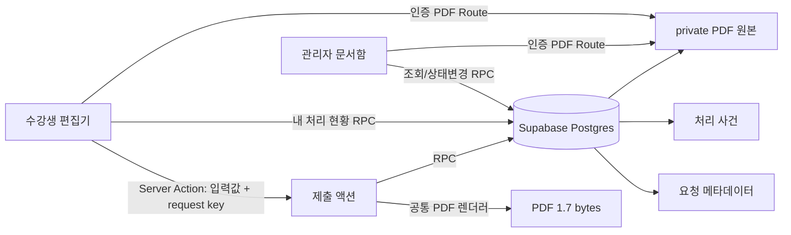

# 수강생 서류 민원 처리 - Design Document

> Version: 1.0.0 | Date: 2026-09-23 | Status: Approved
> Level: Dynamic | Plan: `docs/01-plan/features/anchor-learner-document-workflow.plan.md`

---

## 1. 개요

### 1.1 목적

기존 수강생 서류 편집기와 PDF 1.7 렌더러를 유지하면서, 제출 시점 PDF를 서버에서 다시 생성해 보관하고 수강생·담당자가 동일한 상태 이력을 공유하는 민원형 처리 계층을 추가한다.

### 1.2 설계 목표

- 사용자가 본 다운로드 PDF와 서버에 제출된 PDF가 같은 렌더러·원본 양식을 사용한다.
- 민감정보는 관리자 목록 JSON과 공개 테이블에 저장하지 않는다.
- DB 함수가 소유권, 역할, 조직, MFA, 상태 전환을 최종 검증한다.
- 제출과 처리 결과를 새로 고침 뒤에도 복원하고 모든 상태 변경을 사건으로 남긴다.
- 기존 수강생 서류 탭 전환과 입력값 유지 동작을 보존한다.
- 과정 카탈로그의 `offering_id`와 `tuition`을 서식 선택에 연결해 환불 금액을 사용자가 수정할 수 없는 파생값으로 만든다.

## 2. 아키텍처

### 2.1 구성



### 2.2 컴포넌트

| 영역 | 책임 |
|---|---|
| `learner-documents/editor.tsx` | 세 서식 입력, 클라이언트 PDF 다운로드, 제출 버튼, 결과 안내, 내 처리 현황 |
| `mypage/documents/actions.ts` | 입력 검증, 서버 PDF 재생성, SHA-256 계산, 제출 RPC 호출 |
| `learner-document-workflow/data.ts` | 수강생·관리자 컨텍스트 RPC 호출과 응답 정규화 |
| `admin/learner-documents/page.tsx` | 유형·상태 필터, 목록, 타임라인, 원본 열람, 처리 폼 |
| `admin/learner-documents/actions.ts` | 상태 전환 입력 검증, 처리 RPC, 목록 재검증 |
| `api/learner-documents/[id]/pdf` | 세션 확인, 파일 RPC 호출, no-store PDF 응답 |
| DB migration | 테이블, 제약, 권한, 제출·조회·처리·파일 RPC, 감사 로그 |

### 2.3 제출 데이터 흐름

1. 편집기는 기존 `documentErrors`로 현재 탭의 필수값을 검증한다.
2. 탭별로 생성한 `requestKey`와 전체 입력값을 서버 액션에 보낸다.
3. 서버 액션은 신뢰하지 않은 입력을 다시 검증하고 정규화한다.
4. 서버에서 원본 PDF·한글 글꼴을 읽고 기존 `renderLearnerDocument`로 PDF 1.7을 생성한다.
5. 서버 액션은 PDF base64와 SHA-256, 목록용 최소 메타데이터를 제출 RPC에 전달한다.
6. DB는 사용자-사람 연결, 조직, PDF 헤더·크기, 중복 키를 검증하고 요청·원본·최초 사건을 하나의 트랜잭션으로 기록한다.
7. 편집기는 성공 메시지를 표시하고 서버 컴포넌트를 새로 고쳐 처리 현황을 갱신한다.

### 2.4 환불 금액 계산

과정 선택값이 실제 `life_offerings`와 연결되고 `tuition`이 null이 아닐 때만 계산한다. 수강료를 `T`라고 할 때 반환액은 각 구간에서 원 단위 내림(`floor`)으로 계산하고 공제금액은 `T - 반환액`이다.

| 발생시점 | 반환액 |
|---|---:|
| 수업 시작 전 | `T` |
| 수업 시작일부터 총 수업시간 1/6 전 | `floor(T × 5 / 6)` |
| 총 수업시간 1/6 이상 1/3 미만 | `floor(T × 2 / 3)` |
| 총 수업시간 1/3 이상 1/2 미만 | `floor(T × 1 / 2)` |
| 총 수업시간 1/2 이상 | `0` |

과정 수강료가 null이면 세 금액은 빈 문자열을 유지하고 제출을 차단한다. 0원은 확인된 무료 과정이므로 세 금액을 `0`으로 표시한다. 환불 PDF에서는 상단 신청날짜 영역을 비우고 하단 작성일만 사용하며, `음영처리된 곳만 표기하시기 바랍니다` 문구는 흰색 마스킹으로 제거한다.

### 2.5 처리 데이터 흐름

1. 관리자 문서함은 MFA가 확인된 담당 조직의 요청만 RPC로 받는다.
2. 담당자가 다음 상태와 수강생 공개 메모를 제출한다.
3. DB는 최근 MFA, 역할, 현재 revision, 허용 상태 전환을 검증한다.
4. 요청 행 갱신, 처리 사건 추가, 감사 로그 기록을 한 트랜잭션에서 수행한다.
5. 수강생 화면에는 다음 조회부터 동일한 사건과 최신 안내가 표시된다.

## 3. 데이터 모델

필드·관계·인덱스의 상세 정의는 `docs/01-plan/features/anchor-learner-document-workflow.schema.md`를 따른다.

### 3.1 공개 메타데이터와 비공개 원본 분리

- `public.life_learner_document_requests`: 검색·업무 처리용 최소 메타데이터
- `public.life_learner_document_events`: 수강생에게 공개할 처리 타임라인
- `life_private.learner_document_files`: PDF bytea, 해시, 크기

테이블은 RLS를 활성화하되 일반 SELECT/INSERT/UPDATE 권한은 부여하지 않는다. 모든 접근은 `SECURITY DEFINER` 함수와 public wrapper RPC를 경유한다.

### 3.2 상태 전환

| 현재 | 허용 다음 상태 | 행위자 |
|---|---|---|
| 없음 | RECEIVED | 수강생 제출 |
| RECEIVED | REVIEWING, APPROVED, REJECTED | 관리자 |
| REVIEWING | APPROVED, REJECTED | 관리자 |
| APPROVED | COMPLETED | 관리자 |
| RECEIVED | CANCELLED | 제출자 |
| REJECTED, COMPLETED, CANCELLED | 없음 | - |

반려 메모는 필수다. 나머지 관리자 상태 변경도 처리 내용을 수강생이 알 수 있도록 안내 메모를 필수로 받는다.

## 4. API와 RPC

### 4.1 서버 액션

#### `submitLearnerDocument(input)`

입력:

```ts
{
  type: "application" | "scholarship" | "refund";
  requestKey: string;
  offeringId?: string;
  values: LearnerDocumentValues;
}
```

응답:

```ts
{ ok: true; requestId: string; message: string }
| { ok: false; message: string; fieldErrors?: Record<string, string> }
```

#### `updateLearnerDocumentStatus(formData)`

`requestId`, `revision`, `nextStatus`, `note`, 현재 필터를 받고 성공·오류 알림으로 관리자 페이지에 redirect한다.

### 4.2 공개 RPC

| RPC | 대상 | 설명 |
|---|---|---|
| `life_submit_learner_document` | authenticated learner | 멱등 제출과 PDF 원본 저장 |
| `life_my_learner_documents` | authenticated learner | 본인 요청과 사건 조회 |
| `life_cancel_learner_document` | owner | 검토 전 취소 |
| `life_admin_learner_documents` | authorized staff + MFA | 조직 범위 관리자 문서함 |
| `life_decide_learner_document` | authorized staff + recent MFA | 상태 전환과 사건 기록 |
| `life_learner_document_file` | owner or authorized staff + MFA | PDF base64·파일명 반환 |

모든 public RPC는 같은 이름의 `life_private` 구현을 호출하는 얇은 wrapper이며 `authenticated`에만 실행 권한을 준다.

### 4.3 PDF 다운로드 HTTP

`GET /api/learner-documents/:id/pdf`

- 성공: `application/pdf`, UTF-8 파일명, `Cache-Control: private, no-store`
- 미인증: 401
- 권한 없음/없는 문서: 404 또는 403을 일반 메시지로 반환
- 응답 본문은 DB에서 읽은 제출 당시 PDF 원본

## 5. UI 설계

### 5.1 수강생 서류 편집기

- 기존 세 탭과 좌측 입력·우측 PDF 미리보기 배치를 유지한다.
- 우측 하단에 `작성한 PDF 다운로드`와 서식별 제출 버튼을 나란히 배치한다.
- 수강신청원서: `입력완료`
- 장학금 지급신청서·수강료 환불신청서: `신청처리`
- 제출 중 중복 클릭을 막고 성공 뒤 동일 입력 재제출 버튼을 비활성화한다.
- 상단 탭 아래에 `내 서류 처리 현황`을 표시한다. 각 항목은 문서 종류, 과정명, 현재 상태, 접수일, 최신 안내와 시간순 사건을 포함한다.
- 제출 성공 뒤 현황을 새로 고치며 PDF 다운로드는 계속 가능하다.
- 장학금·환불 은행명은 금융결제원 금융회사 코드 범위에 맞춘 국내 은행·상호금융·우체국·저축은행 드롭다운으로 제공한다.
- 환불 수강료·공제금액·반환액은 읽기 전용이며 선택한 과정과 발생시점이 바뀔 때 즉시 갱신한다.

### 5.2 관리자 문서함

- 새 메뉴 `수강생 서류`를 관리자 내비게이션에 추가한다.
- 문서 종류·상태 필터와 처리 건수 요약을 제공한다.
- 각 요청은 신청자, 과정, 접수 시각, 금액, 현재 상태, 최신 안내, 처리 이력을 보여준다.
- 원본 PDF는 인증 API route로 새 탭에서 연다.
- 현재 상태에서 허용되는 다음 상태만 선택할 수 있으며 안내 메모와 revision을 제출한다.

## 6. 구현 파일

```text
supabase/migrations/*_anchor_learner_document_workflow.sql
src/lib/learner-document-workflow/types.ts
src/lib/learner-document-workflow/data.ts
src/app/mypage/documents/actions.ts
src/app/mypage/documents/page.tsx
src/components/learner-documents/editor.tsx
src/app/admin/learner-documents/actions.ts
src/app/admin/learner-documents/page.tsx
src/app/api/learner-documents/[id]/pdf/route.ts
src/lib/auth/workspace-navigation.ts
src/app/admin/page.tsx
scripts/verify-learner-document-workflow.mjs
```

구현 순서는 DB 스키마·RPC, TypeScript 타입·조회 계층, 수강생 제출, 관리자 처리, PDF 다운로드, 내비게이션, 자동 검증 순이다.

## 7. 검증 계획

### 7.1 정적·빌드

- TypeScript `tsc --noEmit`
- 변경 파일 ESLint
- Next.js production build
- 기존 `verify-learner-documents.mjs`로 세 PDF 1.7 회귀 검증

### 7.2 DB 통합

- 제출 RPC가 요청·PDF·최초 사건을 원자적으로 만든다.
- 동일 request key 재호출이 같은 request id를 반환한다.
- 다른 수강생의 목록과 PDF 접근이 거부된다.
- 권한/MFA 없는 관리자의 목록·처리가 거부된다.
- 허용 상태 전환이 성공하고 사건·revision·감사 로그가 갱신된다.
- 반려 메모 누락, 오래된 revision, 잘못된 전환이 거부된다.

### 7.3 브라우저

- 수강생이 각 서식에서 다운로드와 제출을 독립적으로 실행한다.
- 제출 성공, 버튼 비활성화, 처리 현황 갱신을 확인한다.
- 관리자 문서함에서 PDF를 열고 상태를 처리한다.
- 수강생 화면에서 관리자 안내와 타임라인을 확인한다.
- 데스크톱과 좁은 화면에서 편집기·목록 레이아웃이 깨지지 않는다.

## 8. 보안과 운영

- 서버 액션과 DB 양쪽에서 입력 길이·형식·문서 유형을 검증한다.
- 관리자 조회에는 MFA verified, 상태 변경에는 recent MFA를 요구한다.
- `search_path`를 고정한 SECURITY DEFINER 함수를 사용한다.
- PDF base64를 로그·오류 메시지·감사 JSON에 포함하지 않는다.
- API 다운로드는 `no-store`, `nosniff`, inline disposition을 사용한다.
- 전화번호는 공개 메타데이터에 마스킹해 저장한다.
- PDF는 최대 5 MiB이며 `%PDF-1.7` 헤더와 SHA-256 형식을 검증한다.
- 사용자 안내 메모는 텍스트로만 렌더링해 HTML 주입을 막는다.
