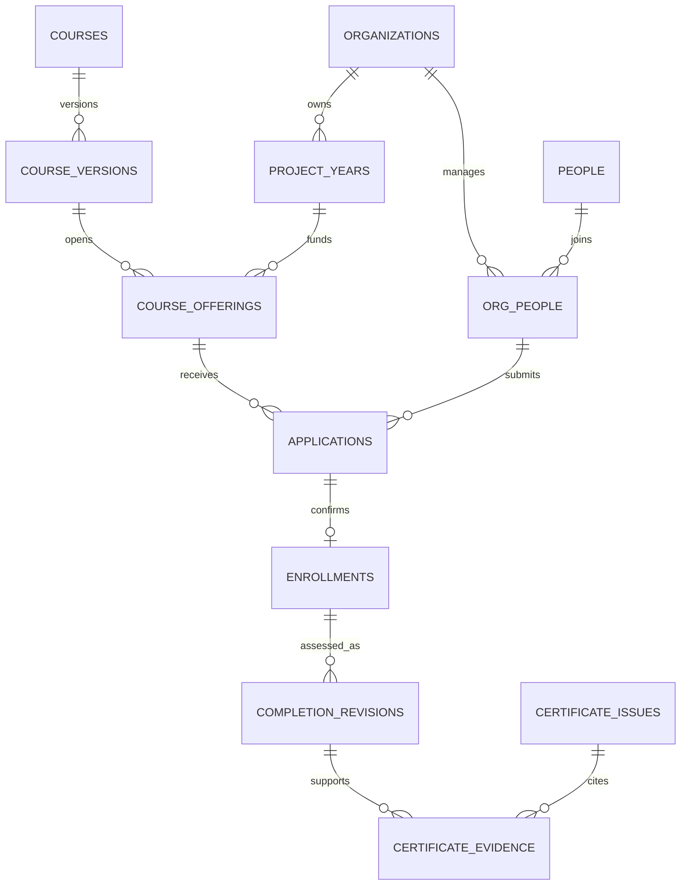
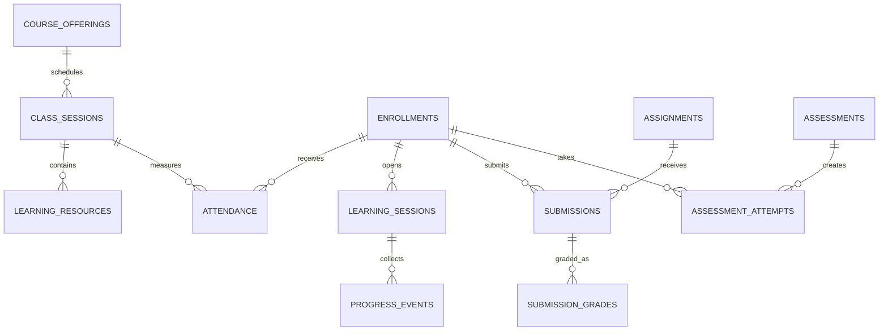

# 앵커사업 플랫폼 DB 상세명세

버전 1.0 · 2026-09-18 · 상위 기준: [상세설계](/Users/thomas/Documents/uc-life/docs/02-design/features/anchor-lifelong-education-platform.design.md)

이 문서는 구현할 논리 모델과 핵심 컬럼·제약의 명세다. 실행 가능한 SQL이나 실제 DB 반영 결과가 아니다. 기존 테이블은 이관 매핑 후 단계적으로 전환한다.

## 1. 공통 데이터 규칙

기본 PK는 `id uuid`다. 업무 테이블은 `org_id uuid`, `created_at timestamptz`, 필요한 경우 `created_by uuid`, `updated_at timestamptz`, `version integer`를 가진다. 기관 소유 자료는 `org_id`를 필수로 하고 클라이언트가 보낸 값을 검증 없이 저장하지 않는다. 조직이 다른 FK 연결을 막기 위해 `(org_id,id)` 유일키와 복합 FK 또는 동등한 DB 제약을 사용한다.

금액은 원 단위 `bigint`와 음수·잔액 검증, 시간은 실제 분 `numeric(9,2)` 또는 이벤트 초 `integer`, 비율은 `numeric(5,2)` 0~100, 날짜는 `date`, 시각은 `timestamptz`로 구분한다. 프론트에 매우 큰 bigint를 전달할 때 JSON 문자열 직렬화 규칙을 고정한다. 화면은 Asia/Seoul 기준이며 사업연도는 명시한 시작·종료일을 사용한다.

아래 주요 필드는 기본 필수이며 `?`는 조건부/선택값이다. 서버 생성·계산 값도 필수 필드에 포함된다. 문서에 없는 임의 필드 저장을 허용하지 않고, 화면에서 작성 가능한 필드는 별도 DTO 허용목록으로 제한한다. 상태 코드는 상세설계의 상태표를 따르며 자유문자 입력으로 생성하지 않는다.

스키마 경계 제안: 업무 데이터 `app`, 개인정보·지급·정답 `private`, 외부 공개용 제한 조회 `api`, 집계 `reporting`. 명칭 자체가 보안을 보장하지 않으므로 exposed schema 설정, GRANT, RLS, 함수·뷰 실행권한을 함께 관리한다. 외부 브라우저의 업무 테이블 직접 쓰기는 기본 차단하고 허용된 서버 명령을 통한다.

## 2. 핵심 관계

사람의 내부 식별자는 계정과 분리한다. 하나의 사람에게 여러 기관 관계가 있어도 학습·상담·재무 데이터는 소유기관별로 분리된다. 글로벌 사람 ID를 안다는 이유로 다른 기관 이력을 열람하거나 전화번호만으로 사람을 합칠 수 없다.

## 3. 기관·인물·권한·정책

| 테이블 | 주요 필드와 타입 | 관계·제약·공개 범위 |
|---|---|---|
| organizations | name text, legal_name text, status code | 법적 운영주체 정보. 단위 사업단과 법인 관계 구분 |
| projects | org_id uuid, code text, name text | 기관+과제코드 유일 |
| project_years | project_id uuid, year_no int, starts_on date, ends_on date | 시작≤종료, 과제+연차 유일; 달력연도와 별개 |
| academies | org_id uuid, code text, name text, active bool | 4개 아카데미 초기값, 이력 있는 코드 삭제 대신 비활성화 |
| people | id uuid, created_at timestamptz, erased_at? timestamptz | 로그인·개인정보와 분리된 내부 식별자. 인증삭제 연쇄삭제 없음 |
| auth_links | person_id uuid, auth_user_id? uuid, revoked_at? timestamptz | 유효 auth_user_id 유일, auth.users 삭제 시 링크 해제; 검증된 계정 연결만 허용 |
| org_people | org_id uuid, person_id uuid, name text, status code | 기관+사람 유일; 이름 정정 이력. 다른 기관의 프로필 자동 공개 금지 |
| contact_points | org_id uuid, person_id uuid, type code, encrypted_value bytea, verified_at? timestamptz | 목적·권한 제한, 화면 마스킹, 중복 검색 시 별도 키·범위 제한 |
| role_assignments | person_id uuid, org_id uuid, role_code code, scope_type code, scope_id? uuid, valid_from timestamptz, valid_to? timestamptz | 수강생 자기 부여 금지. 교차기관 scope 금지, 승인자·회수자 기록 |
| permission_grants | role_assignment_id uuid, permission_code code | 세부 승인·계좌열람·반출 권한. 시스템 운영과 업무 열람 분리 |
| instructor_profiles | person_id uuid, public_bio? text, specialty text, review_status code | 공개 프로필과 검증상태 분리; 검증상태는 본인 수정 불가 |
| instructor_credentials | instructor_id uuid, type code, description text, file_id? uuid, verified_by? uuid, verified_at? timestamptz | 자기신고와 확인 경력 구분, 검증자료 비공개 |
| appointments | instructor_id uuid, starts_on date, ends_on date, status code, contract_file_id? uuid | 기관 위촉, 유효기간, 전결·승인 이력 |
| policy_versions | kind code, version_no int, body jsonb, status code, approved_by? uuid, effective_from? timestamptz | 수료·환불·선발·강사료·개인정보 정책; 승인본은 불변 |

주민등록번호는 org_people나 회원가입 공통 컬럼으로 두지 않는다. 실제 세무처리에 법적 근거가 확인된 경우에만 별도 제한 데이터 영역과 처리목적을 설계한다. 학력·건강·취약계층 증빙도 요구되는 업무에서만 보유한다.

## 4. 교육 원본·기수·신청

| 테이블 | 주요 필드와 타입 | 관계·제약 |
|---|---|---|
| courses | academy_id uuid, code text, title text, active bool | 기관+과정코드 유일. 일정·수료결과는 저장하지 않음 |
| course_versions | course_id uuid, version_no int, title text, objectives jsonb, audience text, change_type code, change_reason? text, completion_policy_id uuid, status code | 과정+버전 유일. 승인 이후 내용 불변. 승인자·일시 기록 |
| modules | code text, title text, competency_tags jsonb | 역량 분류, 학점 자동 인정 의미 없음 |
| version_modules | course_version_id uuid, module_id uuid, sequence int, planned_minutes numeric | 승인 버전별 모듈 구성 |
| learning_tracks, track_modules | track_id uuid, module_id uuid, sequence int, prerequisite? jsonb | 모듈 누적·선수조건; 이수사실과 대학 승인학점 분리 |
| course_offerings | course_version_id uuid, project_year_id uuid, cohort_name text, delivery_mode code, capacity int, min_open_count? int, application_start/end timestamptz, course_start/end timestamptz, selection_policy_id uuid, refund_policy_id uuid, tuition_krw bigint, status code | 정원>0, 시간순서 검증, 승인 정책 필수. 실제 기수 단위 |
| offering_instructors | offering_id uuid, instructor_id uuid, role code, valid_from/to timestamptz | 담당 기수 접근 범위, 위촉상태 확인, 실제시수는 별도 |
| venues, equipment, resource_reservations | resource_id uuid, offering_id uuid, starts_at/ends_at timestamptz, status code | 시설·장비 중복 예약 검사, 승인 예외 기록 |
| applications | offering_id uuid, person_id uuid, attempt_no int, answers jsonb, status code, submitted_at? timestamptz, policy_snapshot jsonb | 활성 신청의 기관+기수+사람 중복 차단. 과거 취소·재신청 보존 |
| application_files | application_id uuid, file_id uuid, requirement_code code | 동일 기관·신청자 소유·필요 문서만 연결 |
| application_events | application_id uuid, from_status? code, to_status code, reason? text, actor_id uuid, at timestamptz | 서버가 기록, 일반 사용자 덮어쓰기·삭제 불가 |
| seat_reservations | application_id uuid, offering_id uuid, status code, expires_at? timestamptz | 기수 잠금 하에서 HELD+CONFIRMED≤capacity, 신청당 유효좌석 1개 |
| waitlist_entries | application_id uuid, offering_id uuid, queue_no bigint, status code | 기수+순번 유일; 서버 접수 기준, 수동변경 승인 |
| enrollments | offering_id uuid, person_id uuid, application_id uuid, status code, confirmed_at timestamptz | 기관+기수+사람 유일. 취소 후 복귀는 상태 이벤트. 같은 기수 신청만 FK 연결 |

신청 answers JSON은 해당 버전의 허용 질문·타입으로 검증한다. 개인정보 정책과 무관한 자유항목 추가를 금지한다. course_offerings에는 선택된 정책의 참조와 필요한 고정 사본을 보존하여 나중에 정책 변경으로 기존 계약조건이 바뀌지 않게 한다.

## 5. 내부 LMS·수료·강의실적

| 테이블 | 주요 필드와 타입 | 관계·제약 |
|---|---|---|
| class_sessions | offering_id uuid, sequence int, title text, mode code, scheduled_at? timestamptz, planned_minutes numeric, status code, replaces_session_id? uuid | 차시 취소·대체 명시. 자기대체·다른 기수 대체 금지 |
| learning_resources | session_id uuid, offering_id uuid, type code, title text, file_id? uuid, provider_ref? text, duration_seconds? int, available_from/to? timestamptz, status code, revision int | 영상·자료·링크, 유형별 파일 또는 공급자 참조 필수 |
| learning_sessions | enrollment_id uuid, resource_id uuid, started_at timestamptz, expires_at timestamptz, closed_at? timestamptz | 수강생·기수·차시 일치. 활성 세션 정책 적용 |
| progress_events | learning_session_id uuid, sequence bigint, start_second/end_second int, received_at timestamptz, validation_status code | 세션+sequence 유일, 구간 범위·시간 경과 검증. 최소 보존기간 적용 |
| learning_progress | enrollment_id uuid, resource_id uuid, resource_revision int, accepted_ranges jsonb, accepted_seconds int, updated_at timestamptz | 등록+자료+revision 유일. 검증된 구간 합집합, 전체길이 초과 금지 |
| attendance | enrollment_id uuid, session_id uuid, offering_id uuid, status code, recognized_minutes numeric, source code, confirmed_by? uuid | 등록+차시 유일. 기수 복합 FK 일치, 확정시간 상한·수정 권한 |
| attendance_revisions | attendance_id uuid, revision int, before/after jsonb, reason text, actor_id uuid, approved_by? uuid | 변경 근거 최소기록, 공결 자료 비공개 |
| assignments | offering_id uuid, session_id? uuid, title text, instructions text, due_at timestamptz, max_score numeric, rubric jsonb, late_policy code, revision int | 배점≥0, 공개기간·마감 검증 |
| submissions | assignment_id uuid, enrollment_id uuid, offering_id uuid, revision int, answer_text? text, submitted_at? timestamptz, status code | 과제+등록+revision 유일. 자기 제출만, score 컬럼 없음 |
| submission_files | submission_id uuid, file_id uuid | 같은 제출자·기관, 검사완료 파일만 연결 |
| submission_grades | submission_id uuid, grader_id uuid, score numeric, feedback? text, published_at? timestamptz, revision int | 강사·승인자만 쓰기. 0≤score≤max_score. 이력 보존 |
| assessments | offering_id uuid, title text, available_from/to timestamptz, time_limit_seconds? int, max_attempts int, selection_rule code, score_rule code, reveal_at? timestamptz | 시험·퀴즈 정책, 재응시·최고/최종점 기준 |
| question_versions | type code, prompt jsonb, choices? jsonb, answer_key jsonb, rubric? jsonb, revision int | 비공개 문항·정답 영역. 문항 조회는 허용 필드만 투영 |
| assessment_questions | assessment_id uuid, question_version_id uuid, points numeric, sequence int | 버전·배점 고정, 문항 유일성 검증 |
| assessment_attempts | assessment_id uuid, enrollment_id uuid, attempt_no int, started_at timestamptz, deadline_at timestamptz, submitted_at? timestamptz, status code | 등록+평가+시도번호 유일, 동시 활성시도 제한. 점수는 별도 |
| attempt_items | attempt_id uuid, question_version_id uuid, sequence int, points numeric, prompt_snapshot jsonb | 출제한 문제만 접근. prompt_snapshot에 정답·해설 포함 금지 |
| attempt_answers | attempt_item_id uuid, answer jsonb, saved_at timestamptz, revision int | 본인+유효시각. 제출 후 수정 차단 |
| attempt_grades | attempt_item_id uuid, score numeric, grader_id? uuid, grading_version text, published_at? timestamptz | 서버/담당강사 쓰기 전용, 배점 범위 검사 |
| class_notices, class_questions, class_answers | offering_id uuid, author_id uuid, body text, visibility code, published_at? timestamptz | 질문 본인/담당강사/명시 공개 범위. 첨부 권한 별도 |
| completion_runs | offering_id uuid, policy_version_id uuid, input_revision jsonb, requested_by uuid, created_at timestamptz | 판정 batch, 원자료 시점·정책 보존 |
| completion_revisions | enrollment_id uuid, run_id uuid, revision int, decision code, evidence_snapshot jsonb, confirmed_by? uuid, confirmed_at? timestamptz | 등록+revision 유일. 유효 확정본 1개, 근거 누락은 확인필요 |
| teaching_logs | instructor_id uuid, offering_id uuid, session_id uuid, taught_at timestamptz, actual_minutes numeric, content text, status code, approved_by? uuid | 실제 수행시간·역할. 강사 자기 확정 금지, 충돌·중복 검토 |

이관 기록은 실제 차시·점수 자료가 없으면 허위 차시·성적을 생성하지 않는다. 별도 승인된 legacy evidence를 수료근거로 연결하고 출처·확인자를 기록한다. 명확한 근거 없는 과거 기록은 확인필요 상태로 보존한다.

## 6. 재무·증명

| 테이블 | 주요 필드와 타입 | 관계·제약 |
|---|---|---|
| invoices | application_id uuid, offering_id uuid, person_id uuid, currency code, due_amount_krw bigint, due_at? timestamptz, status code | 청구 원장, 무료·감면 근거 연결 |
| invoice_adjustments | invoice_id uuid, type code, amount_krw bigint, reason text, policy_version_id uuid, approved_by uuid | 감면·credit note·추가청구 구분, 원래 청구 덮어쓰기 금지 |
| payments | received_amount_krw bigint, received_at timestamptz, provider code, external_tx_id text, status code, verified_by? uuid | 기관+공급자+원거래 유일. 양수 입금만, 무료확정은 입금으로 생성 안 함 |
| payment_allocations | payment_id uuid, invoice_id uuid, amount_krw bigint, allocated_at timestamptz | 양수, 같은 기관·통화, 배분 합계≤가용입금; 해제·정정 이벤트 보존 |
| refunds | invoice_id uuid, requested_by uuid, reason text, requested_at timestamptz, policy_version_id uuid, calculated_krw bigint, approved_krw? bigint, status code, approved_by? uuid, external_ref? text | 요청과 승인·송금 구분, 승인/처리 중 예약액도 환불가능액에서 제외 |
| refund_allocations | refund_id uuid, payment_allocation_id uuid, amount_krw bigint | 원입금 배분별 환불한도, 합계가 환불액과 일치 |
| payout_accounts | person_id uuid, encrypted_account bytea, bank_code code, verified_at? timestamptz | 지급 업무 전용, 계좌 변경 후 재확인, 키 분리 |
| instructor_payouts | instructor_id uuid, period_start/end date, policy_version_id uuid, confirmed_log_refs jsonb, gross_krw bigint, withholding_krw bigint, net_krw bigint, status code | 실제 실적·회계 확정 분류를 근거로 계산. 임의 고정세율 금지 |
| certificate_templates | type code, version_no int, template_file_id uuid, approved_by uuid | 이수·수강·강의경력별 승인 서식 |
| issuer_authorizations | issuer_org_id uuid, title text, name text, seal_file_id uuid, valid_from/to timestamptz, delegated_permissions jsonb | 발급권·직인 유효기간, 과거 발급 스냅샷과 분리 |
| certificate_requests | subject_person_id uuid, certificate_type code, requested_by uuid, status code, approved_by? uuid, approved_at? timestamptz | 본인 요청 또는 인가 담당자 요청, 정정 사유 연결 |
| certificate_issues | request_id uuid, certificate_no text, template_id uuid, issuer_authorization_id uuid, issued_snapshot jsonb, file_id? uuid, file_sha256? text, verification_token_hash text, status code, issued_at? timestamptz, supersedes_id? uuid | 기관+종류+번호 유일, 토큰 원문 공개 로그 금지, ISSUED에는 완성 파일·해시 필수 |
| certificate_evidence | certificate_issue_id uuid, completion_revision_id? uuid, teaching_log_id? uuid | 둘 중 하나만 지정; 같은 기관·사람의 확정 근거. 여러 강의일지 연결 가능 |
| certificate_counters | org_id uuid, type code, year int, next_no bigint | 잠금 하에 증가, COUNT+1 금지 |
| badge_definitions, badge_awards | definition_id uuid, person_id uuid, completion_revision_id uuid, provider_ref? text, criteria_version int, visibility code, status code | 기준·근거·실제 발급 연결. 이미지가 있다는 이유로 표준 인증 완료로 표시하지 않음 |

인증·수강·과정 레코드의 삭제에 `ON DELETE CASCADE`를 일괄 적용하지 않는다. 확정 재무·증명·수료 근거는 보존 근거 검토 없이 삭제되지 않도록 RESTRICT 또는 검증된 파기 절차를 사용한다. 수정 불가 원장도 보유기간이 끝나면 승인된 파기 대상이 될 수 있다.

## 7. 지원·평가·공식 지표

| 테이블 | 주요 필드·관계 | 제약 |
|---|---|---|
| support_programs, support_applications, scholarship_awards | 프로그램 버전·신청자·연차·대상기수·증빙·심사·지급 | 장학·시험지원·학습지원 구분, 중복지원 기준 |
| counseling_cases, counseling_sessions | 담당자·대상·예약·원문·이용자 공개요약·후속일 | 상담원문 별도권한, 제한 기간 |
| qualification_records | 자격종류·취득일·확인상태·증빙 | 자가신고와 검증 구분 |
| outcome_followups | 대상자·기수·관측일·조사차수·상태·응답 여부·증빙 | 미응답/미확인과 미취업 구분, 덮어쓰기 대신 시계열 |
| credit_recognition_requests, credit_reviews | 대상자·대학·모듈·신청학점·인정학점·심사결과·근거 | 기관의 승인권자만 확정, 성적/학위 자동생성 금지 |
| survey_rounds, survey_participation, survey_responses | 문항버전·대상기수·참여확인·응답 | 강사 조회에서 응답자 연결 제거, 진정 익명 여부를 정확히 고지 |
| course_reviews, improvement_actions | 과정/기수/연차·검토결과·유지/개편/통합/폐지·담당·기한 | 다음 버전 반영 여부 추적 |
| metric_definitions | code text, version int, population jsonb, numerator_rule jsonb, denominator_rule jsonb, dedup_rule jsonb, approved_by? uuid | 미승인 정의는 공식집계 확정 불가 |
| metric_targets, metric_observations | 정의버전·연차·기준값·목표·분자·분모·출처·기준일·검토자 | 회원수·실인원·수강건수 분리, 분모 0/미확인은 값 없음으로 표시 |
| report_snapshots | org_id uuid, project_year_id uuid, definitions jsonb, results jsonb, evidence_refs jsonb, confirmed_by uuid, revision int | 확정본 불변, 사후정정은 새 revision |
| partner_agreements, sharing_grants | 기관간 관계·목적·과정·정보종류·근거·기간 | 협약 자체를 포괄 개인정보 제공 근거로 사용하지 않음 |
| clubs, club_memberships, club_activities | 동아리·가입·활동·지원 연차 | 명단 공개는 별도 설정, 활동과 공식 성과 산입 기준 구분 |

공식 지표에는 제시된 사업연도 2026-03~2027-02와 실제 승인된 집계 기준일을 저장한다. 지원지수 산식 불일치는 D06으로 관리하고 임의 산식 교체로 해결하지 않는다. 성과는 자격·취업·지원서비스의 확인 가능한 원자료에서 산출하며 보고 스냅샷과 집계 쿼리 버전을 함께 남긴다.

## 8. 개인정보·파일·감사·비동기

| 테이블 | 주요 필드·관계 | 제약 |
|---|---|---|
| processing_purposes | 목적코드·항목·법적근거·대상·담당·retention_rule_id | 개인정보 처리대장의 원본, 승인 전 수집 금지 |
| consent_versions | 목적·문안버전·항목·기간·거부 영향·게시일·사본 | 공개한 문안 불변 |
| consent_events | person_id·org_id·purpose_id·consent_version_id·선택/철회·시각·채널 | 사용자 행동 근거, 사전 체크·미응답=동의 처리 금지 |
| sharing_records | 목적·근거·제공기관·대상·항목·일시·담당·외부요청 ID | 최소 필요 기록, 후속 정정·삭제 통지 추적 |
| retention_rules | 목적·자료종류·기간값·단위·기산점·근거·승인자 | 미확정 기간을 영구보관으로 해석하지 않음 |
| privacy_requests, erasure_jobs | 권리요청·본인확인·처리범위·보존/삭제 결정·기한·결과 | DB·파일·연계처·백업순환 결과 확인, 보류 근거·종료일 |
| file_objects | org_id·owner_person_id·bucket·object_key·hash·size·mime·scan_status·purpose·retention_rule_id | 공개URL 저장 대신 객체키; 업무 객체 접근권한 별도 검사 |
| audit_events | actor·기관·행위·대상·사유·시각·request_id·최소 변경 요약 | 서버 작성, actor 위조 차단, 값 전체·토큰·비밀정보 로깅 금지 |
| message_templates, message_jobs, message_deliveries | 운영/홍보·템플릿버전·대상필터·예약·수신자·시도·공급자 ID·결과 | 발송 전 동의 재확인, 중복키·과금·실패 추적 |
| outbox_jobs | 기관·type·entity_id·payload_version·state·attempts·next_attempt_at·lease_until·idempotency_key | DB commit과 함께 등록, 점유 만료·재시도, 최소 개인정보 payload |
| idempotency_records | 기관·actor·operation·key·request_hash·response_ref·expires_at | 동일 key 다른 요청 409, 업무 유일제약도 별도 적용 |
| notices, inquiries, demand_surveys | 공지·문의·과정/기업수요·답변·공개상태 | 문의 기본 비공개, 출처·담당·보유기간 |
| import_batches, import_rows, legacy_links | 출처파일 해시·행번호·기존키·신규키·검토자·처리상태 | 원본 대조·재실행 중복방지, 임시 개인정보 파기 |

검증 토큰은 충분한 엔트로피의 난수로 발급하고 DB에는 안전한 해시를 보관한다. 개인 식별자를 토큰으로 쓰지 않는다. 대외 검증 화면은 토큰을 접근 근거로 최소정보만 조회하며, 토큰 유출 시 회수·재발급 경로를 둔다. 내부 로그·리퍼러에 토큰이 남지 않도록 별도 처리한다.

## 9. 필수 제약·인덱스·트랜잭션

1. 등록·차시·과제·응시·지급배분은 동일 기관·기수/통화를 함께 검사한다. UUID라는 이유만으로 유효한 연결로 인정하지 않는다.
2. 본인 UPDATE가 가능해도 role, is_approved, score, completion, amount, issuer, org_id 등은 변경할 수 없게 한다. 읽기뷰·컬럼권한·업무 RPC와 별도 테이블로 강제한다.
3. 좌석 확정·대기승급·만료는 기수 row lock, 입금배분·환불예약은 거래/청구 row lock을 사용한다. 잠금순서를 정하고 충돌 시 제한 재시도한다.
4. 수료확정은 입력 revision 확인, 증명발급은 승인·카운터·원장·outbox 생성을 원자적으로 수행한다. 외부 PDF·송금·문자 호출을 DB 트랜잭션 안에 두지 않는다.
5. 외부 callback과 재처리에는 공급자 이벤트 ID unique 및 상태전이 검사를 적용한다. 실패 응답과 결과 미확인은 서로 다른 상태다.
6. 초기 인덱스: 기수 `(org_id,project_year_id,status)`, 신청 `(org_id,offering_id,status,submitted_at)`, 수강 `(org_id,person_id,confirmed_at)`, 출결 `(enrollment_id,session_id)`, 역할 `(person_id,org_id,valid_to)`, outbox `(state,next_attempt_at)`, 파일 `(org_id,owner_person_id)`. 운영자료량에 맞춰 실행계획으로 검증한다.
7. 증명·재무·지원금이 각각 여러 건인 학습이력 조인에서 행이 곱해지지 않게 영역별 먼저 집계한다. 증명 재발급 횟수를 수료자 수에 더하지 않는다.
8. 데이터 파기는 보존근거·기한을 확인한 전용 작업으로 수행하며 개인정보 없는 집계 유지와 원자료 보존을 구분한다. soft delete는 접근제한 단계이며 실제 파기 완료가 아니다.

## 10. 기존 DB 이관 매핑

| 기존 | 목표 | 처리 방법 |
|---|---|---|
| auth.users + user_profiles | people + auth_links + org_people + role_assignments | 실제 신원·권한 승인 대조; 사용자 metadata의 관리자 요청 승계 금지 |
| instructor_profiles | instructor_profiles + credentials + appointments + payout_accounts | 공개이력·심사·계좌·지급등급 분리 |
| courses | courses + course_versions + course_offerings | 각 기존 강좌를 최소 1기수로 연결. 동일명 과정 자동병합 금지 |
| course_instructors | offering_instructors | 기수별 배정으로 이동, 배정시간을 실제실적으로 승계하지 않음 |
| course_enrollments | applications + enrollments + completion_revisions | 혼합상태를 분해, 수료 증빙 확인, 기존키 보존 |
| payments | invoices + payments + allocations + adjustments/refunds | 실제거래 확인; 기존 기본 COMPLETED 값을 입금증거로 간주하지 않음 |
| lms_lectures/attendance | class_sessions + learning_resources + attendance | 기수·차시 연결·누락·중복 검토 |
| lms_assignments/submissions | assignments + submissions + submission_grades | 제출자와 채점자 권한 분리, 기존 점수 출처 확인 |
| course_evaluations | survey 구조 | 기존 식별 연결이 있으면 익명 데이터라고 설명하지 않음 |
| certificates | requests + issues + evidence | 발급원본·번호·직인·근거·취소상태 대조, 삭제연쇄 차단 |
| badge_classes/assertions | badge_definitions/awards | 실제 발급인지 샘플인지 확인, 기존 표준정보 보존 후 변환 검증 |
| scholarships/disbursements | support_programs/applications/awards | 신청·선정·실지급 분리 |
| 010의 역할별 view | 범위 제한 조회 및 reporting | 공개 GRANT·RLS·호출자 권한·기관 범위 검증 후 대체 |

이관 순서: 실제 적용 스키마·권한·원자료 확인 → 백업·복구 연습 → 신규 구조 추가 → 제한된 staging에 매핑·검증 → 건수·금액·수료·증명 대조 → 읽기 전환 → 쓰기 전환 → 관찰기간 → 보존기간이 끝난 임시자료 정리. 전환 시 짧은 쓰기 중단 또는 명시적 동기화 경로를 택해 누락을 방지한다. 잘못된 이관 시 롤백할 기준점과 책임자를 정하며, 이미 외부 발급·송금된 작업은 DB 롤백만으로 취소됐다고 보지 않는다.

검증자료: 기관·연차·기수별 건수, 수납/배분/환불/잔액 합계, 수료자·증명 원본 대조, 권한별 허용/거부, 레거시 링크, 개인정보 동의 근거, 파일 접근·파기 목록. 생성한 화면이 있다는 사실만으로 이관·연동 완료로 판단하지 않는다.
