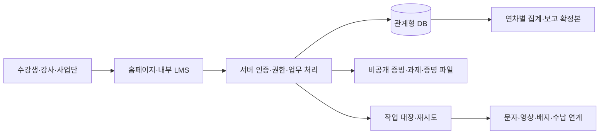

# 앵커사업 평생직업교육 플랫폼 상세설계

버전 1.1 · 작성일 2026-09-18 · 구현 주석 2026-09-19 · PDCA Design · 운영기관 검토용 설계안

## 1. 설계 기준과 문서 구성

기준은 [기획안](/Users/thomas/Documents/uc-life/docs/01-plan/features/anchor-lifelong-education-platform.plan.md)이다. 사용자가 선택한 **홈페이지 내 기본 LMS**를 1차 구축에 포함한다. 본 문서는 구현 명세이며 구현·배포 완료 보고가 아니다.

- [화면 상세명세](/Users/thomas/Documents/uc-life/docs/02-design/features/anchor-lifelong-education-platform.screens.md): 메뉴·경로, 입력, 버튼, 검증, 화면 상태.
- [DB 상세명세](/Users/thomas/Documents/uc-life/docs/02-design/features/anchor-lifelong-education-platform.data.md): 관계, 주요 필드, 제약, 보존·이관 기준.
- 이 문서: 권한, 상태전이, LMS 규칙, API, 보안, 구현 순서, 인수 기준.

서로 다른 의미의 ‘과정’을 구분한다. 과정 원본은 교육상품의 정체성, 과정 버전은 승인된 교육내용·평가기준, 개설 기수는 특정 연차·기간·교육장·강사로 실제 운영하는 단위다. 모든 신청·출결·수료는 기수에 연결한다.

### 1.1 결정사항과 미확정 정책

| ID | 항목 | 상태·설계 처리 |
|---|---|---|
| D01 | 기본 LMS | 사용자 확정: 홈페이지 내부 운영. 기존 LMS 연결은 확장 |
| D02 | 개인정보처리·수납 주체 | 기관 확정 필요. 기관코드·법인명·담당자를 운영설정으로 관리 |
| D03 | 수료기준 | 기관 확정 필요. 출석·배점·미제출·공결·설문 조건을 승인된 버전으로 관리 |
| D04 | 모집·수강료·환불 | 과정별 확정 필요. 선착순/심사/추첨, 무료/유료, 적용 규정 버전 |
| D05 | 증명 발급권·전결 | 기관 확정 필요. 사업단장 명의·위임·직인·유효기간을 발급권한으로 등록 |
| D06 | 공식 KPI | 산식·분모·실인원 기준 확정 필요. 특히 지원지수 64.5와 제시 산식의 불일치 |
| D07 | 개인정보 보유기간 | 항목·목적별 기간·기산점·근거 확정 필요. 관련 수집 기능의 공개 전 필수 |
| D08 | 외부 서비스 | 문자·영상·배지·결제 업체, 비용·보관지역·위탁/국외이전 구조 확정 필요 |
| D09 | 미성년자 과정 | 운영 여부 확정 필요. 대상이면 보호자 확인 흐름을 활성화 |
| D10 | 기술적 운영값 | 파일크기·영상 heartbeat·링크 만료 등은 아래 제안값으로 시작해 부하검증 후 확정 |

미확정 정책은 임의 기본값으로 실제 모집·수료·발급에 적용하지 않는다. 화면·DB·자동화는 설정형으로 설계하고, 필수 정책 미확정 시 해당 모집공개·확정·발급 작업을 차단한다. 설계 작성 완료와 기관 정책 승인 완료는 별개다.

프로젝트 내부 스킬에 있는 출석 80%, 평가 60점, 설문 필수, GPS 출석, 강사 등급·세율은 기존 가이드의 값이며 대학의 승인 근거는 확인되지 않았다. 실제 운영값으로 승계하지 않고 D03·D04 및 회계 승인으로 확정한다. GPS·얼굴정보는 기본 출석수단에 포함하지 않는다.

## 2. 기존 프로젝트 확인과 전환 방향

로컬 소스·SQL을 정적으로 확인했다. 배포 DB의 실제 스키마·권한·적용 이력·데이터는 확인하지 않았다. 아래는 수정 완료나 실제 정보 노출 판정이 아니라 구현 전 확인·대체할 항목이다.

| 확인 지점 | 로컬 근거 | 설계 반영 |
|---|---|---|
| 역할을 브라우저 저장값과 user_metadata에서 읽음 | `src/lib/auth/roleContext.tsx` | 서버 검증 신원 + DB 역할배정으로 전환. 화면 역할선택은 권한을 생성하지 않음 |
| 가입 트리거가 사용자 입력 role 사용, 본인 프로필 수정정책 존재 | SQL 002, 009 | 가입 시 최소권한, 역할·승인·지급등급은 본인 수정 필드에서 분리 |
| 신청·증명·KPI에 샘플 처리 존재 | 신청 화면, 증명 화면, 배지 API | 실제 DB 성공 이후에만 접수·발급 성공 표시. 운영 빌드에 가상 실적 금지 |
| courses에 내용·일정·정원·수료기준 혼재 | SQL 003 | 과정/버전/기수 분리 |
| 신청·선발·수료가 하나의 상태에 혼재 | SQL 004 | 신청, 수강등록, 수료, 재무 상태 분리 |
| 신청 INSERT 시 수량만 검사 | SQL 004 | 선발·좌석예약·만료·승급 전부 기수 잠금으로 직렬 처리 |
| 강사·제출물 본인 수정정책이 행 전체를 허용하는 형태 | SQL 005, 010 | 제출내용과 성적·승인컬럼 분리; 클라이언트 성적 수정 차단 |
| 공개 증명 조회에 전체 허용 정책이 존재 | SQL 006, 009 | 증명 원장 공개 권한 제거 후 최소정보 검증 API로 제공 |
| 수업/성적 없음에 100점 대체, 번호는 COUNT+1 | SQL 006 | 판정불가 상태, 필수 평가 확인, 트랜잭션 번호 발급 |
| 역할별 집계 뷰에 호출자 보안 설정이 명시되지 않음 | SQL 010 | 뷰 권한·RLS 검사, 기관 범위 적용, 운영 계정으로 허용·거부 검증 |
| 배지 API가 고정된 2.0 샘플 반환 | `src/app/api/badges/[id]/route.ts` | 실제 발급자료·공개설정 연결, 3.0 도입은 별도 검증·전환 |

기존 UI 레이아웃·일부 폼은 재사용 후보다. SQL은 실제 적용 상태를 대조한 후 추가 마이그레이션으로 변경한다. 과거 마이그레이션을 수정하거나 운영 데이터를 재생성하는 방식으로 전환하지 않는다.

## 3. 시스템 구성과 권한

Next.js·Supabase 기반을 활용하되 설치된 SDK와 프레임워크 버전에 맞춰 구현한다. 최신 문서의 Proxy 예제를 현재 Next.js 14에 그대로 복사하지 않는다. 일반 요청은 검증된 사용자 세션과 최소 DB 권한으로 처리하고, 관리자 작업도 권한·기관·대상 객체를 서버에서 확인한다. 비밀키가 필요한 백그라운드 작업은 허용된 업무·기관을 명시한다.

### 3.1 역할별 권한표

범위 표기: 본인, 담당 기수, 소속 기관, 승인된 공동 운영 범위. 모두 활성 계정·역할 유효기간을 확인한다.

| 업무 | 수강생 | 강사 | 과정담당 | 회계 | 상담 | 증명승인 | 성과담당 | 시스템담당 |
|---|---|---|---|---|---|---|---|---|
| 신청·학습이력 | 본인 | 담당 기수 최소 | 담당 과정 | 수납 관련 최소 | 배정 건 최소 | 증명 관련 최소 | 비식별 집계 | 기본 접근 없음 |
| 과정 개발 | 조회 | 초안·제출 | 심의·개설 | 비용 조회 | 조회 | 조회 | 승인 개발실적 | 설정만 |
| 출결·과제 | 본인 조회·제출 | 담당 기록·채점 | 검토·정정 | 불가 | 지원상태 최소 | 확정 근거 조회 | 집계 | 불가 |
| 수료 확정 | 결과 조회 | 의견·검토 | 지정 승인권 있을 때 | 불가 | 불가 | 지정 승인권 있을 때 | 집계 | 불가 |
| 입금·환불 | 본인 요청·조회 | 불가 | 처리상태 | 확인·집행 | 불가 | 불가 | 집계 | 불가 |
| 상담 원문 | 공개된 본인 요약 | 불가 | 배정·상태 | 불가 | 배정 건 | 불가 | 집계 | 불가 |
| 증명·직인 | 본인 다운로드 | 본인 경력 신청 | 검토·발급요청 | 불가 | 불가 | 승인·취소 | 집계 | 직인 원본 접근 없음 |
| 권한·서비스 | 본인 설정 | 본인 설정 | 불가 | 불가 | 불가 | 불가 | 불가 | 지정 범위 설정·감사 |

별도 기관관리 역할은 사용자 초대·역할 승인만 부여할 수 있으며 자동으로 상담·회계·학습원문을 읽지 못한다. 수료승인·환불승인·발급승인은 permission으로 별도 배정한다. 작성자와 승인자를 분리하는 항목은 동일 사용자 자기승인을 차단한다. 협력기관 역할은 기본 미부여 상태에서 협약 범위와 종료일을 정해 추가한다.

## 4. 상태전이·원자적 처리

모든 전이는 현재상태·권한·version을 검증하고 변경 이벤트를 기록한다. 뒤로 돌릴 때도 과거 이벤트를 삭제하지 않는다.

| 대상 | 주요 상태전이 | 제약·예외 |
|---|---|---|
| 과정 버전 | DRAFT → SUBMITTED → CHANGES_REQUESTED 또는 APPROVED | 승인 이후 내용 수정은 새 버전 생성 |
| 기수 | DRAFT → PUBLISHED → CLOSED → IN_PROGRESS → FINISHED → ARCHIVED | CANCELLED는 폐강 사유·통지·환불 업무 동반 |
| 신청 | DRAFT → SUBMITTED → UNDER_REVIEW → SELECTED / WAITLISTED / REJECTED | WITHDRAWN은 본인 취소, 재신청은 이력 유지 |
| 좌석 | HELD → CONFIRMED / EXPIRED / RELEASED | 정원은 유효 HELD+CONFIRMED로 계산 |
| 수강등록 | ACTIVE → WITHDRAWN / ENDED | 학습종료와 수료여부를 분리 |
| 입금 | RECEIVED → VERIFIED → ALLOCATED, 또는 REJECTED | 실제 대사 완료 전에는 납부확정으로 표시하지 않음 |
| 환불 | REQUESTED → REVIEWED → APPROVED → PROCESSING → PAID | REJECTED, CANCELLED, RECONCILING 분기. 송금 실패·불명은 완료와 구분 |
| 수료 | PENDING → READY / INELIGIBLE / NEEDS_REVIEW → CONFIRMED | 미채점·자료누락은 판정불가, 자동 통과 금지 |
| 증명 | REQUESTED → APPROVED → GENERATING → ISSUED → REVOKED / SUPERSEDED | 생성 실패는 재시도, 실제 파일·원장 완료 후 발급완료 |
| 메시지 | QUEUED → SENDING → SENT / FAILED / UNKNOWN / CANCELLED | 공급자 접수와 실제 전달 결과를 구분 |

### 4.1 신청·좌석·입금

기수 행 잠금 → 모집기간·대상·중복 신청 검사 → 무료/유료·선발정책 적용 → 좌석예약 또는 대기순번 생성 → 신청·청구·알림 작업을 한 트랜잭션으로 기록한다. 무료 과정은 결제 성공을 가짜로 만들지 않고 0원 청구 또는 면제 결정으로 수강확정한다. 유료 과정은 확인된 입금 배분액 또는 승인된 면제액이 요구금액을 충족할 때 좌석 확정과 수강등록을 처리한다.

동시 신청, 납부기한 만료와 입금확인 경쟁, 대기자 승급도 같은 잠금 규칙을 적용한다. 마감 후 늦은 입금은 자동 좌석 확정을 하지 않고 회계 예외함으로 보낸다. 선착순은 서버 접수시각과 고유번호로 정렬한다. 추첨은 대상 명단·절차·결과·승인 이력을 남긴다.

### 4.2 환불

금액 계산은 적용 규정 버전·수업 진행·요청시각·입금배분·기지급 환불을 근거로 한다. 승인 시 지급예정 환불액을 예약해 동시 중복승인을 막는다. 송금은 트랜잭션 밖에서 실행하며 고유 지급참조를 사용한다. 공급자 응답이 불명확하면 RECONCILING에 두고 실제 거래를 대사한 후 재시도한다. 환불로 발생한 청구 조정은 credit_notes 등 별도 정정원장에 남겨 미납으로 잘못 재분류하지 않는다.

### 4.3 수료·경력증명

수료 후보 계산은 승인된 기준 버전, 예정·실시·취소·대체 차시, 출석 인정분, 필수 과제·퀴즈를 함께 참조한다. 출석 분모는 인정 대상 전체 차시의 시간으로 계산하며, 출석 기록이 있는 차시만 분모로 사용하지 않는다. 수업·평가가 없거나 필수 과제가 미채점이면 NEEDS_REVIEW다. 평가를 실시하지 않는 과정은 승인된 평가면제 규칙이 있어야 한다.

수료 확정 후 기준 버전·계산 근거를 스냅샷으로 고정한다. 정정은 변경 요청·사유·승인을 거쳐 새 revision을 만들고 영향을 받는 증명·배지를 취소 또는 대체한다. 강사 경력증명의 시간은 확정 강의일지 합계로 산출하며 일정표의 배정시간을 그대로 증명하지 않는다.

번호는 기관·문서종류·발급연도별 안전한 카운터로 발급하고 중복을 DB에서 차단한다. 재출력은 같은 원본, 내용 정정은 새 발급 이력이다. 진위확인은 임의 토큰으로 최소정보만 반환하며 미등록 조회를 곧바로 ‘위조’라고 단정하지 않는다.

## 5. 홈페이지 내부 LMS

### 5.1 1차 기능 범위

기수별 강의실에 공지, 차시, 자료, 영상, 출석, 과제, 퀴즈, 질문, 성적·수료현황을 제공한다. 강사는 콘텐츠 작성·예약공개·제출물 채점·피드백을 관리한다. 운영자는 휴보강·차시·수료기준·이의신청을 관리한다. 자체 화상회의·범용 SCORM 저작도구·AI 감독시험은 후속 범위로 둔다.

영상은 홈페이지에서 재생하되 저장·인코딩·전송은 선택한 비공개 서비스에 위임할 수 있다. 자료 PDF·문서, 자막·대체텍스트, 모바일 재생·이어보기를 제공한다. 공급자 선택 전에는 adapter 계약과 처리상태만 설계한다. 외부 공개 영상 링크를 공식 진도·출석의 유일한 근거로 사용하지 않는다.

### 5.2 영상·출결

- 업로드 → 검사 → 인코딩 → READY → 게시의 처리상태를 둔다. 처리 실패·권한 만료는 화면에서 복구 행동을 안내한다.
- 서버가 수강권한을 확인해 학습 세션과 만료되는 재생권한을 발급한다. 사용자가 보낸 learner_id·기관ID는 신원으로 신뢰하지 않는다.
- 재생 구간·서버 수신시각·세션·연속번호를 기록해 중복 구간은 한 번만 합산한다. 탐색 점프·재전송·재생길이 초과·동시 세션은 검증한다.
- heartbeat 15초와 재생권한 5분은 기술 제안값이다. 배속·백그라운드·인정률은 승인된 교육정책을 적용한다. 브라우저 신호만으로 실제 집중을 완벽히 증명할 수 있다고 주장하지 않는다.
- 네트워크가 끊기면 미동기화 상태를 표시하고 복구 후 중복 없이 반영한다. 검증할 수 없는 구간은 담당자 확인 대상으로 둔다.
- 영상 진도와 차시 출석은 별도 기록이다. 출결 판정 근거와 정정 이력을 남긴다.
- 대면 출석은 제한시간 QR/코드 또는 강사 확인으로 처리한다. 제안 QR 유효시간 60초, 본인·기수·차시·재사용 검사. QR만으로 현장 참석을 완전히 보장하지 않으므로 강사 확인·정정 수단을 둔다.

### 5.3 과제·퀴즈·수료

과제는 기수·차시, 공개·마감시각, 파일/텍스트 형식, 배점·평가기준, 지각제출·재제출 허용을 가진다. 제출본은 revision으로 보존하고 마감 전 마지막 유효 제출을 기준으로 한다. 지각 허용 시 해당 표기를 유지한다. 제출 파일·자유답변과 채점 결과는 테이블·권한을 분리한다.

퀴즈는 객관식·단답형·서술형으로 시작한다. 문항·정답·해설은 비공개 문항영역에 보관하며 응시 전 정답 데이터를 브라우저로 보내지 않는다. 응시 시작 시 문항·배점·순서 버전을 고정하고 서버 기준 종료시각을 발급한다. 답안 임시저장과 재접속을 지원하며 채점·총점·응시횟수는 서버가 결정한다. 재응시 허용 횟수·최종/최고점 채택·정답 공개일은 설정으로 관리한다. 장애 연장은 담당자 승인과 기록이 필요하다.

만족도 설문 응답내용과 참여 확인을 분리하고 강사에게 개별 응답자 연결정보를 보여주지 않는다. 소수 응답 공개 기준은 정책으로 정한다. 설문을 수료조건으로 둘지는 D03 확정사항이며 미승인 상태에서 발급을 막는 조건으로 사용하지 않는다.

## 6. API 계약

경로는 목표 설계다. POST 명령은 명시적 허용 필드만 수용하며 caller, actor, 기관 범위, 역할은 서버에서 결정한다. 데이터 일괄 CRUD를 그대로 공개하지 않는다. 같은 내용을 Server Action으로 구현해도 아래 권한·트랜잭션 계약을 유지한다.

| ID | 메서드·경로 | 기능·호출자 | 핵심 검증 |
|---|---|---|---|
| API01 | GET /api/offerings | 공개 과정목록 | 공개·게시기간, 개인정보 필드 제외 |
| API02 | GET /api/me/context | 내 기관·역할·권한 | 검증된 신원, 활성·유효 역할 |
| API03 | POST /api/offerings/{id}/applications | 본인 신청 | 모집·정원·중복·동의버전·대상, 상태 입력 거부 |
| API04 | POST /api/applications/{id}/withdraw | 본인 취소 | 소유권·현재상태·사유, 환불과 분리 |
| API05 | POST /api/applications/{id}/select | 담당자 선발 | 담당 범위·선발정책·기수 잠금 |
| API06 | POST /api/payments/{id}/verify | 회계 입금확인 | 금액·원거래·중복·대사 근거 |
| API07 | POST /api/enrollments/{id}/refunds | 본인/대리 환불요청 | 소유권·근거·정책버전, 지급금액 서버 계산 |
| API08 | POST /api/refunds/{id}/approve | 환불 승인권자 | 자기승인 제한·잔액 예약·version |
| API09 | POST /api/learning-sessions | 학습 세션 생성 | 수강등록·공개 차시·접근기간 |
| API10 | POST /api/learning-sessions/{id}/events | 영상 진행 전송 | 소유권·순번·재생범위·중복 |
| API11 | POST /api/sessions/{id}/check-in | 본인 출석 | QR 만료·차시·등록·재사용, 상태는 서버 판정 |
| API12 | PUT /api/assignments/{id}/submission | 과제 제출 | 마감·재제출·파일 소유권·검사완료 |
| API13 | POST /api/assessments/{id}/attempts | 퀴즈 시작 | 응시기간·시도횟수·활성 시도 중복 |
| API14 | PUT /api/attempts/{id}/answers | 답안 저장 | 본인·배정 문항·서버 마감, 점수 입력 거부 |
| API15 | POST /api/attempts/{id}/submit | 퀴즈 제출 | 원자적 종료·중복 제출·채점 작업 |
| API16 | POST /api/submissions/{id}/grade | 담당 강사 채점 | 담당 기수·배점·버전, 자기 제출 채점 제한 |
| API17 | POST /api/offerings/{id}/completion-runs | 수료 후보 산출 | 담당 범위·확정 기준·원자료 revision |
| API18 | POST /api/completions/{id}/confirm | 수료 승인 | 산출 이후 자료 변경·승인권·근거 |
| API19 | POST /api/certificate-requests | 본인/담당자 발급 요청 | 확정 수료/강의실적·문서종류 |
| API20 | POST /api/certificate-requests/{id}/approve | 증명 승인 | 발급권자 유효기간·서식·직인·권한 |
| API21 | POST /api/verification/resolve | 진위확인 | 검증토큰·속도제한, 최소 공개 필드 |
| API22 | POST /api/messages/preview, /api/messages/send | 문자 미리보기·발송 | 대상 범위·유형·발송 시점 동의 재확인 |
| API23 | PUT /api/me/consents/{purpose} | 본인 선택동의·철회 | 문안버전·목적, 필수 여부 임의 입력 거부 |
| API24 | POST /api/files/upload-intents, /api/files/{id}/download | 파일 업로드·다운로드 | 객체별 소유권·업무권한·검사·만료 |
| API25 | POST /api/reports/{id}/finalize | 연차 보고 확정 | 정의 승인·자료원·미확인·산식 버전 |
| API26 | POST /api/privacy/requests | 열람·정정·탈퇴 등 요청 | 본인확인·요청종류·처리기한·근거 |

모든 중요 POST는 Idempotency-Key와 body hash를 저장한다. 동일 키·동일 요청은 기존 결과, 동일 키·다른 내용은 409를 반환한다. 요청 수정 경합은 version 또는 If-Match로 검출한다. 목록은 커서 페이지네이션, 허용 정렬·필터·최대 건수를 적용한다.

응답 형식: 성공은 data와 requestId, 실패는 error.code·message·fieldErrors·requestId. 401은 인증 만료, 403은 확인된 접근 거부, 타인 객체의 존재를 숨겨야 하면 404, 409는 상태·수량 충돌, 422는 입력/정책 미충족, 429는 제한, 503은 일시 장애다. 환불·발급 같은 비동기 작업은 202와 jobId·조회 경로를 반환한다.

공통 조회 계약은 GET /api/jobs/{id}와 각 화면의 목록·상세 조회다. 작업 조회는 요청자 또는 해당 업무 담당자만 허용하고 내부 payload·공급자 비밀정보를 반환하지 않는다. 목록·상세는 화면명세의 표시 필드만 반환한다. 회계·상담·정답·직인 원본을 편의상 공통 응답에 포함하지 않는다.

신청 요청 예: offeringId는 URL, body에는 조건에 필요한 답변·증빙 fileId·동의문 버전만 전송한다. 응답은 applicationId, 신청상태, 대기순번 또는 좌석기한, 청구 안내를 제공한다. 사용자에게 접수번호를 보여주기 전 DB commit이 끝나야 한다.

업로드는 업로드 의도 발급 → 격리영역 업로드 → 파일 크기·형식·악성코드 검사 → 업무 객체에 연결 순서다. 파일이 비공개여도 다른 사람 fileId를 과제·증빙에 연결할 수 없게 한다. 개인정보 요청·증명 PDF에는 shared cache를 사용하지 않는다.

## 7. 보안·개인정보·연계

서버는 신원과 업무권한을 각각 검사한다. Supabase 사용자 수정 가능 metadata와 브라우저 저장값을 권한 근거로 쓰지 않는다. JWT 역할이 오래된 경우를 고려해 중요한 작업은 현재 DB 배정·계정활성을 확인한다. 서버에서 getSession 결과만으로 신원을 신뢰하지 않고 설치 버전에서 지원하는 검증 방식(getUser 또는 검증된 getClaims)을 사용한다. [서버 인증 문서](https://supabase.com/docs/guides/auth/server-side/creating-a-client).

노출되는 테이블에는 명시적 최소 GRANT와 RLS를 함께 설계한다. RLS는 행 접근을 제어하므로 성적·역할·승인 등 컬럼 수정까지 자동 보호한다고 보지 않는다. 뷰의 호출자 보안·함수 실행권한도 검증한다. 권한 함수는 필요 최소로, SECURITY DEFINER가 필요하면 호출자·기관 검사와 고정 search_path·최소 EXECUTE 권한을 둔다. [RLS 문서](https://supabase.com/docs/guides/database/postgres/row-level-security). 신규 테이블 API 공개 기본값 변경도 배포 시 확인한다. [변경 공지](https://supabase.com/changelog/45329-breaking-change-tables-not-exposed-to-data-and-graphql-api-automatically).

증빙·과제·상담·직인·증명서 파일은 각각 업무별 비공개 경계를 둔다. 강사는 담당과제·허용자료만, 회계는 지급자료만 읽는다. 서명 다운로드 URL은 제안 60초로 짧게 유지하되 만료 전 회수에는 한계가 있어 더 강한 통제가 필요한 파일은 매 요청 검사 프록시를 검토한다. 서비스 비밀키는 서버 전용이며 저장소 접근을 우회하므로 직접 업무 권한을 검증한다. [Storage 접근 제어](https://supabase.com/docs/guides/storage/security/access-control).

동의문·목적·문안버전·선택 결과·시각·철회를 이벤트로 보존한다. 선택동의 거부로 기본 수강을 막지 않는다. 홍보 큐는 enqueue 시점과 실제 send 직전에 수신 가능 여부를 다시 확인한다. 취업기업·기관 제공은 제공목적·항목·근거·대상·시각을 남긴다. 사업계획의 공동 운영 문구만으로 전체 명단을 공유하지 않는다.

회원탈퇴는 로그인 차단, 세션 회수, 제공·홍보 작업 중단, 업무별 보존 근거 판정, 실제 삭제·연계파기 작업으로 분리한다. 법정 보존 기록은 최소정보로 제한하고 기한 후 파기한다. 인증 사용자 삭제가 학습·증명 대장을 연쇄 삭제하지 않게 설계한다. 보유기간·법적 근거와 정책 공개 문안은 기획안의 정책 절차에 따라 D02·D07을 확정한다.

문자·영상·결제·배지의 외부 처리에는 outbox와 외부 거래 고유키를 사용한다. commit과 외부 발송은 분리하며 중복 이벤트를 제거한다. webhook 서명·시각·재전송을 확인하고 클라이언트 결제성공 화면만으로 수납을 확정하지 않는다. 장애 시 관리자 재처리함과 변경·재시도 이력을 제공한다.

## 8. 구현 순서와 인수 기준

### 8.1 구현 단위

1. 실제 DB 적용 이력 확인, 기존 권한·샘플 처리 목록 확정, 개발용 합성 데이터 마련.
2. 기관·사업연도·사람·역할·개인정보 목적·파일권한 기반 및 서버 인증 구현.
3. 과정/버전/기수, 개발·승인, 공개 카탈로그, 강사 배정 구현.
4. 신청·좌석·청구·입금·환불 및 문자 outbox 구현.
5. 내부 LMS 차시·자료·출석·과제·퀴즈·질의응답·성적 구현.
6. 수료 후보·확정, 강의실적·증명 승인·발급·정정·검증 구현.
7. 장학·상담·취창업·연차지표, 과거 이력 이관, 운영 검수.

목표 코드 배치는 `src/app`의 화면/route, `src/lib/auth`의 인증·권한, `src/lib/domain`의 업무처리, `src/lib/integrations`의 공급자 adapter, `src/lib/jobs`의 비동기 작업으로 구분한다. 업무 규칙을 페이지 컴포넌트에 중복 작성하지 않는다. DB 변경 시 CLI로 새 마이그레이션을 생성하고 스키마·GRANT·RLS·검증을 함께 관리한다. 기존 3자리 파일명 규칙과 CLI 생성 규칙의 차이는 적용 이력 확인 후 팀 규칙으로 정리한다.

### 8.2 검수 시나리오

| ID | 시나리오 | 통과 기준 |
|---|---|---|
| T01 | 수강생이 metadata·localStorage의 역할을 관리자 변경 | 서버 권한·개인정보 접근 증가 없음 |
| T02 | 본인 프로필·제출물에 role·score·approved 필드 삽입 | 명시적 거부, DB 값 불변 |
| T03 | 다른 기관·기수의 ID와 fileId로 접근 | 조회·변경·다운로드 차단 |
| T04 | 위촉·권한 종료 후 기존 토큰으로 요청 | 중요 작업 즉시 거부 |
| T05 | 남은 1석에 2명 동시 신청 | 유효 좌석 1개, 나머지는 정책에 따른 대기 |
| T06 | 접수 재전송·재새로고침 | 동일 신청·청구 한 건, 결과 복구 가능 |
| T07 | 무료 과정 확정 | 가짜 입금 없이 등록·이수 가능 |
| T08 | 좌석 만료와 입금확인 동시 실행 | 좌석·납부 모순 없음, 늦은 입금 예외함 |
| T09 | 1건 입금의 여러 청구 배분·부분환불 | 잔액·중복승인·환불한도 일치 |
| T10 | 환불 공급자 응답 누락 | 무조건 재송금하지 않고 대사 상태 유지 |
| T11 | 영상 반복재생·탐색 점프·중복 heartbeat | 인정 구간 중복 없음, 실제 길이 초과 불가 |
| T12 | 영상 만료·네트워크 단절 | 재인증·동기화 복구, 허위 학습완료 없음 |
| T13 | 만료·다른 차시·재사용 QR | 출석 거부와 접근성 대체 절차 |
| T14 | 과제 마감·재제출·악성 파일 | 서버 시각 적용, 버전 보존, 검사 전 열람 차단 |
| T15 | 퀴즈 재접속·마감·중복 제출 | 기존 응시 복원, 서버 종료, 채점 중복 없음 |
| T16 | 정답 API·다른 학습자 제출 조회 | 공개시점 전 정답 차단, 타인 응답 차단 |
| T17 | 차시 0건·미채점·필수 미제출 | 자동 100점 통과 없음, 판정불가/미충족 구분 |
| T18 | 출석기록 누락·휴강·보강 | 승인 기준에 따른 전체 분모·대체 관계 적용 |
| T19 | 산출 후 성적 변경 중 수료확정 | version 충돌로 재산출 요구 |
| T20 | 동시 증명발급·재출력·정정 | 번호 중복 없음, 원본/대체본 구분 |
| T21 | 임의·취소·교체 증명 토큰 검증 | 실제 상태, 개인정보 최소, 미등록을 위조로 단정하지 않음 |
| T22 | 강사 실적과 예정시간 불일치 | 확정 실적만 경력증명에 반영 |
| T23 | 홍보 예약 후 동의 철회 | 발송 직전 대상 제외, 교육 서비스 유지 |
| T24 | 익명 설문·소수응답 | 강사에게 응답자 연결·식별정보 제공 없음 |
| T25 | 사업연도 경계·중복수강·미응답 | 승인된 KPI 대상·중복·분모 재현 |
| T26 | 지원지수 산식 미확정 | 공식 보고 자동 확정 차단 |
| T27 | 탈퇴·법정 보존·기간 도래 | 필요한 원장만 보존, 파일·연계·백업 순환 삭제 추적 |
| T28 | API·직접 Data API·뷰·RPC·Storage 접근 | 경로마다 동일한 객체권한·컬럼보호 |
| T29 | DB·파일·키·검증서비스 복원 | 합의 RPO/RTO 내 복원, 삭제 이력 재적용 |
| T30 | 모바일·키보드·큰 글자·화면낭독 | 신청·학습·제출·증명 주요 흐름 완료 |

구현 단계에서 금액·좌석·판정은 단위/트랜잭션 테스트, 권한은 실제 역할별 DB 테스트, 학습·발급은 브라우저 통합 테스트로 검증한다. 이번 단계에서는 문서의 화면/API/DB 연결과 누락만 검토한다. 구현 후에는 이 설계 대비 gap analysis로 기능·권한·검수 결과를 대조한다.

## 구현 주석 (2026-09-19)

첫 작업단위와 보안 의존성 변경은 [anchor-core-flow 상세](anchor-core-flow.design.md)에 기록했다. 구현 중 확인된 Next.js 14 취약점으로 15.5.25 / React 19.3.0으로 전환했으며, 이 문서의 기존 프로젝트 조사와 v14 관련 설명은 조사 당시 상태를 뜻한다. 전체 설계의 영상·출결·시험·수납·증명·성과 기능은 계속 구현 대상이다.
