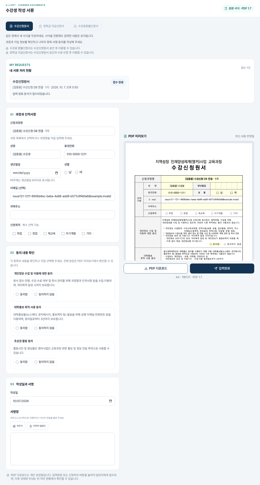
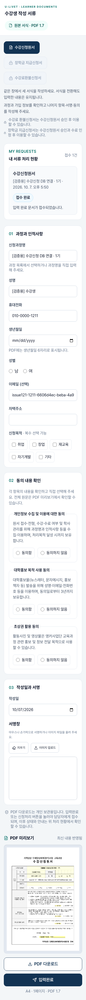
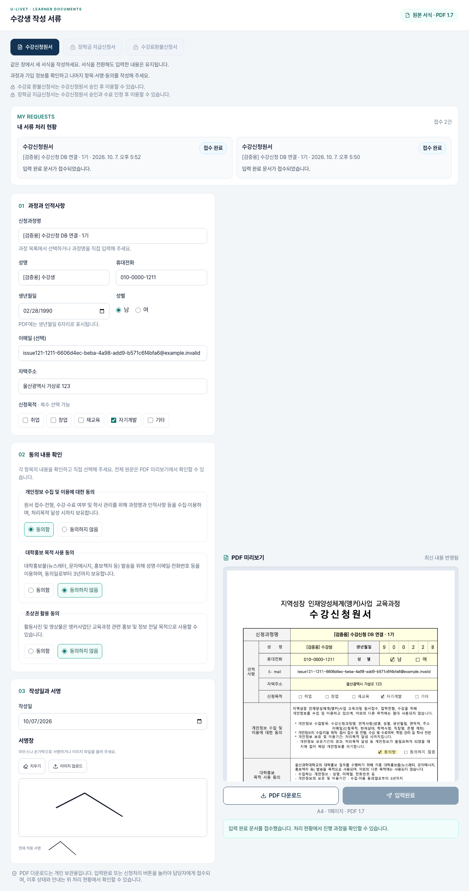

# 과정별 수강신청원서·가입정보 자동 입력 검수

2026-10-07 · [설계](../02-design/features/course-application-document-prefill.design.md)

## 설계 일치율: 100% (10/10)

| 요구사항 | 결과·근거 |
| --- | --- |
| 과정 소개에서 원서 팝업 | 공개 guide slug로 실제 팝업 열기 확인 |
| 모집 과정·신청 화면·나의 신청 현황 연결 | 동일 offering UUID 링크 확인 |
| 로그인 전후 과정 유지 | 실제 비로그인 팝업→로그인→A 유지; 공통 layout 인증도 보완 |
| 과정명 자동 입력과 A/B 구분 | 실제 A 소개/B 모집 과정별 입력 확인 |
| 가입 성명·이메일·전화 자동 입력 | own Auth getUser + 기존 identity, native82/+82/국내번호 검증 |
| 유효한 기존 생년월일만 사용 | 기존 metadata 생년월일·불가능/미래 날짜 검사 |
| 수정 가능, 없는 정보·동의·서명 빈칸 | 실제 입력 수정·미선택 상태 확인 |
| 조회 실패·잘못된 URL 처리 | 서버 오류 안내, 배열·잘못된·없는 과정 404 검사 |
| 기존 접수·PDF·권한 동작 보존 | 실제 원서 접수와 비공개 PDF, 기존 신청·역할 회귀 검사 |
| 모바일·팝업 차단 대체 | 360px/1440px 가로 넘침 없음, 동일 과정 새 탭 링크 |

## 검증

- 실제 로컬 production 앱→Auth→팝업→서명→서버 액션→DB→개인 PDF: **9개 통과**. [결과](evidence/course-application-document-prefill/result.json)
- 순수 프로필·문서 페이지·내부 요청 header 경계: **8개 통과**. 클라이언트가 보낸 내부 header 덮어쓰기와 인증 쿠키 갱신 유지 포함.
- 교육과정 카탈로그: **17개 통과**. 역할별 내비게이션: **23개 통과**.
- 기존 온라인 신청 DB/관리자 조회: **15개 통과**. 새 middleware 적용 후 다시 검사. [결과](evidence/course-application-document-prefill/application-flow-result.json)
- 원서·장학금·환불 PDF 3종: 원본 A4/PDF1.7, 빈값/작성/거부 동의, 필수값·오류·반환액 검사 통과.
- 제출 PDF 텍스트 추출에서 과정명·성명·이메일·전화 반영 확인. [합성 회원 제출 PDF](evidence/course-application-document-prefill/submitted-application.pdf)
- `npm run lint`, `npm run build` (manuals v1.0.0~v1.3.0 포함), `git diff --check` 통과.

## 발견·수정

초기 실제 브라우저 검사에서 상위 `/mypage` layout이 `/mypage`로 로그인 복귀 주소를 덮어쓰는 문제를 발견했다. 실제 요청 주소를 middleware에서 내부 header로 전달하고 상위 layout에서 `safeReturnTo`로 확인해 인증 보호와 과정 선택을 함께 유지했다. 소개 과정 ID는 UUID가 아닌 기존 slug인 경우도 있어 UUID/slug 모두 공개 서버 카탈로그로 해석하도록 설계를 보완했다.

원서 편집기 훅 순서·탭별 입력 유지·동의 직접 선택을 유지하고, 인증 조회는 서버에서 본인만 대상으로 수행한다. 기존 모집 접수 기간 검사·수강 확정 처리는 별도 기존 흐름을 따른다. 누락 요구사항 없음.

## 화면 증거

아래 화면과 PDF에는 전용 로컬 최신 DB `uc-life-issues`의 합성 회원만 사용했다. 운영 DB 실제 회원의 신청·원서 접수를 검증한 기록은 아니다.

