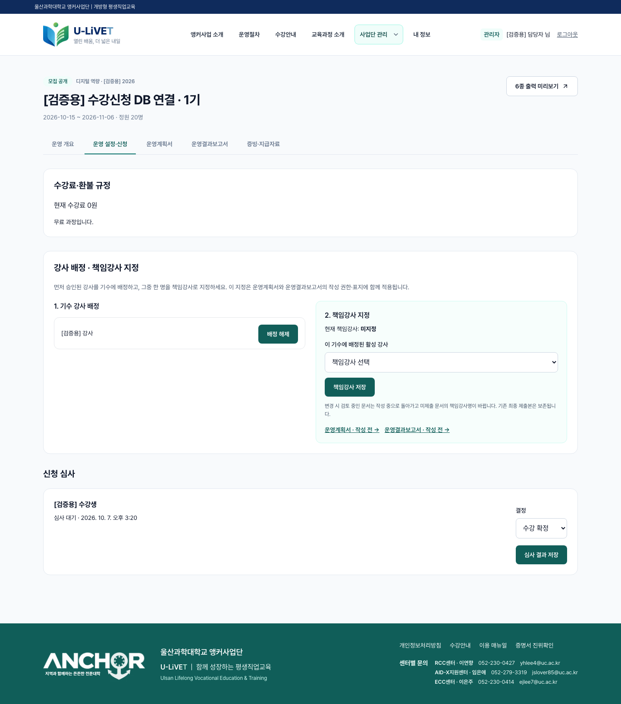

# Issue #121 수강신청 DB·관리자 조회 검증 결과

2026-10-07 (KST) · 기준 main `f7a6e7c` · [설계](../02-design/features/issue-121-application-verification.design.md)

최신 전체 마이그레이션을 적용한 전용 로컬 Supabase `uc-life-issues`와 프로덕션 빌드 앱에서 15개 검사를 통과했다. 실제 Supabase Auth 로그인과 브라우저 서버 액션을 사용했다. 운영 DB의 실사용자 신청 건을 검증한 결과로 확대 해석하지 않는다.

## 확인 결과

| 요구사항 | 확인 방법 | 결과 |
|---|---|---|
| 신청 실제 DB 저장 | 제출 전 0건 → 화면 필수 동의·제출 → `life_applications` SQL 조회 | 같은 수강생·기수에 1건, `SUBMITTED`, 신청시각 저장 |
| 담당 관리자 확인 | COURSE_MANAGER의 `life_roster`와 `/admin/offerings/:id/manage` | 신청 ID·수강생·상태·UTC 시각 일치, UI 한국시간 일치 |
| 동일 신청 연결 | 신청 DB UUID와 roster.application_id 비교 | 일치 |
| 새 조회 유지 | 기존 관리자 browser context 폐기 → 새 context 로그인 → DB 재조회 | 같은 신청 유지 |
| 본인 신청 내역 | 수강생 `/mypage` | 동일 과정 표시 |
| 중복 제출 | 같은 사용자 세션으로 `life_apply` 재호출 | 같은 UUID, 신청 1건·동의 1건 |
| 권한 제한 | 수강생·비담당 관리자·비로그인 roster RPC, 비담당자 테이블 읽기 | RPC 거부, RLS 결과 0건 |
| 실패 저장 차단 | 다른 정책 UUID, 마감된 모집 | 거부, 해당 계정 신청 0건 |

구체적인 테스트 과정·신청 UUID·신청시각과 비교 결과는 [DB 및 roster 증거 JSON](assets/issue-121/result.json)에 있다. 합성 이름·식별자만 포함한다.



신청 처리·명단 조회 실패는 발견하지 않았다. 제품 코드나 운영 DB 변경 없이 검증 도구와 증거를 추가했다. 관리자 명단의 실제 주소는 이슈 시작점의 운영 개요 페이지가 아니라 `/admin/offerings/:id/manage#applications`다.

## 재현

Docker, Supabase CLI, Node 22 이상이 필요하다. 테스트는 지정된 loopback URL, 전용 프로젝트 ID와 Docker label을 모두 확인하여 다른 DB에서 실행되지 않는다.

```sh
npm ci
npx playwright install chromium
node scripts/setup-application-test.mjs
npm run build
APPLICATION_TEST_DB_DIR=/tmp/u-livet-issues-db npm run test:application-flow -- --production
```

macOS의 임시 경로가 다르면 setup 명령 출력의 디렉터리를 사용한다. 개발 서버로 검사할 때는 `--production`을 생략한다. 앱 포트 3100은 전용으로 비워 둔다. 테스트 DB는 합성 계정·과정을 새로 생성하며 운영 이메일을 발송하지 않는다. 비밀번호·JWT·브라우저 세션은 커밋하지 않는다. 출력은 `artifacts/application-flow/`이며 최종 비식별 증거만 이 문서에 복사했다.

## 설계 대조와 기존 검사

설계의 6단계(실제 제출, DB, 담당 RPC, 화면, 새 세션, 중복·거부)를 모두 실행했다. `npm run lint`, `npm run build`(매뉴얼·린트·타입 검사 포함)가 통과했다. 테스트 스크립트는 성공 화면만으로 DB 저장을 추정하지 않고 DB와 화면을 각각 읽는다.

운영 환경의 계정·실제 모집 데이터는 변경하지 않았다. 운영 실신청 점검이 필요할 때는 승인된 테스트 계정과 과정으로 이 절차를 반복한다.
