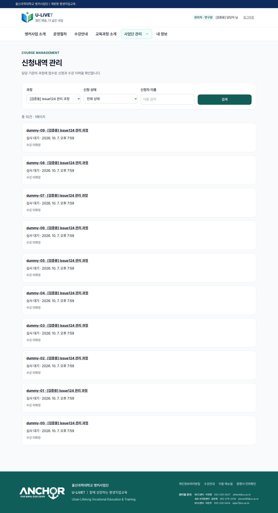
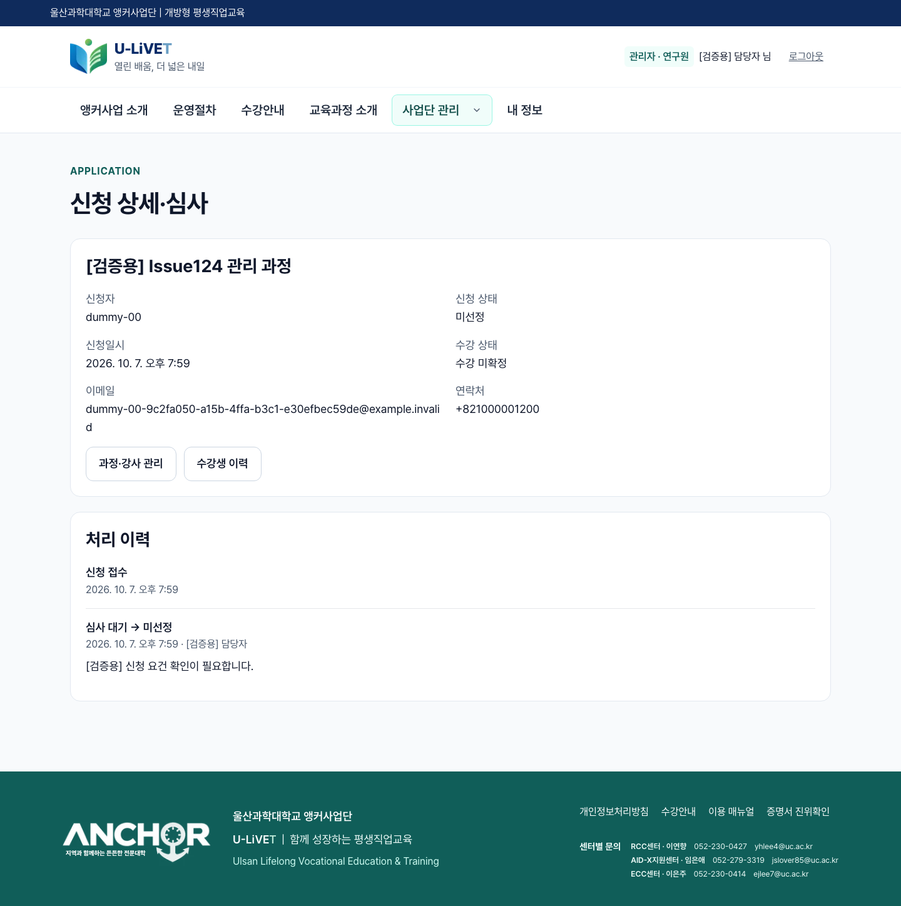
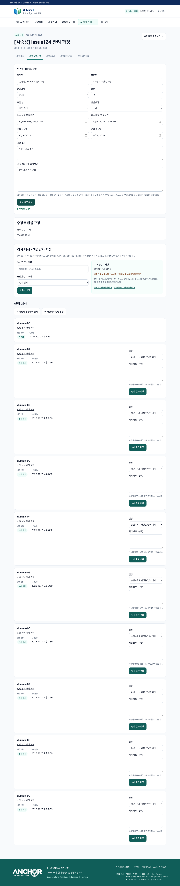
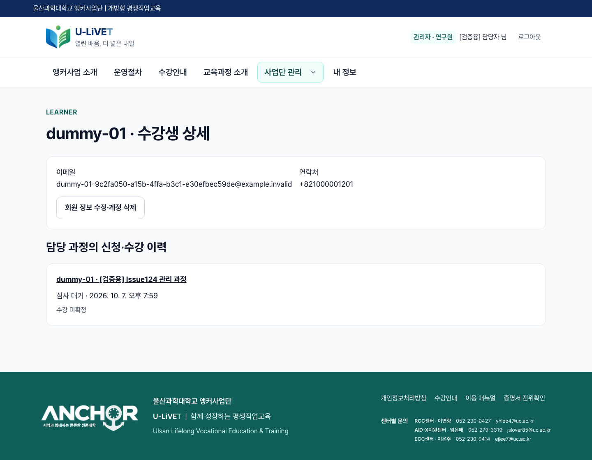
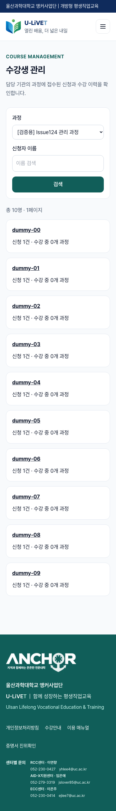

# Issue 124 gap analysis

Design: ../02-design/features/issue-124-management.design.md
Match rate: 100% (17/17 implementation items including the additional user corrections; reuse is explicitly identified below).

| Requirement | Implementation / verified behavior |
| --- | --- |
| Class list/detail/create | Existing /admin/courses, /admin/offerings; actual manager create/publish RPC tested |
| Class editing and recruitment state | OfferingEditForm + life_update_offering, real browser server action; closed/sealed validation |
| Instructor assignment/change | Existing life_assign_instructor and responsibility section; assignment and soft unassignment tested |
| Application list/filter/search/detail | New /admin/applications list/detail, scoped RPCs; ten actual applicants and name/status/course filters |
| Approve/reject/reason/history | New review helper reuses finance-aware decide; browser rejection, stale review, invalid transition and legacy rejection bypass tests |
| Learner list/detail/history/roster | New /admin/learners list/detail and per-course roster link; necessary contact only, actual accepted enrollment history |
| Instructor list/search/register/edit/detail | Existing instructor pool UI/RPCs reused; register/edit/search tested |
| Explicit four management menus | Course management + applications + learners + instructor management; existing 23 role/navigation checks pass |
| Researcher scope and unauthorized access | Actual COURSE_MANAGER org scope; ordinary learner and unrelated researcher URL/RPC denial tested |
| Capacity/duplicates/transitions | Same-ID duplicate submission, two concurrent free approvals with one seat, paid reservations/invoices and invalid transitions tested |
| History-preserving deletion | Existing member soft deletion stops identity access and preserves application; instructor pool removal preserves assignments; course FKs remain intact and closed/archive is retained |
| Migration and ten production fixtures | Exact migration 20261007104417 applied; ten real Auth users + life_apply rows, existing administrator native Auth RPC and account deletion scope verified |
| Approved application unfinished count | Shared kind-aware predicate in homepage, admin alerts and inbox excludes APPROVED applications; inbox shows 처리 종결 without another save step. Financial payment tasks remain pending; real browser before/after count verified |
| Optional document staff note | HTML/server action/guarded DB accept empty, whitespace and null; blank note keeps previous guidance and writes blank transition history. Stale state and length guards retained |
| Existing application resolution metadata | Additive migration sets resolved_at on approval and backfills existing APPROVED applications only; no decision, revision or history overwrite |
| Hide ended public courses | Shared structured end-date/explicit guide-period predicate in catalog and both recommendation paths; inclusive Korean end day, archived state, unknown schedule and year rollover tested |
| English heading spacing | Shared normal/compact label tokens halved to 0.025em/0.0125em |

## Validation
- npm run lint, npm run build (including manual versions 1.0–1.3), TypeScript check: pass.
- Existing application-flow regression: 15 checks pass.
- New management-flow acceptance: 15 checks pass against a dedicated local production build (uc-life-issues). Includes actual learner/admin login, browser actions, persisted DB rows and mobile overflow check.
- Existing navigation verification: 23 checks pass.
- Additional corrections: 6 real Auth/browser/action/DB document resolution checks, 19 catalog checks, 4 learner-home checks and 5 student-learning checks pass. Blank note approval preserves guidance/history, removes home/admin pending alerts and leaves approved refund payment tasks pending until completion. Production build, lint and TypeScript checks pass after changes.
- Preview configuration: Supabase integration injected branch-only server/DB credentials and an unregistered public key name, causing the review-only release guard to block the build. Removed only this branch's injected variables to restore the existing isolated read-only preview configuration. Production settings and guard logic are unchanged.
- Production resolution migration 20261007110653 applied successfully. Aggregate verification found the existing approved APPLICATION document has a resolved timestamp, and both completed REFUND documents retain theirs. No applicant details were extracted or published.
- Production: project uoebygejgglgiivzgyks, real Auth and scoped administrator RPC confirms 10 SUBMITTED applications. Each account is visible/manageable through existing member-directory API. No mail or payment sent. The temporary administrator verification session was signed out without altering credentials or grants.
- Catalog grants: all six new public RPCs are SECURITY INVOKER, anon execution denied; private history has RLS and no direct authenticated SELECT/UPDATE; legacy private decision helper execution revoked.
- Supabase advisor: no new WARN/ERROR. New INFO for private history's deliberate default-deny RLS with no direct table policy; privileged checked helpers own access. [Advisor explanation](https://supabase.com/docs/guides/database/database-linter?lint=0008_rls_enabled_no_policy). Existing unrelated MFA/definer notices are unchanged.

## Screenshots and records
[Local result](evidence/issue-124-management/result.json), [production result](evidence/issue-124-management/production-result.json).

## Design refinements and practical limits
- No production offering was accepting applications (3 archived, 15 draft), so a marked verification offering was created under the main organization instead of changing real recruitment dates. Its two marked verification policies have no completion rules; it is not an actual education/certificate offering.
- Operational management continues to require organization-scoped COURSE_MANAGER, including researchers. SYSTEM_ADMIN by itself retains account-management privileges; it does not acquire operational access automatically.
- Historical reasons that were never collected cannot be reconstructed. Existing audit decisions are shown, while the new reviewer records preserve future reasons and actual resulting status (including PENDING_PAYMENT).
- Deleting a test account means existing service soft deletion: access is stopped and histories remain. It does not erase Auth/history evidence. Main-organization placement avoids the existing all-affiliations deletion-scope restriction.
- DB edit concurrency uses existing academic_revision; finalized/archived course snapshots remain read-only. Shared course versions are cloned on content edits.
