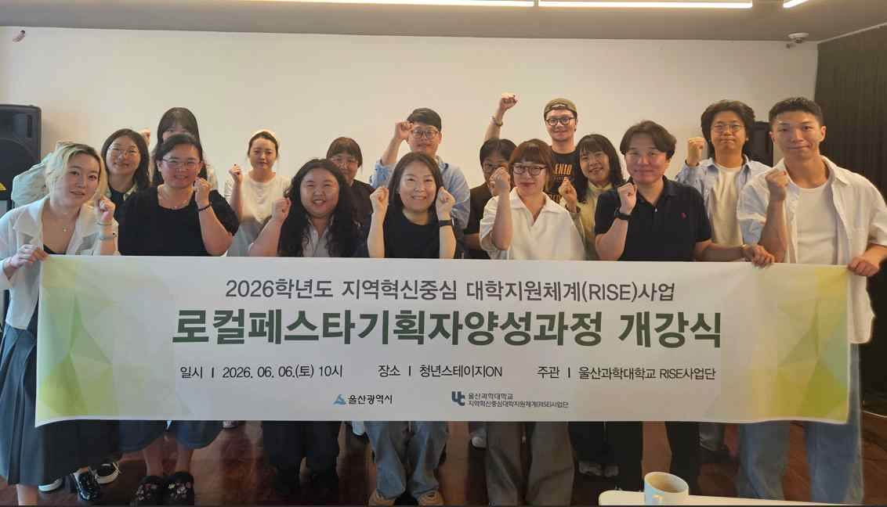
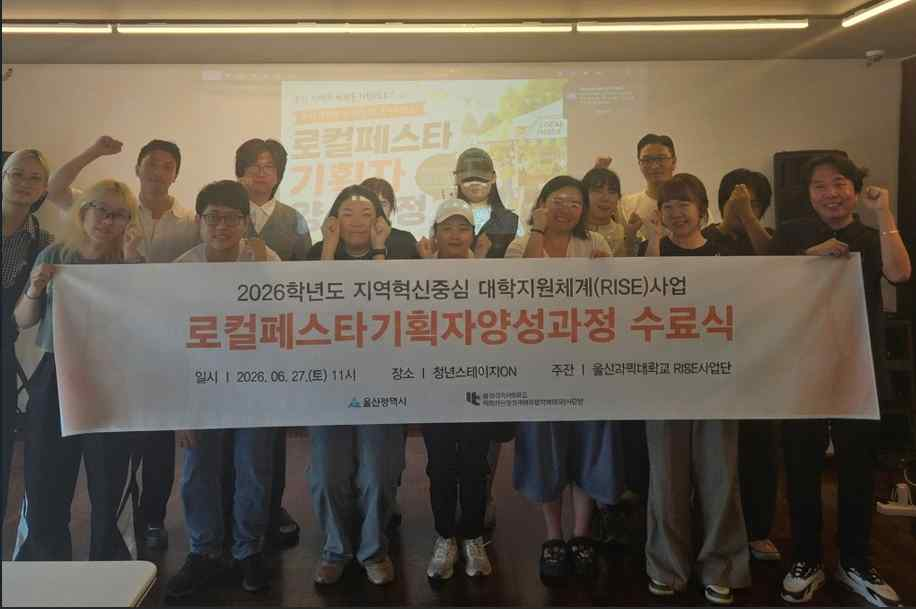
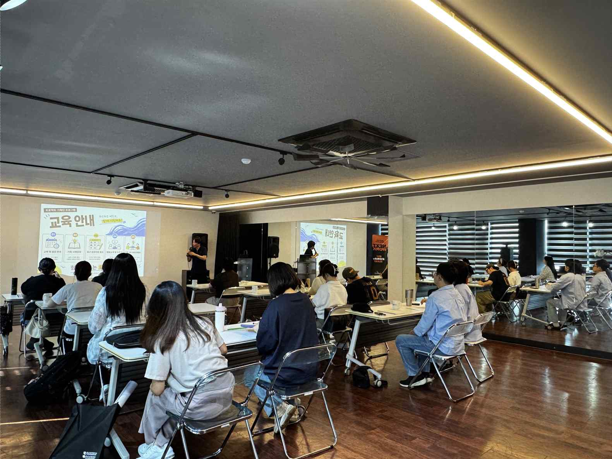
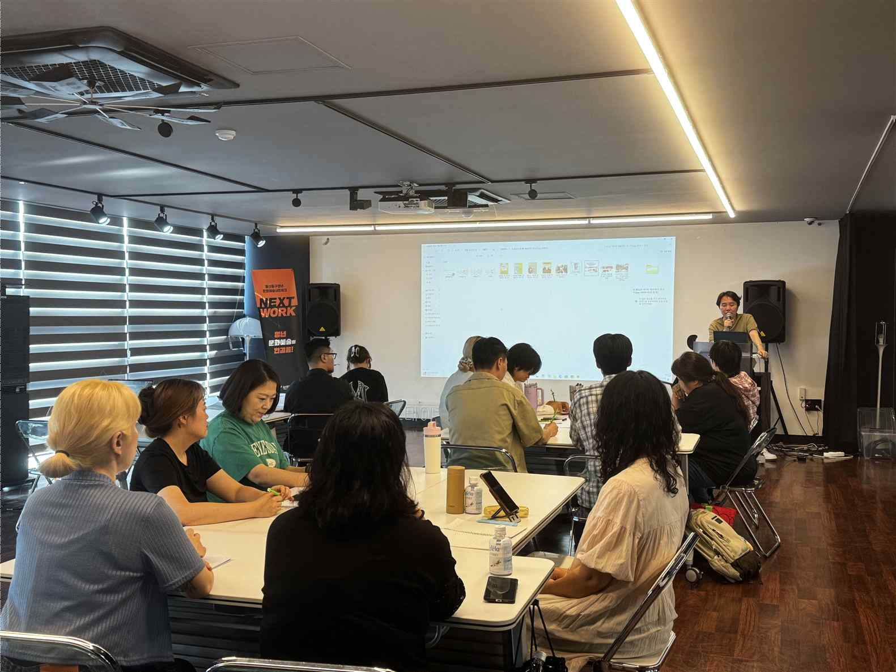
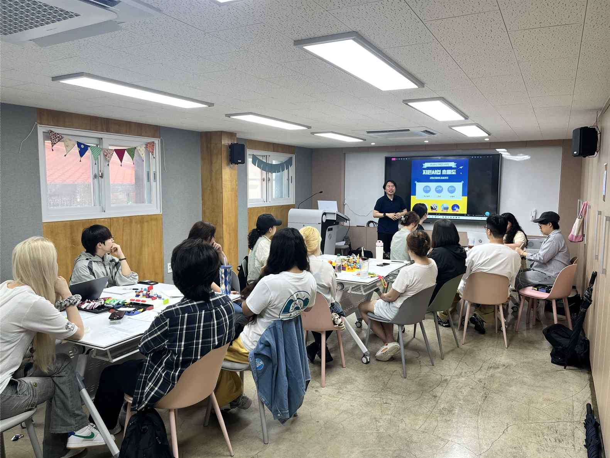
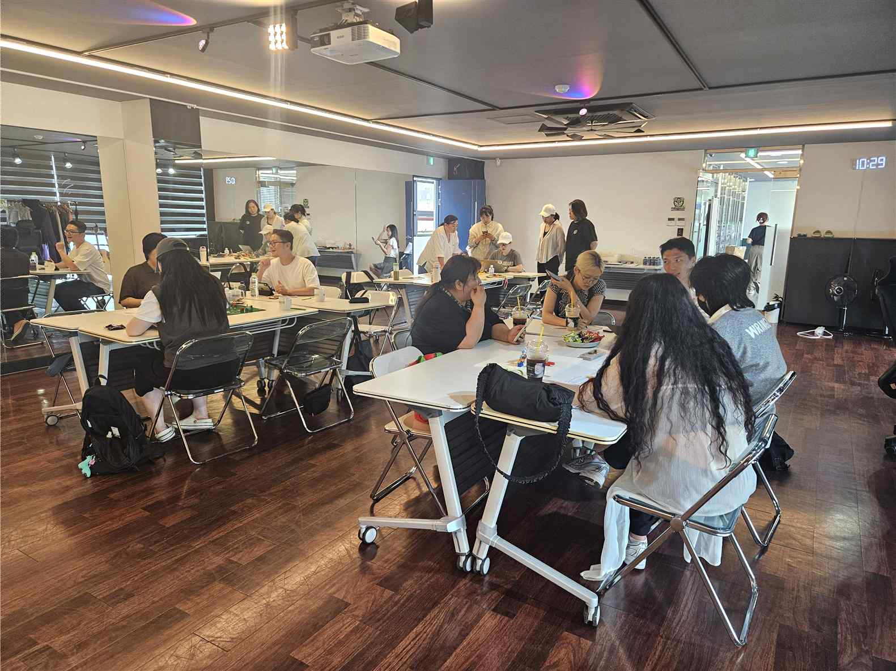

# 로컬 페스타(LOCAL FESTA) 기획자 양성과정 운영결과보고서

## 1. 기본 정보

| 항목 | 내용 |
| :--- | :--- |
| **사업명** | 2026학년도 지역성장 인재양성체계(앵커)사업 |
| **영역** | 로컬창업 |
| **프로그램명** | 로컬 페스타(LOCAL FESTA) 기획자 양성과정 |
| **담당교수** | 현용환 |
| **교육기간** | 2026. 06. 06. ~ 2026. 06. 27. |
| **보고일자** | 2026. 7. 1. |

## 2. 주요 내용

• 지역 자산을 활용한 문화기획 전문가 양성 과정
• 공연, 마켓, 라이프스타일 등 부분별 실습과정을 통한 실습형 교육
• 지역 기관과 연계하여 전문 영역 프로젝트 참여

## 3. 운영 성과

| 구분 | 모집정원 | 모집인원 | 수료인원 (수료율) | 자격증 취득 (취득율) | 취·창업인원 (취창업율) | 교육만족도 |
| :--- | :---: | :---: | :---: | :---: | :---: | :---: |
| **실적** | 20명 | 15명 | 13명 (86.7%) | 0명 (-) | 0명 (-) | 95.6% |

## 4. 교육 운영 사진

> 교육과정 운영 중 촬영된 주요 사진입니다. 개별 사진 파일은 `images/1. 2026년 앵커사업 로컬페스타기획자양성과정 운영결과보고서/` 폴더에 저장되어 있습니다.

| 번호 | 사진 제목 | 교육 일자 | 사진 미리보기 | 파일명 |
| :---: | :--- | :---: | :---: | :--- |
| 1 | **개강식** | 2026.6.6 |  | `01_개강식_20260606.png` |
| 2 | **수료식** | 2026.6.27 |  | `02_수료식_20260627.png` |
| 3 | **운영사진1** | 2026.06.06 |  | `03_운영사진1_20260606.png` |
| 4 | **운영사진2** | 2026.06.13 |  | `04_운영사진2_20260613.png` |
| 5 | **운영사진3** | 2026.06.20 |  | `05_운영사진3_20260620.png` |
| 6 | **운영사진4** | 2026.06.27 |  | `06_운영사진4_20260627.png` |

### 📸 운영 사진 갤러리

#### 1. 개강식 (2026.6.6)



#### 2. 수료식 (2026.6.27)



#### 3. 운영사진1 (2026.06.06)



#### 4. 운영사진2 (2026.06.13)



#### 5. 운영사진3 (2026.06.20)



#### 6. 운영사진4 (2026.06.27)



## 5. 강사별 교육시간 상세 내역

```
회차

일시

강의주제 및 내용
[특강1] 지역 브랜딩 공사례와
기획자의 역할
[오리엔테이션&팀빌딩]

1

2026.06.06
09:00-12:00

사업취지, 로드맵 및 운영안내
[팀빌딩]
파트별 조편성/아이스브레이킹

강사
강사
교육
명
시간
황동윤

2

2026.06.13
09:00-12:00

1

조별 아이디어 구체화/ 피드백

서승연

1

이뤄라
김성엽
황동윤

1

서승연

1

이뤄라
김성엽
황동윤

2

기반 아이디어 발산
[멘토링]

지ON
김성엽

황동윤

서승연

2

이뤄라
김성엽
황동윤

1

교육
장소
청년스테이

1

[워크숍]
일산해수욕장/ 일산청년광장

보조강사
강사
교육
명
시간

서승연
이뤄라

1

청년스테이
지ON
청년스테이
지ON
청년스테이
지ON
청년스테이
지ON

3

2026.06.20
09:00-12:00

김성엽

[실습] 조별
아이디어 회의 및 마인드맵
작성

황동윤

[실습] 조별 실행 계획서 및
발표자료 집중 작성

황동윤

2

서승연

2

동구청년센터

1

동구청년센터

이뤄라
김성엽
1

서승연
이뤄라
김성엽

[발표] 조별 기획안
PT 및 전문가 심사
4

2026.06.27
09:00-12:00

황동윤

1

서승연

1

이뤄라
김성엽
[피드백] 실행 가능성 검토/
최종 예산 조율

황동윤

1

서승연

1

이뤄라
[마무리] 수료식 및 향후
실행 가이드 안내

황동윤

합계

청년스테이
지ON
청년스테이
지ON
청년스테이

1

지ON

12h

10h
```

## 6. 예산 집행 현황

```
5. 예산집행현황
단위(원)

구분

신청예산

집행예산

비고

운영비

240,000

240,000

인쇄비

140,000

-

재료비

400,000

400,000

강사료

2,500,000

2,410,000

합계

3,280,000

3,050,000
```

## 7. 프로그램 품질 개선 및 총평

```
6. 프로그램 품질 개선
운영 내용
• 2회차 특강을 통한 집중교육 프로그램 진행
2026학년도 프로그램

교육방법

운영 사항

• 매회차 조별 과제 중심의 개별 프로젝트 진행
• 현장탐방,입체 마인드맵등 다양한 보조프로그램
진행

교육내용

• 문화/예술관련 로컬 기획성공사례 분석

• 아이템 선별요령 및 기획안 작성요령
• 조별 기획프로그램 구성 및 제안서 제작 발표
• 청년스테이지온 회원 대상으로한 홍보문자발송
교육생
모집 홍보

• 분야별 기획자풀을 통한 온라인홍보
• 라이즈사업단 자체 홍보를 통한 홍보
• 조별 기획안을통해 지역에 필요한 우수한

기타

아이디어들 다수 발굴
• 추후 실행사업을 통해 아이디어 실현가능성

7. 총평
구 분

내

용

• 지역로컬 문화자원 분석을통한 수준높은 기획안을 조별로
기획한점
우수한 점

• 공연예술,플리마켓,해변을 활용한 문화콘텐츠등 동구지역
의 자원을 활용한 축제 콘텐츠를 개발한점
• 높은 출석율을 통해 조별 활동 성과를 우수하게 끌어올린

총

점
• 실행 사업으로 이어진다면 좀더 예산,타겟등 실행게 맞게

평

금 명확한 기획을 진행해 볼 수 있었을것으로 기대
개선할 점

• 과정 수료후의 비전을 명확히 제시해 줄 수 있다면 동기
부여가 더욱 높아졌을 것으로 기대
• 한정된 예산으로인해 외부 우수강사를 섭외 하지 못한 것
이 아쉬움.
• 조별 기획한 내용들을 주강사/보조강사들을 통해 수정 보
완하는 작업 진행
• 각종 기관에서 진행하는 문화기획사업과 연계하여 실행까

환류 계획

지 진행해보기 위한 탐색과정 진행
• 참가자 대상 개별 질의응답 채널을 오픈하여 지속적인 서
비스 제공
• 주강사,보조강사 회의를 통해 교육과정 개선점 및 보완점
논의

비고

8 장학금 지원
구분

인원수

장학금액

학습활동 우수장학

13

374,400

비고
```

---
*원문 파일: `1. 2026년 앵커사업 로컬페스타기획자양성과정 운영결과보고서.pdf`*
