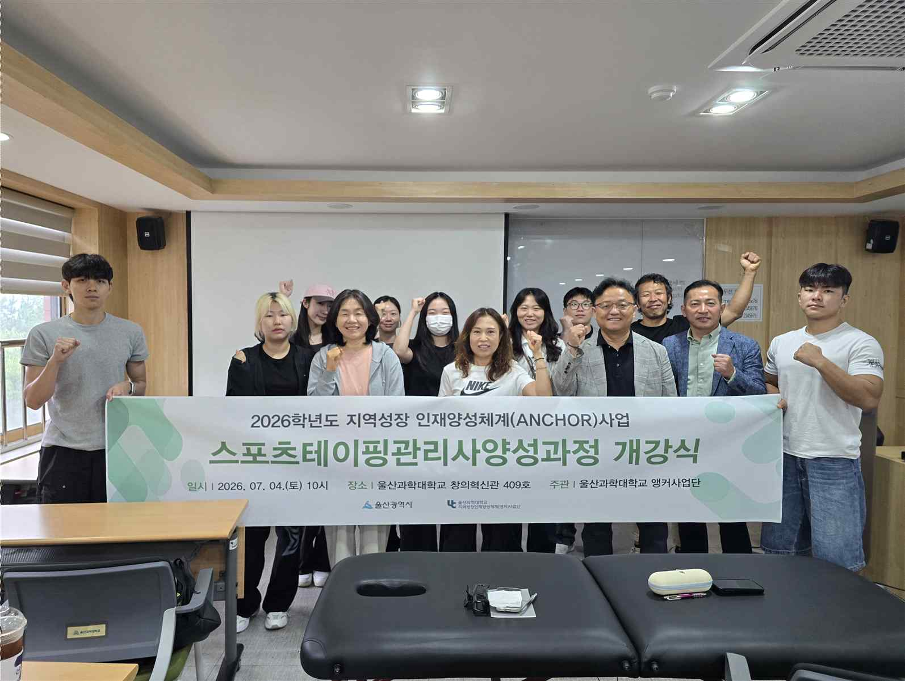
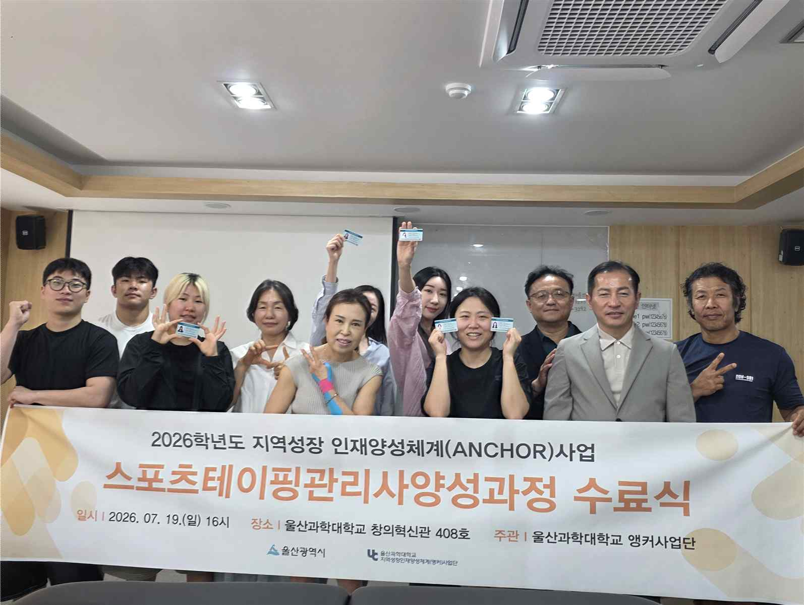
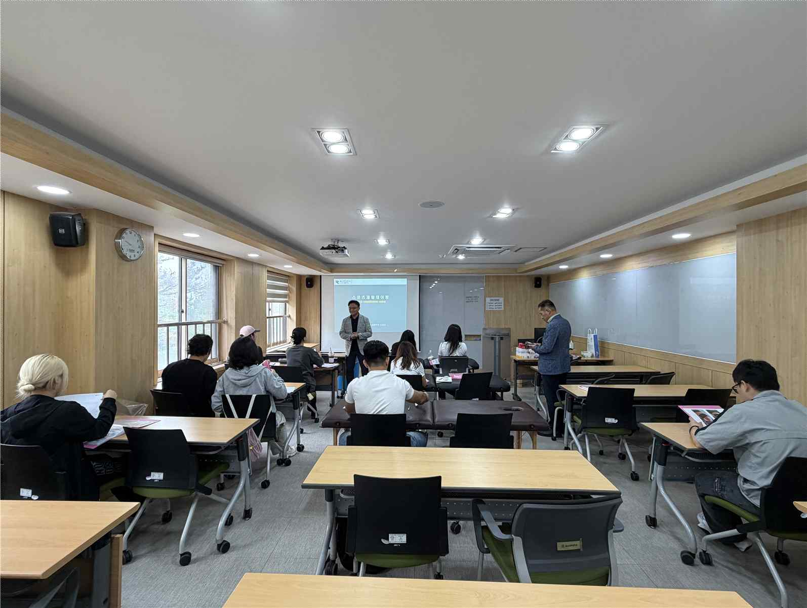
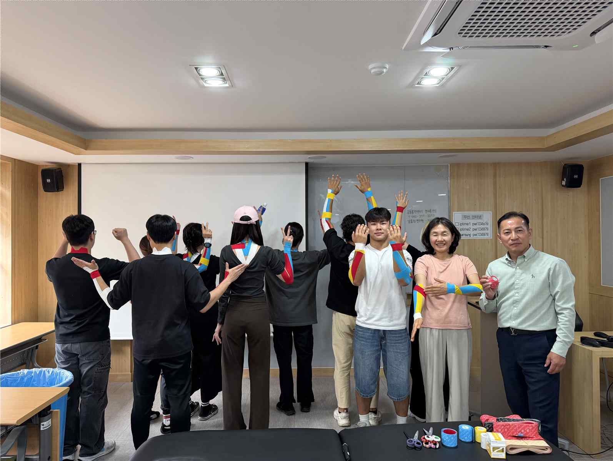
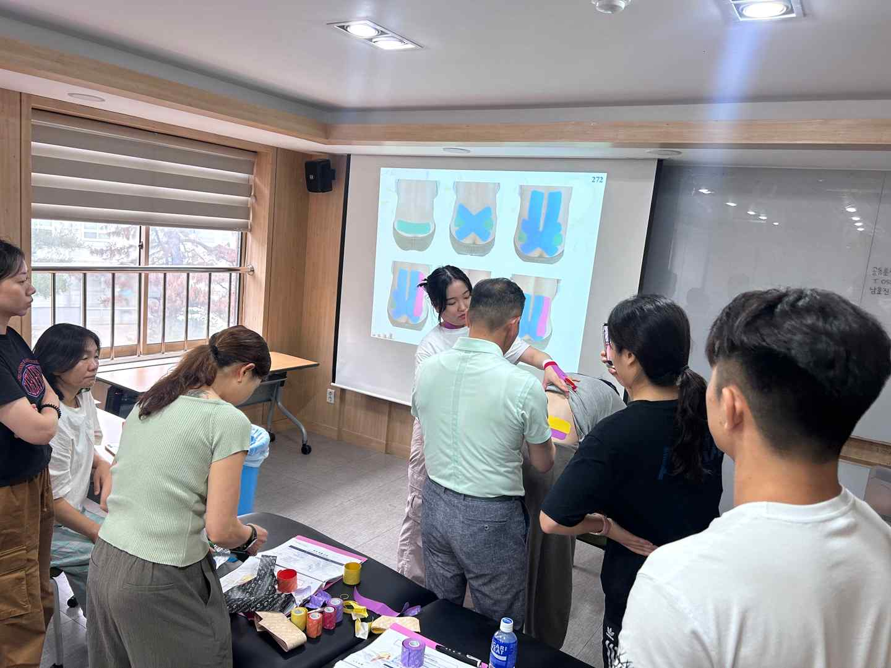
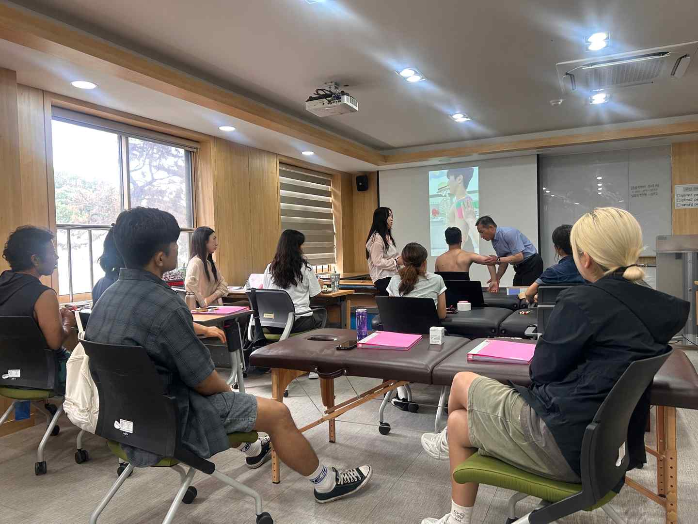
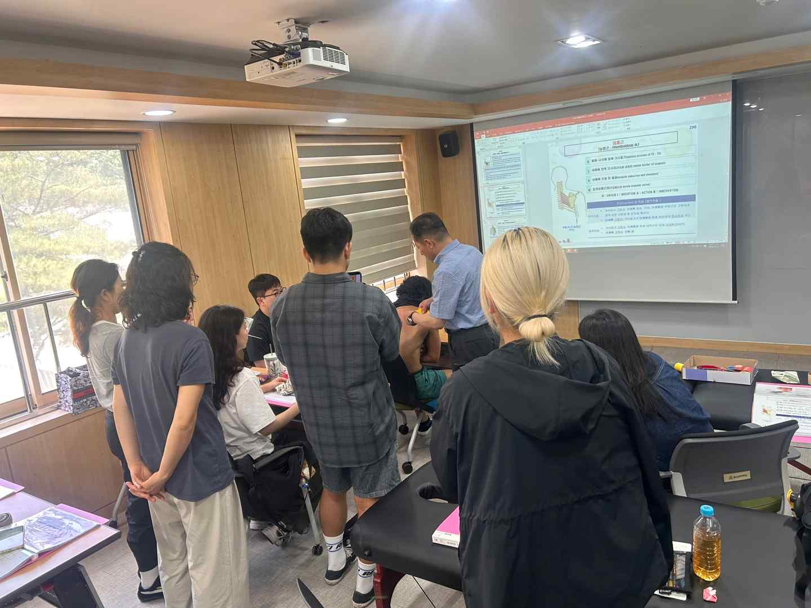
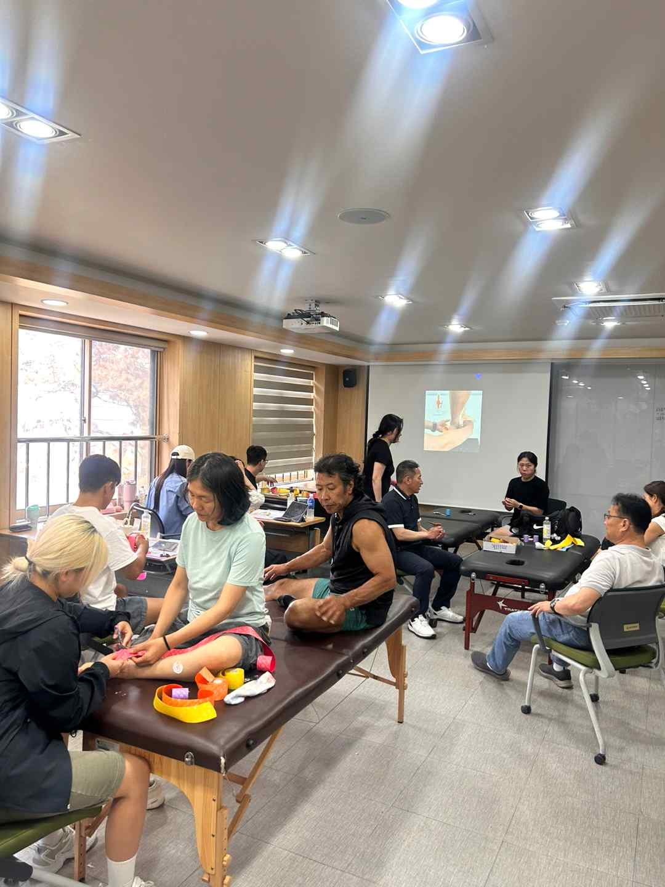

# 스포츠테이핑관리사 양성(자격증)과정 운영결과보고서

## 1. 기본 정보

| 항목 | 내용 |
| :--- | :--- |
| **사업명** | 2026학년도 지역성장 인재양성체계(앵커)사업 |
| **영역** | 라이프케어 아카데미 교육 프로그램 |
| **프로그램명** | 스포츠테이핑관리사 양성(자격증)과정 |
| **담당교수** | 서 |
| **교육기간** | 봉 |
| **보고일자** | 2026. 7. 24. |

## 2. 주요 내용

▪

스포츠를 즐기는 시민들이 안전하고 즐겁게 스포츠를 즐기는 방법이 있으면 좋겠다는

것은 모두의 희망이다. 스포츠 경기를 할 때 보다 더 안전하고 즐겁게 즐기는 방법 중에 최
고가 상해나 부상을 예방하는 방법이다. 이것이 바로 스포츠테이핑이다.
▪ 스포츠테이핑관리사 양성(자격증)과정을 통해 상해 예방과 경기 중 부상 방지를 위해, 부
상 부위별 운동 스포츠테이핑의 이론을 학습하고 실기를 실습하여 숙달시키는 것이 스포츠
테이핑관리사 양성(자격증)과정의 목표이다.

## 3. 운영 성과

| 구분 | 모집정원 | 모집인원 | 수료인원 (수료율) | 자격증 취득 (취득율) | 취·창업인원 (취창업율) | 교육만족도 |
| :--- | :---: | :---: | :---: | :---: | :---: | :---: |
| **실적** | 20명 | 10명 | 10명 (90.9%) | 0명 (-) | 0명 (-) | 100% |

## 4. 교육 운영 사진

> 교육과정 운영 중 촬영된 주요 사진입니다. 개별 사진 파일은 `images/1. 2026년 앵커사업 스포츠테이핑관리사양성과정 운영결과보고서/` 폴더에 저장되어 있습니다.

| 번호 | 사진 제목 | 교육 일자 | 사진 미리보기 | 파일명 |
| :---: | :--- | :---: | :---: | :--- |
| 1 | **개강식** | 2026.07.04. |  | `01_개강식_20260704.png` |
| 2 | **수료식** | 2026.07.19. |  | `02_수료식_20260719.png` |
| 3 | **운영사진1** | 2026.07.04. |  | `03_운영사진1_20260704.png` |
| 4 | **운영사진2** | 2026.07.05. |  | `04_운영사진2_20260705.png` |
| 5 | **운영사진1** | 2026.07.11. |  | `05_운영사진1_20260711.png` |
| 6 | **운영사진2** | 2026.07.12. |  | `06_운영사진2_20260712.png` |
| 7 | **운영사진3** | 2026.07.18. |  | `07_운영사진3_20260718.png` |
| 8 | **운영사진4** | 2026.07.19. |  | `08_운영사진4_20260719.png` |

### 📸 운영 사진 갤러리

#### 1. 개강식 (2026.07.04.)



#### 2. 수료식 (2026.07.19.)



#### 3. 운영사진1 (2026.07.04.)



#### 4. 운영사진2 (2026.07.05.)



#### 5. 운영사진1 (2026.07.11.)



#### 6. 운영사진2 (2026.07.12.)



#### 7. 운영사진3 (2026.07.18.)



#### 8. 운영사진4 (2026.07.19.)



## 5. 강사별 교육시간 상세 내역

```
강사
회차

일시

강의주제 및 내용

보조강사

강사명

교육
시간

강사명

교육
시간

교육
장소

1

2026.07.04.
(09:00~11:00)

스포츠테이핑 요법의 이해

서봉한

2

창의혁신관
409호

2

2026.07.04.
(11:00~13:00)

스포츠테이핑 기초 이론

조경호

2

창의혁신관
409호

3

2026.07.04.
(14:00~17:00)

상지부테이핑 기초 실습(1)

조경호

3

우철호

3

창의혁신관
409호

4

2026.07.05.
(09:00~12:00)

상지부테이핑 기초 실습(2)

조경호

3

우철호

3

창의혁신관
409호

5

2026.07.04.
(13:00~17:00)

하지부테이핑 기초 실습(1)

조경호

4

우철호

3

창의혁신관
409호

6

2026.07.11.
(09:00~12:00)

하지부테이핑 기초 실습(2)

조경호

3

우철호

3

창의혁신관
409호

7

2026.07.11.
(13:00~17:00)

통증부위별 테이핑 기초실습(1)

조경호

4

우철호

3

창의혁신관
409호

8

2026.07.12.
(09:00~12:00)

통증부위별 테이핑 기초실습(2)

조경호

3

우철호

3

창의혁신관
409호

9

2026.07.12.
(13:00~17:00)

상지부테이핑 심화 실습

조경호

4

손승우

3

창의혁신관
409호

10

2026.07.18.
(09:00~12:00)

하지부테이핑 심화 실습

조경호

3

손승우

3

창의혁신관
409호

11

2026.07.18.
(13:00~17:00)

통증부위별 테이핑 심화 실습(1)

조경호

4

손승우

3

창의혁신관
409호

12

2026.07.19.
(09:00~12:00)

통증부위별 테이핑 심화 실습(2)

조경호

3

손승우

3

창의혁신관
409호

13

2026.07.19.
(13:00~16:00)

스포츠테이핑 실습 및 평가

서봉한

3

창의혁신관
409호

14

2026.07.18.
(16:00~17:00)

스포츠테이핑의 활용 방안

서봉한

1

창의혁신관
409호

합계

42h

- 4 -

30h
```

## 6. 예산 집행 현황

```
5. 예산집행현황
단위(원)

구분

신청예산

집행예산

비고

운영비

462,000

664,400

인쇄비

300,000

-

재료비

495,000

495,000

강사료

4,860,000

4,860,000

합계

6,117,000

6,019,400
```

## 7. 프로그램 품질 개선 및 총평

```
6. 프로그램 품질 개선
운영 내용

• 집합교육으로 실습위주의 교육실시
교육방법

• 수강생의 수준에 맞추어서 교육실시
• 기초과정으로 개설 운영함.

• 과정별 교육실시
교육내용

• 부위별 테이핑 기초과정 교육실시
• 통증부위별 테이핑 기초과정 교육실시

2026학년도 프로그램
운영 사항
• 대학 홈페이지 홍보
교육생

• 스포츠 관련 단체 모집 홍보

모집 홍보 • 성인학습자 대상으로 홍보
• 거리 현수막 부착 홍보

•
기타

•
•

- 5 -

7. 총평
구 분

내

용

비고

• 스포츠테이핑관리사 양성(자격증)과정 프로그램 운영에 있어서 모든
수강생들이 적극적으로 참여하였으며, 수강 신청하신 11명 중 1명이
개인 일신상의 이유로 수강을 할 수 없었으며, 나머지 수강생 10명의
우수한 점

수강생은 수료(90.9%)하였음.
• 프로그램 운영에 대한 수강생들의 만족도가 매우 높게 나타남.
• 프로그램에 대한 수료는 10명이 하였으며, 연계하여 운영한 자격증은
취득을 희망한 10명이 모두 자격증을 취득함.
• 프로그램 운영 전반에 대해 매우 우수하게 운영됨.

총
• 스포츠테이핑관리사 양성(자격증)과정 프로그램 운영함에 있어서 수

평

료한 수강생들이 적극적이었고, 프로그램의 운영에 대한 만족도는
매우 높았으므로 특별한 개선할 사항은 없으나, 수강생들의 모집에
있어서 대학에서 지역 방송이나 공공기관의 협조를 통한 홍보가 필
개선할 점

요한 것으로 사료됨.
• 프로그램의 운영상 교재의 컬러가 필수였으나, 인쇄 및 제본의 가격
이 너무 비싸서 운영비의 여건상 학과의 협조를 받아 복사하여 파일
에 수강생이 직접 넣어서 교재를 대신하여 애로사항이 있어서 컬러
교재의 필요시 거기에 상응하는 운영비의 지원이 필요함.

• 스포츠테이핑관리사인 전문인력 양성하여 지역사회의 체육관련 문화
복지행사의 일환으로 봉사활동과 실습능력을 향상시킬 수 있는 참여

환류 계획

프로그램을 운영할 계획임.
• 작년에 개발한 교재를 토대로 보완하여 사용하였으며, 매차시 보완하
여 차기 수업에 활용할 계획임.
• 지속적으로 수강생의 만족도를 높일 수 있는 방안을 마련할 계획임.

8. 장학금 지원
구분

인원수

장학금액

학습활동 우수장학

10

1,008,000

- 6 -

비고
```

---
*원문 파일: `1. 2026년 앵커사업 스포츠테이핑관리사양성과정 운영결과보고서.pdf`*
