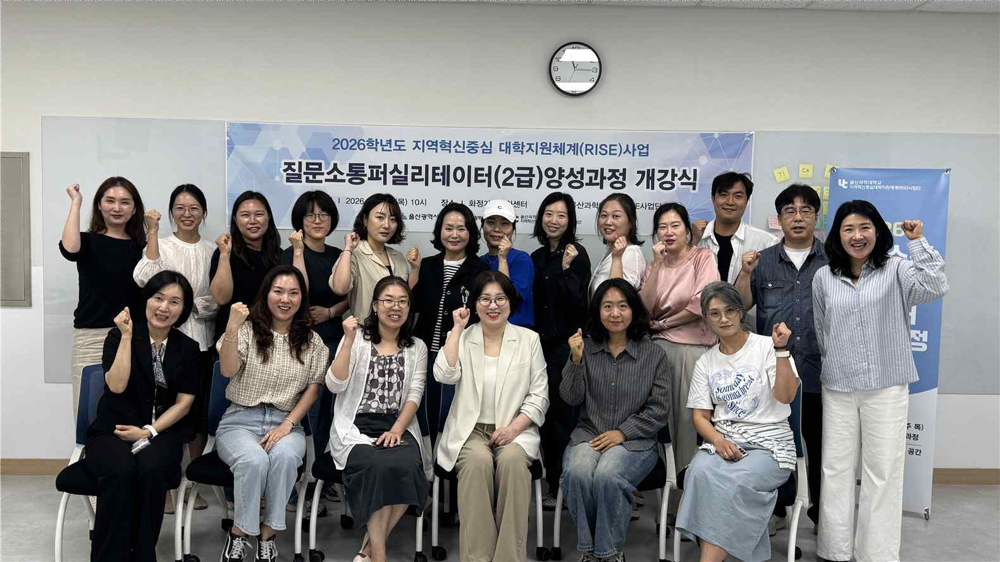
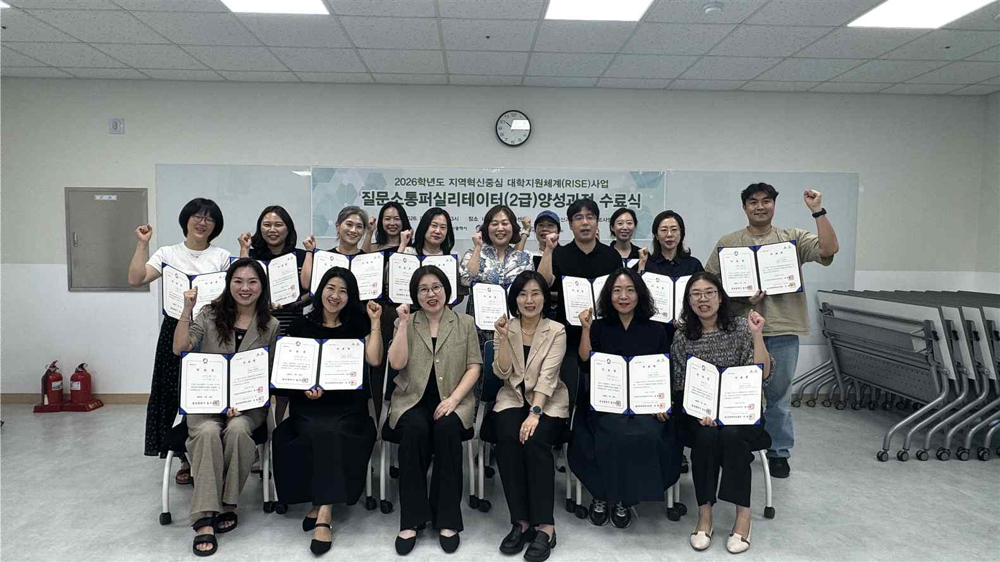
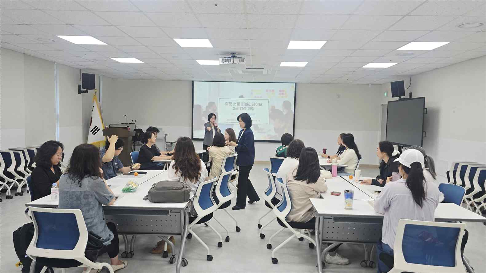
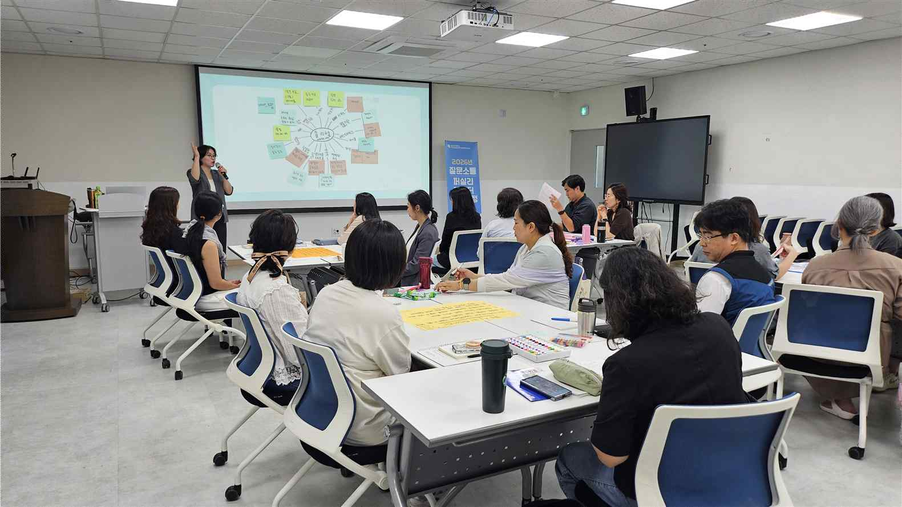
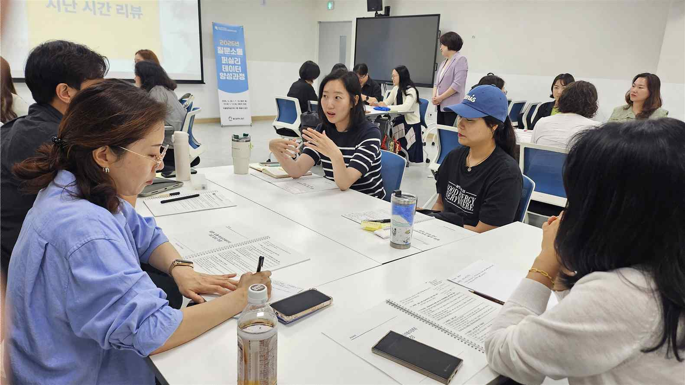
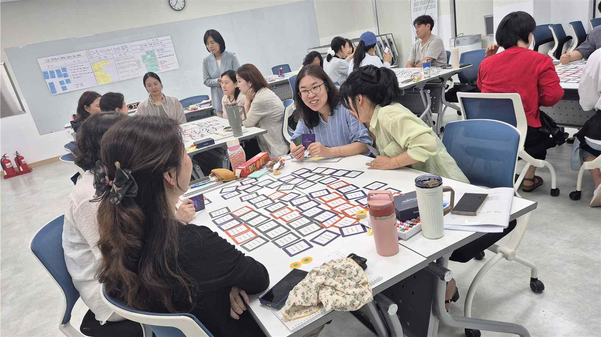

# 질문 소통 퍼실리테이터 2급 양성과정 운영결과보고서

## 1. 기본 정보

| 항목 | 내용 |
| :--- | :--- |
| **사업명** | 2026학년도 지역성장 인재양성체계(앵커)사업 |
| **영역** | 팝업 아카데미 |
| **프로그램명** | 질문 소통 퍼실리테이터 2급 양성과정 |
| **담당교수** | 현 용 환 |
| **교육기간** | 2026. 5. 28. ~ 2026. 7. 16. |

## 2. 주요 내용

: 퍼실리테이터 역량 교육 및 지역문제해결 실천 역량 강화
▪ 질문 소통 역량 강화: 공감과 경청을 바탕으로 참여를 이끌어 내는 핵심 질문 디자인 및
소통 기술 내재화
▪ 실천적 문제해결 도구 습득: 지역의 현안을 분석하고 대안을 구조화하는 실천적 분석 도
구 마스터
▪ 현장 맞춤형 프로세스 설계: 지역 토론회 및 워크숍 운영을 위한 표준 스크립트 작성 및
상황별 촉진(Facilitating) 시뮬레이션
▪ 지역사회 소통 파트너 정체성 확립: 대학-지역 상생 거버넌스의 주체로서 퍼실리테이터
의 사회적 역할 및 실천 방안 정립

## 3. 운영 성과

| 구분 | 모집정원 | 모집인원 | 수료인원 (수료율) | 자격증 취득 (취득율) | 취·창업인원 (취창업율) | 교육만족도 |
| :--- | :---: | :---: | :---: | :---: | :---: | :---: |
| **실적** | 20명 | -명 | -명 (100%) | 0명 (-) | 0명 (-) | 96% |

## 4. 교육 운영 사진

> 교육과정 운영 중 촬영된 주요 사진입니다. 개별 사진 파일은 `images/1. 2026년 앵커사업 질문소통퍼실리테이터2급양성과정 운영결과보고서/` 폴더에 저장되어 있습니다.

| 번호 | 사진 제목 | 교육 일자 | 사진 미리보기 | 파일명 |
| :---: | :--- | :---: | :---: | :--- |
| 1 | **개강식** | 2026.5.28 |  | `01_개강식_20260528.png` |
| 2 | **수료식** | 2026.7.16 |  | `02_수료식_20260716.png` |
| 3 | **운영사진1** | 2026.6.4 |  | `03_운영사진1_20260604.png` |
| 4 | **운영사진2** | 2026.6.18 |  | `04_운영사진2_20260618.png` |
| 5 | **운영사진3** | 2026.7.2 |  | `05_운영사진3_20260702.png` |
| 6 | **운영사진4** | 2026.7.9 |  | `06_운영사진4_20260709.png` |

### 📸 운영 사진 갤러리

#### 1. 개강식 (2026.5.28)



#### 2. 수료식 (2026.7.16)



#### 3. 운영사진1 (2026.6.4)



#### 4. 운영사진2 (2026.6.18)



#### 5. 운영사진3 (2026.7.2)



#### 6. 운영사진4 (2026.7.9)



## 5. 강사별 교육시간 상세 내역

```
강사
회차

일시

강의주제 및 내용

강사명

교육
시간

보조강사
교육
강사명
시간

[연결의 시작]

1

2026.05.28
10:00-13:00

문제와 해결의 연결, 지역사회 소통
파트너로서의 퍼실리테이터 역할

화정
정영은

3h

진경선

3h

2

3

2026.06.11
10:00-13:00

화정

[공감적 경청]
참여자의 심리적 안전감을 형성하는

정영은

3h

진경선

3h

공감 소통 및 경청 기술 내재화

정영은

3h

진경선

3h

및 상황별 질문 실습

4

집단지성을 촉진하고 아이디어
발산을 돕는 다양한 브레인스토밍

화정
정영은

3h

진경선

3h

5

지역 현안 분석 및 복잡한 의제
시각화를 위한 로직 트리 등 분석

화정
정영은

3h

진경선

3h

6

갈등을 최소화하고 실행력을 높이는
합리적 의사결정 및 최적 방안 선정
기법

가족문
화센터

도구 마스터
[합의와 결정]

2026.07.02
10:00-13:00

가족문
화센터

기법 실습
[분석과 구조화]

2026.06.25
10:00-13:00

가족문
화센터

[아이디어 발산]

2026.06.18
10:00-13:00

가족문
화센터
화정

[질문의 힘]
사고를 확장하는 핵심 질문 디자인

가족문
화센터

이해

2026.06.04
10:00-13:00

교육
장소

화정
정영은

3h

진경선

3h

가족문
화센터

7

8

2026.07.09
10:00-13:00
2026.07.16
10:00-13:00

화정

[갈등 조율]
현장 변수 대처 및 갈등

조율 스킬

정영은

3h

진경선

3h

화센터
화정

[실전 시뮬레이션]
지역 토론회 전용 스크립트 작성 및

가족문

정영은

3h

진경선

3h

실전 촉진 시뮬레이션

가족문
화센터

합계

24h

24h
```

## 6. 예산 집행 현황

```
5. 예산집행현황
단위(원)

구분

신청예산

집행예산

비고

운영비

110,000

71,500

인쇄비

400,000

210,000

재료비

295,000

295,000

강사료

3,440,000

3,440,000

합계

4,245,000

4,016,500
```

## 7. 프로그램 품질 개선 및 총평

```
6. 프로그램 품질 개선
운영 내용
• 실전형 액션 러닝(Action Learning)
- 학습자의 경험 자산을 존중하며, 이론+ 실습
중심의 참여 교육으로 진행
• 피어 코칭(Peer Coaching): 학습자 간 상호
피드백을 통해 퍼실리테이션 설계 능력을
2026학년도 프로그램

교육방법

운영 사항

실시간으로 보완하고 동반 성장 도모
• 시나리오 기반 훈련: 실제 지역 현안을 주제로
설정하여, 질문 디자인부터 합의 형성까지 전
과정을 직접 수행해보는 역할극(Role-play)
운영

교육내용

• 퍼실리테이션의 이해 및 기법 실습

• 다양한 그룹 다이내믹스 기법 실습
• 아이디어 발산과 합리적 협의 방법 설계 실습
• 평생교육 이수자 문자 안내
교육생
모집 홍보

• sns 포스터 홍보
• 교육생 인프라 통한 추천
•

기타

•

7. 총평
구 분

내

용

비고

• 지역문제해결형 퍼실리테이터 양성으로 그룹 다이내믹스를 촉
진하는 소통과 질문 능력을 향상하였음
우수한 점

• 매회 다른 팀 구성으로 참여자 상호 간 배움이 다채로웠음
• 매회 차 참여자가 퍼실리테이터가 되어 진행하는 현장 중심 실

총

습이 참여자의 이해도와 현장감을 높였음

평

• 매회 차 학습의 공동 메모리 구조를 갖추어 기록화 필요
개선할 점

• 인터넷 툴 활용한 실습 보강하기
• 설계 실습 기반으로 리허설 시간 안배 필요

• 달콤한 도약 등 지역주민 대상 프로젝트에 참관 기회 제공
• 정기적 스터디를 통한 퍼실리테이션 역량 강화

환류 계획

• sns에 퍼실리테이션 활동 경험을 기록하여 앵커사업을 통한 성
장을 기록하기
• 숨은 퍼실리테이터 역할로 지역 소통에 기여하기

8 장학금 지원
구분

인원수

장학금액

학습활동 우수장학

18

1,036,800

비고
```

---
*원문 파일: `1. 2026년 앵커사업 질문소통퍼실리테이터2급양성과정 운영결과보고서.pdf`*
