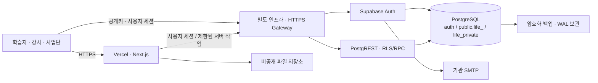

# 별도 인증 서버 운영 설계

2026-09-19 · 사용자 선택: 정확한 비밀번호 기준 유지 + 별도 인증 서버 운영 설계.

이 문서는 운영 배치 제안이다. 새 서버 구매·프로비저닝·DB 이관·도메인 연결은 실행하지 않았다.

## 1. 권장 배치와 결정 범위

**Vercel에 홈페이지를 두고, 독립 인프라에서 Supabase Auth와 업무 PostgreSQL을 함께 운영하는 구성을 기본안으로 제안한다.** Auth와 업무 데이터는 같은 PostgreSQL 인스턴스 안의 별도 schema/역할로 관리하고, Auth·API Gateway·DB 프로세스는 분리한다. 서버 한 대에 모두 배치해야 한다는 뜻은 아니다.

이 제안은 코드의 현재 의존성에 따른 판단이다. `life_auth_links`는 `auth.users`를 참조하고, 복구는 같은 DB transaction의 감사 이벤트를 사용하며, MFA/권한 판정은 `auth.sessions`, `auth.mfa_factors`, `auth.mfa_amr_claims`를 확인한다. Auth만 다른 DB로 옮기면 이 외래키·트리거·세션 판정은 그대로 동작하지 않는다.

**기본안에는 업무 DB의 운영 위치 변경도 포함된다. 사용자가 선택한 것은 별도 인증 서버의 설계 방향이며, Cloud DB 이관 실행까지 승인된 것은 아니다.** 기존 Cloud main은 유지하고, 이번에 만든 Cloud Preview는 업무 schema/RLS 검증용으로 사용한다.

브라우저에 전달되는 키는 공개 클라이언트 키뿐이다. service role·DB 접속 비밀·JWT 서명 개인키·SMTP/CAPTCHA 비밀은 서버 경계에만 둔다. 일반 업무 요청은 사용자 세션과 RLS/RPC를 사용하며 모든 요청을 service role로 처리하지 않는다.

## 2. Cloud 업무 DB 유지안과 비교

| 항목 | 기본안: Auth와 업무 DB 공동 운영 | 대안: 외부 Auth + Cloud 업무 DB |
|---|---|---|
| 비밀번호 조건 | GoTrue 사용자 지정 문자 집합으로 직접 강제 | 선택한 인증 제품의 정책 지원부터 검증 |
| 기존 SQL | 같은 DB의 Auth 참조를 유지할 수 있음 | auth.users FK와 세션/MFA/복구 상태 모델 재설계 |
| 세션 즉시 회수 | 기존 DB 세션 확인 모델 유지 | 외부 세션 상태 확인·폐기 전파·장애 시 거부 설계 필요 |
| JWT/RLS | 동일 스택의 Auth·API 설정 일치 | issuer/audience/subject 매핑, JWKS/키 회전과 RLS 변경 |
| 운영 책임 | OS·컨테이너·DB·백업·가용성 직접 관리 | 인증 서버는 직접 관리, Cloud DB는 관리형 유지 |
| 현재 코드 변경 범위 | 배포 설정·인수 검사 중심, native 호환성 재검증 | 인증 어댑터·다수 SQL·모든 권한 회귀 검사 포함 |

Supabase의 공식 외부 인증 연동은 지정 공급자와 비대칭 서명 JWT를 다룬다. 자체 GoTrue 서버가 URL 교체만으로 동일하게 연결된다고 가정하지 않는다. 사용자가 Cloud 업무 DB 유지를 우선한다면 대안을 별도 기능으로 구현한다. [공식 Third-party Auth](https://supabase.com/docs/guides/auth/third-party/overview)

## 3. 서버와 네트워크

- 운영과 인수시험 스택을 별도 DB·키·도메인·메일 수신 범위로 분리한다. Cloud의 `preview` 브랜치와 자체 운영 스택은 서로 다른 환경이다.
- 공식 self-hosted Docker Compose 배포를 기준으로 버전과 이미지 digest를 고정한다. 현재 로컬 회귀에 사용한 Auth는 `v2.195.0`이며 운영 버전으로 자동 승인하지 않는다. 보안 공지와 버전 호환성을 검토하고 회귀 시험한 조합을 채택한다.
- 용량 산정 출발점은 공식 권장 4 CPU core·8GB 이상 RAM·80GB 이상 SSD다. 실제 동시접속, 영상 제공 방식, PDF 발급량, 백업 공간을 부하 시험으로 반영한다. 이 수치는 견적이나 성능 보장이 아니다. [Docker 운영 요구사항](https://supabase.com/docs/guides/self-hosting/docker)
- 인터넷에는 HTTPS Gateway만 공개한다. Postgres, Studio, Auth 내부 포트, API 관리 포트는 사설 네트워크/VPN으로 제한한다. 운영자 Studio 접속은 개인 계정과 접근 기록을 남긴다.
- 예시 변수는 `APP_ORIGIN`, `BACKEND_ORIGIN`, `STAGING_APP_ORIGIN`, `STAGING_BACKEND_ORIGIN`으로 관리한다. 사용자가 제공한 홈페이지 주소는 **https://uc-life.vercel.app**이다. 별도 인증 서버의 호스팅·OS·백엔드 주소 및 인수시험 주소는 아직 확인되지 않았다. 홈페이지 주소를 백엔드 주소로 중복 지정하지 않는다.
- 최신 공식 구성의 `API_EXTERNAL_URL`에는 `/auth/v1`을 포함한다. SDK의 Supabase URL은 Gateway 기본 origin을 사용한다. OAuth callback에 `/auth/v1`이 두 번 붙지 않도록 확인한다. [URL 변경 공지](https://supabase.com/changelog/47093-self-hosted-supabase-api-external-url-to-include-auth-v1)

## 4. 인증 설정 계약

| 설정 | 적용 기준 |
|---|---|
| 비밀번호 길이 | `GOTRUE_PASSWORD_MIN_LENGTH=12` |
| 문자 조합 | `GOTRUE_PASSWORD_REQUIRED_CHARACTERS`: 영문 대소문자 한 집합, 숫자 한 집합, ASCII 특수문자 한 집합 |
| 정확한 설정 생성 | `scripts/lib/hosted-auth-preflight.mjs`의 `REQUIRED_CHARACTERS`를 단일 기준으로 사용. 콜론 escape와 literal 전달 확인 |
| DB 감사 이벤트 | `GOTRUE_AUDIT_LOG_DISABLE_POSTGRES=false`. 실제 비밀번호 변경 이벤트와 transaction 순서 별도 시험 |
| 관리자 MFA | TOTP 등록·검증 활성, 현행 최근 15분 인증 및 DB guard 유지 |
| 메일 | 기관 SMTP·이메일 확인·한국어 복구 템플릿, 복구 증명 15분, 발송 간격 최소 60초 |
| 남용 방지 | Native Turnstile + Auth rate limit + 기존 홈페이지 제한. 운영 키/도메인 설정 전 테스트 키로 운영하지 않음 |
| Redirect | 운영/시험의 정확한 HTTPS 주소만 허용, 임의 호스트·와일드카드 콜백 금지 |
| 가입 개방 | 정책·SMTP·CAPTCHA·복구·MFA·운영자 시험 완료 후 개방 |

문자 집합과 감사 옵션은 고정 버전 [공식 Auth 설정 코드](https://github.com/supabase/auth/blob/v2.195.0/internal/conf/configuration.go)를 기준으로 확인했다. 설정의 `$`, 역슬래시, 작은따옴표를 shell/Compose가 변형하지 않도록 literal 주입 후 실제 컨테이너의 일치 여부만 검사한다. 비밀번호나 비밀 환경변수 전체를 출력하지 않는다.

웹 화면의 보기/숨기기, 실시간 조건 체크, 큰 안내 문구는 그대로 유지한다. 소문자만 또는 대문자만 사용한 12자 비밀번호도 숫자·특수문자가 있으면 허용해야 한다. 직접 Auth API 가입/변경에서도 같은 규칙을 적용한다.

## 5. 현재 저장소에서 필요한 변경

1. `scripts/lib/release-readiness.mjs`의 Cloud project-ref/URL 전제를 배포 종류별 검사로 분리한다. self-hosted일 때는 기관 HTTPS origin·고정 스택 식별자·설정/이미지 지문을 확인한다. 기존 검사를 꺼서 우회하지 않는다.
2. Cloud 전용 `check:hosted-auth`와 별도로 self-hosted의 비밀값 없는 설정 증거를 검사한다. DB 감사 기록·Auth 실제 행동은 별도 인수 증거로 남긴다.
3. 개발 전용 `configure-auth-local.mjs`를 운영 서버에서 실행하지 않는다. 운영 Compose override와 비밀 주입·health 확인·복귀 절차를 별도 작성한다.
4. 운영 설정과 한국어 메일 템플릿을 확인한 뒤 전체 22개 migration을 시험 스택에 적용한다. 복구·MFA·남용 방지 3개는 native 정책 선행 조건이 충족된 환경에만 적용한다.
5. Vercel의 Preview/Production에서 각각 해당 backend origin으로 새 빌드한다. 공개 환경변수는 빌드에 반영되므로 이전 빌드를 그대로 재사용하지 않는다.

후속 `anchor-self-hosted-preflight`에서 1~3의 사전 검사·Auth 정책 override·빈 인수 양식을 구현했다. [설정 및 검사 가이드](self-hosted-preflight.md)를 참조한다. 실제 서버 구성·전체 인증 인수·앱 backend 전환은 남아 있다.

후속 `anchor-auth-candidate-lab`에서 Auth v2.196.0 후보와 22개 앱 migration을 새 임시 DB에 적용하고 native 인증 28개 검사를 통과했다. [격리 시험 결과와 재실행](auth-candidate-lab.md)을 참조한다. HTTP·Mailpit·CAPTCHA 비활성의 로컬 시험이므로 운영 인수 기록을 승인 상태로 변경하지 않는다.

## 6. 운영 책임과 복구

| 담당 | 해야 할 일 |
|---|---|
| 서비스 운영 담당 | 모니터링 확인, 장애 접수·복구 실행, 유지보수 공지 |
| 인프라/DB 담당 | OS·이미지 패치, DB 백업/WAL 보관·복원, 자원과 인증서 관리 |
| 인증/보안 담당 | 키 회전, MFA 분실 복구의 별도 승인, 세션 회수와 감사 검토 |
| 사업단 승인자 | 본인확인 절차, 개인정보 문안·보유기간, 관리자 권한 위임 승인 |

Self-hosted에서는 관리형 백업·PITR·브랜치·플랫폼 관리 API를 그대로 제공받지 않는다. 별도 시험 스택과 백업/복원 운영이 필요하다. 현재 Supabase CLI 개발 스택을 외부에 노출하는 방식으로 운영하지 않는다. [Self-hosting 운영 책임](https://supabase.com/docs/guides/self-hosting)

복구 목표 초안은 RPO 15분 이내·RTO 4시간 이내로 제안하며 운영 책임자와 예산에 맞춰 확정한다. 야간 전체 백업과 WAL 보관, 원격 암호화 보관, 정기 복원 시험을 구성한다. Auth와 업무 DB를 일관된 시점으로 복구하고 파일 저장소는 별도 복원한다. 서명 키·Auth 암호화 키·파일 암호화 키도 DB와 별도로 복구 가능하게 보관한다.

Auth 장애나 세션 확인 실패 시 민감 업무는 거부한다. 장애 해소를 위해 MFA나 RLS를 끄지 않는다. 복원/키 유출 후에는 승인된 절차에 따라 세션 회수와 재로그인을 시행한다. MFA 분실은 기존 기관 본인확인·별도 승인·실행자 기록 절차를 유지한다.

## 7. 시험·전환 순서

1. 운영 담당자, 도메인, 서버/백업 예산, DB 위치를 확정한다. 기존 Cloud 데이터를 옮기는 시점은 별도로 정한다.
2. 운영과 분리된 self-hosted 인수 스택을 공식 배포판으로 설치하고 HTTPS·키·백업을 구성한다.
3. Native 정책을 먼저 설정하고 전체 migration 및 승인된 시험 정책을 적용한다. 가상 계정만 사용한다.
4. 다음 인수 표를 실제 시험한다. 기존 로컬 전용 검사기의 대상 보호를 지워 원격에 실행하지 않는다.
5. 비밀번호 해시·세션·MFA 이관 가능성을 별도로 검증한다. 방식이 불명확하면 기존 세션을 유지한다고 약속하지 않고 기관 승인 재인증 절차를 준비한다. 대량 복구메일은 별도 발송 승인 후 수행한다.
6. 복원 시험·역할별 업무·개인정보 문안·운영 담당자 확인 후 Vercel의 실제 backend 연결을 전환한다. 전환 직전까지 Cloud main은 유지한다.

| 인수 항목 | 통과 기준 |
|---|---|
| Native 비밀번호 | 11자/영문 누락/숫자 누락/특수문자 누락 각각 거부; 소문자만·대문자만 12자 조합 허용 |
| 특수문자 전달 | 콜론·역슬래시·달러·따옴표가 설정/입력 경로에서 변형되지 않음 |
| 복구 | 잘못된/만료/재사용 토큰 거부, 다른 기기 복구 성공, 기존 세션 접근 회수 |
| 정책 증명 | 명시적 native 비밀번호 변경만 정책 승인, 단순 rehash로 승인되지 않음 |
| MFA | 오래된 AAL2·직접 factor 호출 우회 거부, 관리자 마지막 factor 보호 |
| 메일/CAPTCHA | 실제 승인 수신함 배송, 잘못된 CAPTCHA 거부, 재발송/반복 시도 제한 |
| 데이터 권한 | 타 학습자/담당 외 강좌 거부, 환불·강사 심사·증명 권한 분리 |
| 복원/업데이트 | 백업 복원 및 버전 변경 후 위 조건 유지, 복귀 가능성 확인 |

추가 서버는 아직 생성하지 않았고 비용도 확정하지 않았다. 현재 Cloud Preview는 검증용으로 유지 중이며, self-hosted 인수가 완료되면 사용 목적과 유지 비용을 재검토한다. 자동 삭제나 main 이관은 수행하지 않는다.
