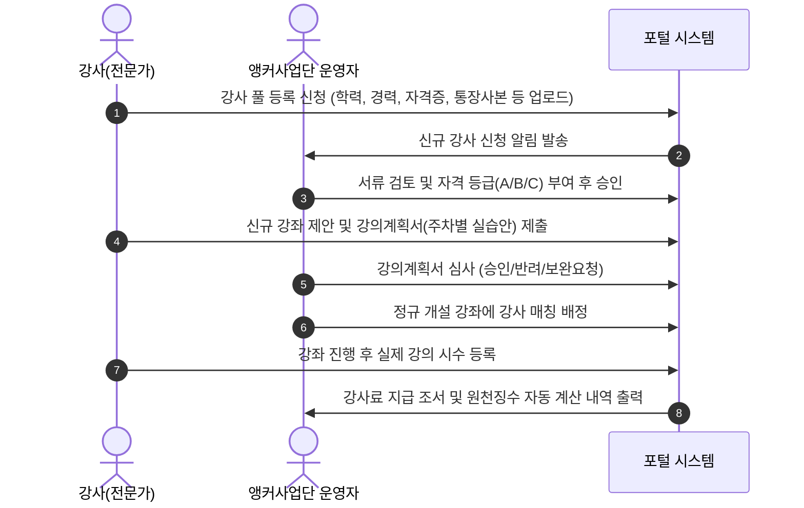

# 강사 관리 시스템 설계 및 운영 가이드 (INSTRUCTOR-MANAGEMENT)

## 1. 개요 및 목적
앵커사업단의 평생직업교육은 지역 산업체(조선, 화학, 이차전지, 모빌리티 등)의 최고 현장 전문가와 우수 교원을 강사로 확보하는 것이 핵심입니다. 본 스킬은 강사 등록부터 강의계획서 심사, 강의 배정 및 강사료 정산 데이터 산출까지의 전 과정을 표준화합니다.

---

## 2. 강사 관리 4단계 워크플로우

---

## 3. 핵심 데이터 구조 및 검증 기준

### 3.1. 강사 자격 등급 체계 (예시 기준표)
| 등급 | 자격 기준 예시 | 시간당 강사료 기준 |
| :--- | :--- | :--- |
| **특급 / A등급** | 대한민국 명장, 기술사, 박사학위 소지 후 관련분야 10년 이상 실무경력 | 100,000원 ~ 150,000원 |
| **고급 / B등급** | 관련분야 석사학위 및 실무 7년 이상, 공인 국가전문자격 소지자 | 70,000원 ~ 100,000원 |
| **중급 / C등급** | 관련분야 학사학위 및 실무 3년 이상, 현장 실무 기술자 | 50,000원 ~ 70,000원 |

### 3.2. 강의계획서 필수 작성 항목 (Syllabus Schema)
1. **기본 정보**: 강좌명, 교육대상(재직자/구직자 등), 적정 수강인원, 총 교육시간(이론/실습 분리).
2. **교육 목표**: NCS(국가직무능력표준) 능력단위 또는 산업체 직무 기반 달성 목표.
3. **주차별/차시별 계획**: 차시, 강의주제, 세부 학습내용, 실습 장비/SW, 과제 유무.
4. **수료 평가 기준**: 출석 배점(비율), 실습 평가 배점, 퀴즈 배점.
5. **교재 및 준비물**: 필요 소프트웨어, 하드웨어 공구 및 사업단 제공 실습재료 명세.

---

## 4. 강사료 자동 산출 로직 가이드
- **총 지급액 = (실제 강의 진행 시수 $\times$ 시간당 단가) + 교통비/교재개발비(해당 시)**
- **소득세 원천징수(기타소득 또는 사업소득)**:
  - 사업소득(3.3%): 소득세 3% + 지방소득세 0.3%
  - 기타소득(8.8% 또는 60% 필요경비 인정 여부에 따라 적용)
- 관리자 화면에서 "강사료 지급 결재용 엑셀"을 원클릭으로 다운로드할 수 있도록 설계.
