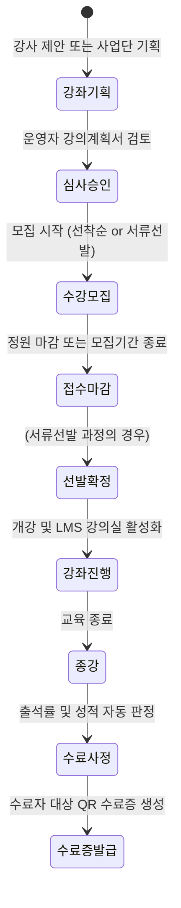

# 울산과학대학교 앵커사업단 평생직업교육 도메인 가이드 (UC-LMS-DOMAIN)

## 1. 개요 및 목적
본 스킬은 울산과학대학교 앵커사업단 평생직업교육 포털 구축 시 필수적인 교육 정책, 사용자 역할, 수강신청 프로세스 및 LMS 운영 규칙을 안내합니다. 모든 개발 작업은 본 지침의 도메인 모델을 기반으로 진행되어야 합니다.

---

## 2. 사용자 역할 (Roles) 및 권한 매트릭스
1. **학습자 (`ROLE_LEARNER`)**:
   - 지역 성인학습자, 재직자, 미취업자, 재학생
   - 수강신청, 온/오프라인 강의 수강, 과제 제출, 퀴즈 응시, 수료증 출력
2. **강사 (`ROLE_INSTRUCTOR`)**:
   - 겸임교수, 외래교수, 산업체 전문가
   - 강사 풀 등록, 강의계획서 작성 및 제출, 학습자 출결 승인, 과제 채점, 강의평가 확인
3. **사업단 운영자 (`ROLE_OPERATOR`)**:
   - 앵커사업단 전담 연구원, 행정 매니저
   - 강좌 개설 승인, 강사 심사 및 배정, 수료 사정 최종 확정, 직인 날인, 실적 보고서 다운로드
4. **최고 관리자 (`ROLE_ADMIN`)**:
   - 시스템 총괄 권한, RLS 및 보안 정책 점검, 시스템 로그 감사

---

## 3. 핵심 비즈니스 워크플로우

### 3.1. 강좌 개설 및 수강신청 생명주기

### 3.2. 평생직업교육 특화 출결 및 수료 기준
- **출결 기준 (Attendance)**:
  - **오프라인 강좌**: 전자출석부(강사 수기 체크) 또는 모바일 QR 체크인 (GPS 기반 캠퍼스 위치 반경 200m 검증 권장)
  - **온라인 동영상 강좌**: 동영상 누적 시청 시간 측정 (배속 1.5배속 초과 시 불인정, 최소 80% 이상 실제 재생 유지 필수)
- **수료 판정 공식 (Completion Formula)**:
  - 기본 요건: **출석률 $\ge$ 80%**
  - 평가 요건: 과제 및 퀴즈 환산 점수 **$\ge$ 60점 (100점 만점 기준)**
  - 필수 요건: **강의 만족도 설문조사 제출 완료**
  - 위 3가지 조건을 모두 충족할 때 자동으로 `COMPLETED(수료)` 상태 부여

---

## 4. 프론트엔드 UI/UX 설계 원칙
1. **성인학습자 친화적 접근성 (Silver & Adult Friendly)**:
   - 고대비 텍스트 및 기본 폰트 크기 16px 이상 유지 (글자 크기 조절 옵션 제공)
   - 복잡한 메뉴 트리를 지양하고 3클릭 이내 수강신청 및 강의실 입장 가능 구조
2. **반응형 웹 (Mobile First)**:
   - 모바일 기기에서도 강의 시청, 출결 체크, 수강신청이 막힘없이 동작할 것
3. **코드 작성 원칙 (규칙 4, 5 준수)**:
   - 초보자도 그대로 복사-붙여넣기(`Copy & Paste`)할 수 있도록 모든 컴포넌트와 페이지 코드는 생략 없이 완전하게 작성.
   - 각 함수와 상태(State)마다 상세한 한글 주석 필수.
